# Projects and dependencies analysis

This document provides a comprehensive overview of the projects and their dependencies in the context of upgrading to .NETCoreApp,Version=v10.0.

## Table of Contents

- [Executive Summary](#executive-Summary)
  - [Highlevel Metrics](#highlevel-metrics)
  - [Projects Compatibility](#projects-compatibility)
  - [Package Compatibility](#package-compatibility)
  - [API Compatibility](#api-compatibility)
- [Aggregate NuGet packages details](#aggregate-nuget-packages-details)
- [Top API Migration Challenges](#top-api-migration-challenges)
  - [Technologies and Features](#technologies-and-features)
  - [Most Frequent API Issues](#most-frequent-api-issues)
- [Projects Relationship Graph](#projects-relationship-graph)
- [Project Details](#project-details)

  - [API\CompanyName.MyMeetings.API\CompanyName.MyMeetings.API.csproj](#apicompanynamemymeetingsapicompanynamemymeetingsapicsproj)
  - [BuildingBlocks\Application\CompanyName.MyMeetings.BuildingBlocks.Application.csproj](#buildingblocksapplicationcompanynamemymeetingsbuildingblocksapplicationcsproj)
  - [BuildingBlocks\Domain\CompanyName.MyMeetings.BuildingBlocks.Domain.csproj](#buildingblocksdomaincompanynamemymeetingsbuildingblocksdomaincsproj)
  - [BuildingBlocks\Infrastructure\CompanyName.MyMeetings.BuildingBlocks.Infrastructure.csproj](#buildingblocksinfrastructurecompanynamemymeetingsbuildingblocksinfrastructurecsproj)
  - [BuildingBlocks\Tests\Application.UnitTests\CompanyName.MyMeetings.BuildingBlocks.Application.UnitTests.csproj](#buildingblockstestsapplicationunittestscompanynamemymeetingsbuildingblocksapplicationunittestscsproj)
  - [BuildingBlocks\Tests\IntegrationTests\CompanyName.MyMeetings.BuildingBlocks.IntegrationTests.csproj](#buildingblockstestsintegrationtestscompanynamemymeetingsbuildingblocksintegrationtestscsproj)
  - [C:\Github\POCs\my-dotnet-poc\ddd\build\_build.csproj](#c:githubpocsmy-dotnet-pocdddbuild_buildcsproj)
  - [Database\CompanyName.MyMeetings.Database.Build\CompanyName.MyMeetings.Database.Build.csproj](#databasecompanynamemymeetingsdatabasebuildcompanynamemymeetingsdatabasebuildcsproj)
  - [Database\CompanyName.MyMeetings.Database\CompanyName.MyMeetings.Database.sqlproj](#databasecompanynamemymeetingsdatabasecompanynamemymeetingsdatabasesqlproj)
  - [Database\DatabaseMigrator\DatabaseMigrator.csproj](#databasedatabasemigratordatabasemigratorcsproj)
  - [Modules\Administration\Application\CompanyName.MyMeetings.Modules.Administration.Application.csproj](#modulesadministrationapplicationcompanynamemymeetingsmodulesadministrationapplicationcsproj)
  - [Modules\Administration\Domain\CompanyName.MyMeetings.Modules.Administration.Domain.csproj](#modulesadministrationdomaincompanynamemymeetingsmodulesadministrationdomaincsproj)
  - [Modules\Administration\Infrastructure\CompanyName.MyMeetings.Modules.Administration.Infrastructure.csproj](#modulesadministrationinfrastructurecompanynamemymeetingsmodulesadministrationinfrastructurecsproj)
  - [Modules\Administration\IntegrationEvents\CompanyName.MyMeetings.Modules.Administration.IntegrationEvents.csproj](#modulesadministrationintegrationeventscompanynamemymeetingsmodulesadministrationintegrationeventscsproj)
  - [Modules\Administration\Tests\ArchTests\CompanyName.MyMeetings.Modules.Administration.ArchTests.csproj](#modulesadministrationtestsarchtestscompanynamemymeetingsmodulesadministrationarchtestscsproj)
  - [Modules\Administration\Tests\IntegrationTests\CompanyName.MyMeetings.Modules.Administration.IntegrationTests.csproj](#modulesadministrationtestsintegrationtestscompanynamemymeetingsmodulesadministrationintegrationtestscsproj)
  - [Modules\Administration\Tests\UnitTests\CompanyName.MyMeetings.Modules.Administration.Domain.UnitTests.csproj](#modulesadministrationtestsunittestscompanynamemymeetingsmodulesadministrationdomainunittestscsproj)
  - [Modules\Meetings\Application\CompanyName.MyMeetings.Modules.Meetings.Application.csproj](#modulesmeetingsapplicationcompanynamemymeetingsmodulesmeetingsapplicationcsproj)
  - [Modules\Meetings\Domain\CompanyName.MyMeetings.Modules.Meetings.Domain.csproj](#modulesmeetingsdomaincompanynamemymeetingsmodulesmeetingsdomaincsproj)
  - [Modules\Meetings\Infrastructure\CompanyName.MyMeetings.Modules.Meetings.Infrastructure.csproj](#modulesmeetingsinfrastructurecompanynamemymeetingsmodulesmeetingsinfrastructurecsproj)
  - [Modules\Meetings\IntegrationEvents\CompanyName.MyMeetings.Modules.Meetings.IntegrationEvents.csproj](#modulesmeetingsintegrationeventscompanynamemymeetingsmodulesmeetingsintegrationeventscsproj)
  - [Modules\Meetings\Tests\ArchTests\CompanyName.MyMeetings.Modules.Meetings.ArchTests.csproj](#modulesmeetingstestsarchtestscompanynamemymeetingsmodulesmeetingsarchtestscsproj)
  - [Modules\Meetings\Tests\IntegrationTests\CompanyName.MyMeetings.Modules.Meetings.IntegrationTests.csproj](#modulesmeetingstestsintegrationtestscompanynamemymeetingsmodulesmeetingsintegrationtestscsproj)
  - [Modules\Meetings\Tests\UnitTests\CompanyName.MyMeetings.Modules.Meetings.Domain.UnitTests.csproj](#modulesmeetingstestsunittestscompanynamemymeetingsmodulesmeetingsdomainunittestscsproj)
  - [Modules\Payments\Application\CompanyName.MyMeetings.Modules.Payments.Application.csproj](#modulespaymentsapplicationcompanynamemymeetingsmodulespaymentsapplicationcsproj)
  - [Modules\Payments\Domain\CompanyName.MyMeetings.Modules.Payments.Domain.csproj](#modulespaymentsdomaincompanynamemymeetingsmodulespaymentsdomaincsproj)
  - [Modules\Payments\Infrastructure\CompanyName.MyMeetings.Modules.Payments.Infrastructure.csproj](#modulespaymentsinfrastructurecompanynamemymeetingsmodulespaymentsinfrastructurecsproj)
  - [Modules\Payments\IntegrationEvents\CompanyName.MyMeetings.Modules.Payments.IntegrationEvents.csproj](#modulespaymentsintegrationeventscompanynamemymeetingsmodulespaymentsintegrationeventscsproj)
  - [Modules\Payments\Tests\ArchTests\CompanyName.MyMeetings.Modules.Payments.ArchTests.csproj](#modulespaymentstestsarchtestscompanynamemymeetingsmodulespaymentsarchtestscsproj)
  - [Modules\Payments\Tests\IntegrationTests\CompanyName.MyMeetings.Modules.Payments.IntegrationTests.csproj](#modulespaymentstestsintegrationtestscompanynamemymeetingsmodulespaymentsintegrationtestscsproj)
  - [Modules\Payments\Tests\UnitTests\CompanyName.MyMeetings.Modules.Payments.Domain.UnitTests.csproj](#modulespaymentstestsunittestscompanynamemymeetingsmodulespaymentsdomainunittestscsproj)
  - [Modules\Registrations\Application\CompanyName.MyMeetings.Modules.Registrations.Application.csproj](#modulesregistrationsapplicationcompanynamemymeetingsmodulesregistrationsapplicationcsproj)
  - [Modules\Registrations\Domain\CompanyName.MyMeetings.Modules.Registrations.Domain.csproj](#modulesregistrationsdomaincompanynamemymeetingsmodulesregistrationsdomaincsproj)
  - [Modules\Registrations\Infrastructure\CompanyName.MyMeetings.Modules.Registrations.Infrastructure.csproj](#modulesregistrationsinfrastructurecompanynamemymeetingsmodulesregistrationsinfrastructurecsproj)
  - [Modules\Registrations\IntegrationEvents\CompanyName.MyMeetings.Modules.Registrations.IntegrationEvents.csproj](#modulesregistrationsintegrationeventscompanynamemymeetingsmodulesregistrationsintegrationeventscsproj)
  - [Modules\Registrations\Tests\ArchTests\CompanyName.MyMeetings.Modules.Registrations.ArchTests.csproj](#modulesregistrationstestsarchtestscompanynamemymeetingsmodulesregistrationsarchtestscsproj)
  - [Modules\Registrations\Tests\IntegrationTests\CompanyNames.MyMeetings.Modules.Registrations.IntegrationTests.csproj](#modulesregistrationstestsintegrationtestscompanynamesmymeetingsmodulesregistrationsintegrationtestscsproj)
  - [Modules\Registrations\Tests\UnitTests\CompanyName.MyMeetings.Modules.Registrations.Domain.UnitTests.csproj](#modulesregistrationstestsunittestscompanynamemymeetingsmodulesregistrationsdomainunittestscsproj)
  - [Modules\UserAccess\Application\CompanyName.MyMeetings.Modules.UserAccess.Application.csproj](#modulesuseraccessapplicationcompanynamemymeetingsmodulesuseraccessapplicationcsproj)
  - [Modules\UserAccess\Domain\CompanyName.MyMeetings.Modules.UserAccess.Domain.csproj](#modulesuseraccessdomaincompanynamemymeetingsmodulesuseraccessdomaincsproj)
  - [Modules\UserAccess\Infrastructure\CompanyName.MyMeetings.Modules.UserAccess.Infrastructure.csproj](#modulesuseraccessinfrastructurecompanynamemymeetingsmodulesuseraccessinfrastructurecsproj)
  - [Modules\UserAccess\IntegrationEvents\CompanyName.MyMeetings.Modules.UserAccess.IntegrationEvents.csproj](#modulesuseraccessintegrationeventscompanynamemymeetingsmodulesuseraccessintegrationeventscsproj)
  - [Modules\UserAccess\Tests\ArchTests\CompanyName.MyMeetings.Modules.UserAccess.ArchTests.csproj](#modulesuseraccesstestsarchtestscompanynamemymeetingsmodulesuseraccessarchtestscsproj)
  - [Modules\UserAccess\Tests\IntegrationTests\CompanyNames.MyMeetings.Modules.UserAccess.IntegrationTests.csproj](#modulesuseraccesstestsintegrationtestscompanynamesmymeetingsmodulesuseraccessintegrationtestscsproj)
  - [Modules\UserAccess\Tests\UnitTests\CompanyName.MyMeetings.Modules.UserAccess.Domain.UnitTests.csproj](#modulesuseraccesstestsunittestscompanynamemymeetingsmodulesuseraccessdomainunittestscsproj)
  - [Tests\ArchTests\CompanyName.MyMeetings.ArchTests.csproj](#testsarchtestscompanynamemymeetingsarchtestscsproj)
  - [Tests\IntegrationTests\CompanyName.MyMeetings.IntegrationTests.csproj](#testsintegrationtestscompanynamemymeetingsintegrationtestscsproj)
  - [Tests\SUT\CompanyName.MyMeetings.SUT.csproj](#testssutcompanynamemymeetingssutcsproj)


## Executive Summary

### Highlevel Metrics

| Metric | Count | Status |
| :--- | :---: | :--- |
| Total Projects | 48 | 47 require upgrade |
| Total NuGet Packages | 27 | 5 need upgrade |
| Total Code Files | 1062 |  |
| Total Code Files with Incidents | 72 |  |
| Total Lines of Code | 38320 |  |
| Total Number of Issues | 129 |  |
| Estimated LOC to modify | 77+ | at least 0.2% of codebase |

### Projects Compatibility

| Project | Target Framework | Difficulty | Package Issues | API Issues | Est. LOC Impact | Description |
| :--- | :---: | :---: | :---: | :---: | :---: | :--- |
| [API\CompanyName.MyMeetings.API\CompanyName.MyMeetings.API.csproj](#apicompanynamemymeetingsapicompanynamemymeetingsapicsproj) | net8.0 | 🟢 Low | 1 | 0 |  | AspNetCore, Sdk Style = True |
| [BuildingBlocks\Application\CompanyName.MyMeetings.BuildingBlocks.Application.csproj](#buildingblocksapplicationcompanynamemymeetingsbuildingblocksapplicationcsproj) | net8.0 | 🟢 Low | 1 | 0 |  | ClassLibrary, Sdk Style = True |
| [BuildingBlocks\Domain\CompanyName.MyMeetings.BuildingBlocks.Domain.csproj](#buildingblocksdomaincompanynamemymeetingsbuildingblocksdomaincsproj) | net8.0 | 🟢 Low | 0 | 0 |  | ClassLibrary, Sdk Style = True |
| [BuildingBlocks\Infrastructure\CompanyName.MyMeetings.BuildingBlocks.Infrastructure.csproj](#buildingblocksinfrastructurecompanynamemymeetingsbuildingblocksinfrastructurecsproj) | net8.0 | 🟢 Low | 3 | 5 | 5+ | ClassLibrary, Sdk Style = True |
| [BuildingBlocks\Tests\Application.UnitTests\CompanyName.MyMeetings.BuildingBlocks.Application.UnitTests.csproj](#buildingblockstestsapplicationunittestscompanynamemymeetingsbuildingblocksapplicationunittestscsproj) | net8.0 | 🟢 Low | 0 | 0 |  | DotNetCoreApp, Sdk Style = True |
| [BuildingBlocks\Tests\IntegrationTests\CompanyName.MyMeetings.BuildingBlocks.IntegrationTests.csproj](#buildingblockstestsintegrationtestscompanynamemymeetingsbuildingblocksintegrationtestscsproj) | net8.0 | 🟢 Low | 0 | 0 |  | DotNetCoreApp, Sdk Style = True |
| [C:\Github\POCs\my-dotnet-poc\ddd\build\_build.csproj](#c:githubpocsmy-dotnet-pocdddbuild_buildcsproj) | net8.0 | 🟢 Low | 0 | 7 | 7+ | DotNetCoreApp, Sdk Style = True |
| [Database\CompanyName.MyMeetings.Database.Build\CompanyName.MyMeetings.Database.Build.csproj](#databasecompanynamemymeetingsdatabasebuildcompanynamemymeetingsdatabasebuildcsproj) | netstandard2.1 | ✅ None | 0 | 0 |  | ClassLibrary, Sdk Style = True |
| [Database\CompanyName.MyMeetings.Database\CompanyName.MyMeetings.Database.sqlproj](#databasecompanynamemymeetingsdatabasecompanynamemymeetingsdatabasesqlproj) | net8.0 | 🟢 Low | 0 | 0 |  | ClassicClassLibrary, Sdk Style = False |
| [Database\DatabaseMigrator\DatabaseMigrator.csproj](#databasedatabasemigratordatabasemigratorcsproj) | net8.0 | 🟢 Low | 0 | 0 |  | DotNetCoreApp, Sdk Style = True |
| [Modules\Administration\Application\CompanyName.MyMeetings.Modules.Administration.Application.csproj](#modulesadministrationapplicationcompanynamemymeetingsmodulesadministrationapplicationcsproj) | net8.0 | 🟢 Low | 0 | 0 |  | ClassLibrary, Sdk Style = True |
| [Modules\Administration\Domain\CompanyName.MyMeetings.Modules.Administration.Domain.csproj](#modulesadministrationdomaincompanynamemymeetingsmodulesadministrationdomaincsproj) | net8.0 | 🟢 Low | 0 | 0 |  | ClassLibrary, Sdk Style = True |
| [Modules\Administration\Infrastructure\CompanyName.MyMeetings.Modules.Administration.Infrastructure.csproj](#modulesadministrationinfrastructurecompanynamemymeetingsmodulesadministrationinfrastructurecsproj) | net8.0 | 🟢 Low | 0 | 4 | 4+ | ClassLibrary, Sdk Style = True |
| [Modules\Administration\IntegrationEvents\CompanyName.MyMeetings.Modules.Administration.IntegrationEvents.csproj](#modulesadministrationintegrationeventscompanynamemymeetingsmodulesadministrationintegrationeventscsproj) | net8.0 | 🟢 Low | 0 | 0 |  | ClassLibrary, Sdk Style = True |
| [Modules\Administration\Tests\ArchTests\CompanyName.MyMeetings.Modules.Administration.ArchTests.csproj](#modulesadministrationtestsarchtestscompanynamemymeetingsmodulesadministrationarchtestscsproj) | net8.0 | 🟢 Low | 0 | 0 |  | DotNetCoreApp, Sdk Style = True |
| [Modules\Administration\Tests\IntegrationTests\CompanyName.MyMeetings.Modules.Administration.IntegrationTests.csproj](#modulesadministrationtestsintegrationtestscompanynamemymeetingsmodulesadministrationintegrationtestscsproj) | net8.0 | 🟢 Low | 0 | 4 | 4+ | DotNetCoreApp, Sdk Style = True |
| [Modules\Administration\Tests\UnitTests\CompanyName.MyMeetings.Modules.Administration.Domain.UnitTests.csproj](#modulesadministrationtestsunittestscompanynamemymeetingsmodulesadministrationdomainunittestscsproj) | net8.0 | 🟢 Low | 0 | 0 |  | DotNetCoreApp, Sdk Style = True |
| [Modules\Meetings\Application\CompanyName.MyMeetings.Modules.Meetings.Application.csproj](#modulesmeetingsapplicationcompanynamemymeetingsmodulesmeetingsapplicationcsproj) | net8.0 | 🟢 Low | 0 | 0 |  | ClassLibrary, Sdk Style = True |
| [Modules\Meetings\Domain\CompanyName.MyMeetings.Modules.Meetings.Domain.csproj](#modulesmeetingsdomaincompanynamemymeetingsmodulesmeetingsdomaincsproj) | net8.0 | 🟢 Low | 0 | 0 |  | ClassLibrary, Sdk Style = True |
| [Modules\Meetings\Infrastructure\CompanyName.MyMeetings.Modules.Meetings.Infrastructure.csproj](#modulesmeetingsinfrastructurecompanynamemymeetingsmodulesmeetingsinfrastructurecsproj) | net8.0 | 🟢 Low | 0 | 6 | 6+ | ClassLibrary, Sdk Style = True |
| [Modules\Meetings\IntegrationEvents\CompanyName.MyMeetings.Modules.Meetings.IntegrationEvents.csproj](#modulesmeetingsintegrationeventscompanynamemymeetingsmodulesmeetingsintegrationeventscsproj) | net8.0 | 🟢 Low | 0 | 0 |  | ClassLibrary, Sdk Style = True |
| [Modules\Meetings\Tests\ArchTests\CompanyName.MyMeetings.Modules.Meetings.ArchTests.csproj](#modulesmeetingstestsarchtestscompanynamemymeetingsmodulesmeetingsarchtestscsproj) | net8.0 | 🟢 Low | 0 | 0 |  | DotNetCoreApp, Sdk Style = True |
| [Modules\Meetings\Tests\IntegrationTests\CompanyName.MyMeetings.Modules.Meetings.IntegrationTests.csproj](#modulesmeetingstestsintegrationtestscompanynamemymeetingsmodulesmeetingsintegrationtestscsproj) | net8.0 | 🟢 Low | 0 | 6 | 6+ | DotNetCoreApp, Sdk Style = True |
| [Modules\Meetings\Tests\UnitTests\CompanyName.MyMeetings.Modules.Meetings.Domain.UnitTests.csproj](#modulesmeetingstestsunittestscompanynamemymeetingsmodulesmeetingsdomainunittestscsproj) | net8.0 | 🟢 Low | 0 | 0 |  | DotNetCoreApp, Sdk Style = True |
| [Modules\Payments\Application\CompanyName.MyMeetings.Modules.Payments.Application.csproj](#modulespaymentsapplicationcompanynamemymeetingsmodulespaymentsapplicationcsproj) | net8.0 | 🟢 Low | 0 | 1 | 1+ | ClassLibrary, Sdk Style = True |
| [Modules\Payments\Domain\CompanyName.MyMeetings.Modules.Payments.Domain.csproj](#modulespaymentsdomaincompanynamemymeetingsmodulespaymentsdomaincsproj) | net8.0 | 🟢 Low | 0 | 0 |  | ClassLibrary, Sdk Style = True |
| [Modules\Payments\Infrastructure\CompanyName.MyMeetings.Modules.Payments.Infrastructure.csproj](#modulespaymentsinfrastructurecompanynamemymeetingsmodulespaymentsinfrastructurecsproj) | net8.0 | 🟢 Low | 0 | 6 | 6+ | ClassLibrary, Sdk Style = True |
| [Modules\Payments\IntegrationEvents\CompanyName.MyMeetings.Modules.Payments.IntegrationEvents.csproj](#modulespaymentsintegrationeventscompanynamemymeetingsmodulespaymentsintegrationeventscsproj) | net8.0 | 🟢 Low | 0 | 0 |  | ClassLibrary, Sdk Style = True |
| [Modules\Payments\Tests\ArchTests\CompanyName.MyMeetings.Modules.Payments.ArchTests.csproj](#modulespaymentstestsarchtestscompanynamemymeetingsmodulespaymentsarchtestscsproj) | net8.0 | 🟢 Low | 0 | 0 |  | DotNetCoreApp, Sdk Style = True |
| [Modules\Payments\Tests\IntegrationTests\CompanyName.MyMeetings.Modules.Payments.IntegrationTests.csproj](#modulespaymentstestsintegrationtestscompanynamemymeetingsmodulespaymentsintegrationtestscsproj) | net8.0 | 🟢 Low | 0 | 4 | 4+ | DotNetCoreApp, Sdk Style = True |
| [Modules\Payments\Tests\UnitTests\CompanyName.MyMeetings.Modules.Payments.Domain.UnitTests.csproj](#modulespaymentstestsunittestscompanynamemymeetingsmodulespaymentsdomainunittestscsproj) | net8.0 | 🟢 Low | 0 | 0 |  | DotNetCoreApp, Sdk Style = True |
| [Modules\Registrations\Application\CompanyName.MyMeetings.Modules.Registrations.Application.csproj](#modulesregistrationsapplicationcompanynamemymeetingsmodulesregistrationsapplicationcsproj) | net8.0 | 🟢 Low | 0 | 2 | 2+ | ClassLibrary, Sdk Style = True |
| [Modules\Registrations\Domain\CompanyName.MyMeetings.Modules.Registrations.Domain.csproj](#modulesregistrationsdomaincompanynamemymeetingsmodulesregistrationsdomaincsproj) | net8.0 | 🟢 Low | 0 | 0 |  | ClassLibrary, Sdk Style = True |
| [Modules\Registrations\Infrastructure\CompanyName.MyMeetings.Modules.Registrations.Infrastructure.csproj](#modulesregistrationsinfrastructurecompanynamemymeetingsmodulesregistrationsinfrastructurecsproj) | net8.0 | 🟢 Low | 0 | 6 | 6+ | ClassLibrary, Sdk Style = True |
| [Modules\Registrations\IntegrationEvents\CompanyName.MyMeetings.Modules.Registrations.IntegrationEvents.csproj](#modulesregistrationsintegrationeventscompanynamemymeetingsmodulesregistrationsintegrationeventscsproj) | net8.0 | 🟢 Low | 0 | 0 |  | ClassLibrary, Sdk Style = True |
| [Modules\Registrations\Tests\ArchTests\CompanyName.MyMeetings.Modules.Registrations.ArchTests.csproj](#modulesregistrationstestsarchtestscompanynamemymeetingsmodulesregistrationsarchtestscsproj) | net8.0 | 🟢 Low | 0 | 0 |  | DotNetCoreApp, Sdk Style = True |
| [Modules\Registrations\Tests\IntegrationTests\CompanyNames.MyMeetings.Modules.Registrations.IntegrationTests.csproj](#modulesregistrationstestsintegrationtestscompanynamesmymeetingsmodulesregistrationsintegrationtestscsproj) | net8.0 | 🟢 Low | 0 | 6 | 6+ | DotNetCoreApp, Sdk Style = True |
| [Modules\Registrations\Tests\UnitTests\CompanyName.MyMeetings.Modules.Registrations.Domain.UnitTests.csproj](#modulesregistrationstestsunittestscompanynamemymeetingsmodulesregistrationsdomainunittestscsproj) | net8.0 | 🟢 Low | 0 | 0 |  | DotNetCoreApp, Sdk Style = True |
| [Modules\UserAccess\Application\CompanyName.MyMeetings.Modules.UserAccess.Application.csproj](#modulesuseraccessapplicationcompanynamemymeetingsmodulesuseraccessapplicationcsproj) | net8.0 | 🟢 Low | 0 | 2 | 2+ | ClassLibrary, Sdk Style = True |
| [Modules\UserAccess\Domain\CompanyName.MyMeetings.Modules.UserAccess.Domain.csproj](#modulesuseraccessdomaincompanynamemymeetingsmodulesuseraccessdomaincsproj) | net8.0 | 🟢 Low | 0 | 0 |  | ClassLibrary, Sdk Style = True |
| [Modules\UserAccess\Infrastructure\CompanyName.MyMeetings.Modules.UserAccess.Infrastructure.csproj](#modulesuseraccessinfrastructurecompanynamemymeetingsmodulesuseraccessinfrastructurecsproj) | net8.0 | 🟢 Low | 0 | 6 | 6+ | ClassLibrary, Sdk Style = True |
| [Modules\UserAccess\IntegrationEvents\CompanyName.MyMeetings.Modules.UserAccess.IntegrationEvents.csproj](#modulesuseraccessintegrationeventscompanynamemymeetingsmodulesuseraccessintegrationeventscsproj) | net8.0 | 🟢 Low | 0 | 0 |  | ClassLibrary, Sdk Style = True |
| [Modules\UserAccess\Tests\ArchTests\CompanyName.MyMeetings.Modules.UserAccess.ArchTests.csproj](#modulesuseraccesstestsarchtestscompanynamemymeetingsmodulesuseraccessarchtestscsproj) | net8.0 | 🟢 Low | 0 | 0 |  | DotNetCoreApp, Sdk Style = True |
| [Modules\UserAccess\Tests\IntegrationTests\CompanyNames.MyMeetings.Modules.UserAccess.IntegrationTests.csproj](#modulesuseraccesstestsintegrationtestscompanynamesmymeetingsmodulesuseraccessintegrationtestscsproj) | net8.0 | 🟢 Low | 0 | 4 | 4+ | DotNetCoreApp, Sdk Style = True |
| [Modules\UserAccess\Tests\UnitTests\CompanyName.MyMeetings.Modules.UserAccess.Domain.UnitTests.csproj](#modulesuseraccesstestsunittestscompanynamemymeetingsmodulesuseraccessdomainunittestscsproj) | net8.0 | 🟢 Low | 0 | 0 |  | DotNetCoreApp, Sdk Style = True |
| [Tests\ArchTests\CompanyName.MyMeetings.ArchTests.csproj](#testsarchtestscompanynamemymeetingsarchtestscsproj) | net8.0 | 🟢 Low | 0 | 0 |  | DotNetCoreApp, Sdk Style = True |
| [Tests\IntegrationTests\CompanyName.MyMeetings.IntegrationTests.csproj](#testsintegrationtestscompanynamemymeetingsintegrationtestscsproj) | net8.0 | 🟢 Low | 0 | 2 | 2+ | DotNetCoreApp, Sdk Style = True |
| [Tests\SUT\CompanyName.MyMeetings.SUT.csproj](#testssutcompanynamemymeetingssutcsproj) | net8.0 | 🟢 Low | 0 | 6 | 6+ | DotNetCoreApp, Sdk Style = True |

### Package Compatibility

| Status | Count | Percentage |
| :--- | :---: | :---: |
| ✅ Compatible | 22 | 81.5% |
| ⚠️ Incompatible | 2 | 7.4% |
| 🔄 Upgrade Recommended | 3 | 11.1% |
| ***Total NuGet Packages*** | ***27*** | ***100%*** |

### API Compatibility

| Category | Count | Impact |
| :--- | :---: | :--- |
| 🔴 Binary Incompatible | 0 | High - Require code changes |
| 🟡 Source Incompatible | 72 | Medium - Needs re-compilation and potential conflicting API error fixing |
| 🔵 Behavioral change | 5 | Low - Behavioral changes that may require testing at runtime |
| ✅ Compatible | 34452 |  |
| ***Total APIs Analyzed*** | ***34529*** |  |

## Aggregate NuGet packages details

| Package | Current Version | Suggested Version | Projects | Description |
| :--- | :---: | :---: | :--- | :--- |
| Autofac | 7.1.0 |  | [CompanyName.MyMeetings.BuildingBlocks.Infrastructure.csproj](#buildingblocksinfrastructurecompanynamemymeetingsbuildingblocksinfrastructurecsproj) | ✅Compatible |
| Autofac.Extensions.DependencyInjection | 8.0.0 |  | [CompanyName.MyMeetings.BuildingBlocks.Infrastructure.csproj](#buildingblocksinfrastructurecompanynamemymeetingsbuildingblocksinfrastructurecsproj) | ✅Compatible |
| Dapper | 2.1.24 |  | [_build.csproj](#c:githubpocsmy-dotnet-pocdddbuild_buildcsproj)<br/>[CompanyName.MyMeetings.BuildingBlocks.Application.csproj](#buildingblocksapplicationcompanynamemymeetingsbuildingblocksapplicationcsproj) | ✅Compatible |
| dbup-sqlserver | 5.0.37 |  | [DatabaseMigrator.csproj](#databasedatabasemigratordatabasemigratorcsproj) | ✅Compatible |
| FluentAssertions | 6.12.0 |  | [CompanyName.MyMeetings.ArchTests.csproj](#testsarchtestscompanynamemymeetingsarchtestscsproj)<br/>[CompanyName.MyMeetings.BuildingBlocks.Application.UnitTests.csproj](#buildingblockstestsapplicationunittestscompanynamemymeetingsbuildingblocksapplicationunittestscsproj)<br/>[CompanyName.MyMeetings.BuildingBlocks.IntegrationTests.csproj](#buildingblockstestsintegrationtestscompanynamemymeetingsbuildingblocksintegrationtestscsproj)<br/>[CompanyName.MyMeetings.IntegrationTests.csproj](#testsintegrationtestscompanynamemymeetingsintegrationtestscsproj)<br/>[CompanyName.MyMeetings.Modules.Administration.ArchTests.csproj](#modulesadministrationtestsarchtestscompanynamemymeetingsmodulesadministrationarchtestscsproj)<br/>[CompanyName.MyMeetings.Modules.Administration.Domain.UnitTests.csproj](#modulesadministrationtestsunittestscompanynamemymeetingsmodulesadministrationdomainunittestscsproj)<br/>[CompanyName.MyMeetings.Modules.Administration.IntegrationTests.csproj](#modulesadministrationtestsintegrationtestscompanynamemymeetingsmodulesadministrationintegrationtestscsproj)<br/>[CompanyName.MyMeetings.Modules.Meetings.ArchTests.csproj](#modulesmeetingstestsarchtestscompanynamemymeetingsmodulesmeetingsarchtestscsproj)<br/>[CompanyName.MyMeetings.Modules.Meetings.Domain.UnitTests.csproj](#modulesmeetingstestsunittestscompanynamemymeetingsmodulesmeetingsdomainunittestscsproj)<br/>[CompanyName.MyMeetings.Modules.Meetings.IntegrationTests.csproj](#modulesmeetingstestsintegrationtestscompanynamemymeetingsmodulesmeetingsintegrationtestscsproj)<br/>[CompanyName.MyMeetings.Modules.Payments.ArchTests.csproj](#modulespaymentstestsarchtestscompanynamemymeetingsmodulespaymentsarchtestscsproj)<br/>[CompanyName.MyMeetings.Modules.Payments.Domain.UnitTests.csproj](#modulespaymentstestsunittestscompanynamemymeetingsmodulespaymentsdomainunittestscsproj)<br/>[CompanyName.MyMeetings.Modules.Payments.IntegrationTests.csproj](#modulespaymentstestsintegrationtestscompanynamemymeetingsmodulespaymentsintegrationtestscsproj)<br/>[CompanyName.MyMeetings.Modules.Registrations.ArchTests.csproj](#modulesregistrationstestsarchtestscompanynamemymeetingsmodulesregistrationsarchtestscsproj)<br/>[CompanyName.MyMeetings.Modules.Registrations.Domain.UnitTests.csproj](#modulesregistrationstestsunittestscompanynamemymeetingsmodulesregistrationsdomainunittestscsproj)<br/>[CompanyName.MyMeetings.Modules.UserAccess.ArchTests.csproj](#modulesuseraccesstestsarchtestscompanynamemymeetingsmodulesuseraccessarchtestscsproj)<br/>[CompanyName.MyMeetings.Modules.UserAccess.Domain.UnitTests.csproj](#modulesuseraccesstestsunittestscompanynamemymeetingsmodulesuseraccessdomainunittestscsproj)<br/>[CompanyName.MyMeetings.SUT.csproj](#testssutcompanynamemymeetingssutcsproj)<br/>[CompanyNames.MyMeetings.Modules.Registrations.IntegrationTests.csproj](#modulesregistrationstestsintegrationtestscompanynamesmymeetingsmodulesregistrationsintegrationtestscsproj)<br/>[CompanyNames.MyMeetings.Modules.UserAccess.IntegrationTests.csproj](#modulesuseraccesstestsintegrationtestscompanynamesmymeetingsmodulesuseraccessintegrationtestscsproj) | ✅Compatible |
| FluentValidation | 11.8.1 |  | [CompanyName.MyMeetings.BuildingBlocks.Application.csproj](#buildingblocksapplicationcompanynamemymeetingsbuildingblocksapplicationcsproj) | ✅Compatible |
| Hellang.Middleware.ProblemDetails | 6.5.1 |  | [CompanyName.MyMeetings.API.csproj](#apicompanynamemymeetingsapicompanynamemymeetingsapicsproj) | ✅Compatible |
| IdentityServer4 | 4.1.2 |  | [CompanyName.MyMeetings.Modules.UserAccess.Infrastructure.csproj](#modulesuseraccessinfrastructurecompanynamemymeetingsmodulesuseraccessinfrastructurecsproj) | ✅Compatible |
| IdentityServer4.AccessTokenValidation | 3.0.1 |  | [CompanyName.MyMeetings.API.csproj](#apicompanynamemymeetingsapicompanynamemymeetingsapicsproj)<br/>[CompanyName.MyMeetings.Modules.UserAccess.Infrastructure.csproj](#modulesuseraccessinfrastructurecompanynamemymeetingsmodulesuseraccessinfrastructurecsproj) | ✅Compatible |
| MediatR | 12.2.0 |  | [CompanyName.MyMeetings.BuildingBlocks.Domain.csproj](#buildingblocksdomaincompanynamemymeetingsbuildingblocksdomaincsproj) | ✅Compatible |
| Microsoft.EntityFrameworkCore | 8.0.0 | 10.0.1 | [CompanyName.MyMeetings.BuildingBlocks.Infrastructure.csproj](#buildingblocksinfrastructurecompanynamemymeetingsbuildingblocksinfrastructurecsproj) | NuGet package upgrade is recommended |
| Microsoft.EntityFrameworkCore.SqlServer | 8.0.0 | 10.0.1 | [CompanyName.MyMeetings.BuildingBlocks.Infrastructure.csproj](#buildingblocksinfrastructurecompanynamemymeetingsbuildingblocksinfrastructurecsproj) | NuGet package upgrade is recommended |
| Microsoft.NET.Test.Sdk | 17.8.0 |  | [CompanyName.MyMeetings.ArchTests.csproj](#testsarchtestscompanynamemymeetingsarchtestscsproj)<br/>[CompanyName.MyMeetings.BuildingBlocks.Application.UnitTests.csproj](#buildingblockstestsapplicationunittestscompanynamemymeetingsbuildingblocksapplicationunittestscsproj)<br/>[CompanyName.MyMeetings.BuildingBlocks.IntegrationTests.csproj](#buildingblockstestsintegrationtestscompanynamemymeetingsbuildingblocksintegrationtestscsproj)<br/>[CompanyName.MyMeetings.IntegrationTests.csproj](#testsintegrationtestscompanynamemymeetingsintegrationtestscsproj)<br/>[CompanyName.MyMeetings.Modules.Administration.ArchTests.csproj](#modulesadministrationtestsarchtestscompanynamemymeetingsmodulesadministrationarchtestscsproj)<br/>[CompanyName.MyMeetings.Modules.Administration.Domain.UnitTests.csproj](#modulesadministrationtestsunittestscompanynamemymeetingsmodulesadministrationdomainunittestscsproj)<br/>[CompanyName.MyMeetings.Modules.Administration.IntegrationTests.csproj](#modulesadministrationtestsintegrationtestscompanynamemymeetingsmodulesadministrationintegrationtestscsproj)<br/>[CompanyName.MyMeetings.Modules.Meetings.ArchTests.csproj](#modulesmeetingstestsarchtestscompanynamemymeetingsmodulesmeetingsarchtestscsproj)<br/>[CompanyName.MyMeetings.Modules.Meetings.Domain.UnitTests.csproj](#modulesmeetingstestsunittestscompanynamemymeetingsmodulesmeetingsdomainunittestscsproj)<br/>[CompanyName.MyMeetings.Modules.Meetings.IntegrationTests.csproj](#modulesmeetingstestsintegrationtestscompanynamemymeetingsmodulesmeetingsintegrationtestscsproj)<br/>[CompanyName.MyMeetings.Modules.Payments.ArchTests.csproj](#modulespaymentstestsarchtestscompanynamemymeetingsmodulespaymentsarchtestscsproj)<br/>[CompanyName.MyMeetings.Modules.Payments.Domain.UnitTests.csproj](#modulespaymentstestsunittestscompanynamemymeetingsmodulespaymentsdomainunittestscsproj)<br/>[CompanyName.MyMeetings.Modules.Payments.IntegrationTests.csproj](#modulespaymentstestsintegrationtestscompanynamemymeetingsmodulespaymentsintegrationtestscsproj)<br/>[CompanyName.MyMeetings.Modules.Registrations.ArchTests.csproj](#modulesregistrationstestsarchtestscompanynamemymeetingsmodulesregistrationsarchtestscsproj)<br/>[CompanyName.MyMeetings.Modules.Registrations.Domain.UnitTests.csproj](#modulesregistrationstestsunittestscompanynamemymeetingsmodulesregistrationsdomainunittestscsproj)<br/>[CompanyName.MyMeetings.Modules.UserAccess.ArchTests.csproj](#modulesuseraccesstestsarchtestscompanynamemymeetingsmodulesuseraccessarchtestscsproj)<br/>[CompanyName.MyMeetings.Modules.UserAccess.Domain.UnitTests.csproj](#modulesuseraccesstestsunittestscompanynamemymeetingsmodulesuseraccessdomainunittestscsproj)<br/>[CompanyName.MyMeetings.SUT.csproj](#testssutcompanynamemymeetingssutcsproj)<br/>[CompanyNames.MyMeetings.Modules.Registrations.IntegrationTests.csproj](#modulesregistrationstestsintegrationtestscompanynamesmymeetingsmodulesregistrationsintegrationtestscsproj)<br/>[CompanyNames.MyMeetings.Modules.UserAccess.IntegrationTests.csproj](#modulesuseraccesstestsintegrationtestscompanynamesmymeetingsmodulesuseraccessintegrationtestscsproj) | ✅Compatible |
| Microsoft.VisualStudio.Azure.Containers.Tools.Targets | 1.19.5 |  | [CompanyName.MyMeetings.API.csproj](#apicompanynamemymeetingsapicompanynamemymeetingsapicsproj) | ⚠️NuGet package is incompatible |
| NetArchTest.Rules | 1.3.2 |  | [CompanyName.MyMeetings.ArchTests.csproj](#testsarchtestscompanynamemymeetingsarchtestscsproj)<br/>[CompanyName.MyMeetings.BuildingBlocks.Application.UnitTests.csproj](#buildingblockstestsapplicationunittestscompanynamemymeetingsbuildingblocksapplicationunittestscsproj)<br/>[CompanyName.MyMeetings.BuildingBlocks.IntegrationTests.csproj](#buildingblockstestsintegrationtestscompanynamemymeetingsbuildingblocksintegrationtestscsproj)<br/>[CompanyName.MyMeetings.IntegrationTests.csproj](#testsintegrationtestscompanynamemymeetingsintegrationtestscsproj)<br/>[CompanyName.MyMeetings.Modules.Administration.ArchTests.csproj](#modulesadministrationtestsarchtestscompanynamemymeetingsmodulesadministrationarchtestscsproj)<br/>[CompanyName.MyMeetings.Modules.Administration.Domain.UnitTests.csproj](#modulesadministrationtestsunittestscompanynamemymeetingsmodulesadministrationdomainunittestscsproj)<br/>[CompanyName.MyMeetings.Modules.Administration.IntegrationTests.csproj](#modulesadministrationtestsintegrationtestscompanynamemymeetingsmodulesadministrationintegrationtestscsproj)<br/>[CompanyName.MyMeetings.Modules.Meetings.ArchTests.csproj](#modulesmeetingstestsarchtestscompanynamemymeetingsmodulesmeetingsarchtestscsproj)<br/>[CompanyName.MyMeetings.Modules.Meetings.Domain.UnitTests.csproj](#modulesmeetingstestsunittestscompanynamemymeetingsmodulesmeetingsdomainunittestscsproj)<br/>[CompanyName.MyMeetings.Modules.Meetings.IntegrationTests.csproj](#modulesmeetingstestsintegrationtestscompanynamemymeetingsmodulesmeetingsintegrationtestscsproj)<br/>[CompanyName.MyMeetings.Modules.Payments.ArchTests.csproj](#modulespaymentstestsarchtestscompanynamemymeetingsmodulespaymentsarchtestscsproj)<br/>[CompanyName.MyMeetings.Modules.Payments.Domain.UnitTests.csproj](#modulespaymentstestsunittestscompanynamemymeetingsmodulespaymentsdomainunittestscsproj)<br/>[CompanyName.MyMeetings.Modules.Payments.IntegrationTests.csproj](#modulespaymentstestsintegrationtestscompanynamemymeetingsmodulespaymentsintegrationtestscsproj)<br/>[CompanyName.MyMeetings.Modules.Registrations.ArchTests.csproj](#modulesregistrationstestsarchtestscompanynamemymeetingsmodulesregistrationsarchtestscsproj)<br/>[CompanyName.MyMeetings.Modules.Registrations.Domain.UnitTests.csproj](#modulesregistrationstestsunittestscompanynamemymeetingsmodulesregistrationsdomainunittestscsproj)<br/>[CompanyName.MyMeetings.Modules.UserAccess.ArchTests.csproj](#modulesuseraccesstestsarchtestscompanynamemymeetingsmodulesuseraccessarchtestscsproj)<br/>[CompanyName.MyMeetings.Modules.UserAccess.Domain.UnitTests.csproj](#modulesuseraccesstestsunittestscompanynamemymeetingsmodulesuseraccessdomainunittestscsproj)<br/>[CompanyName.MyMeetings.SUT.csproj](#testssutcompanynamemymeetingssutcsproj)<br/>[CompanyNames.MyMeetings.Modules.Registrations.IntegrationTests.csproj](#modulesregistrationstestsintegrationtestscompanynamesmymeetingsmodulesregistrationsintegrationtestscsproj)<br/>[CompanyNames.MyMeetings.Modules.UserAccess.IntegrationTests.csproj](#modulesuseraccesstestsintegrationtestscompanynamesmymeetingsmodulesuseraccessintegrationtestscsproj) | ✅Compatible |
| Newtonsoft.Json | 13.0.3 | 13.0.4 | [CompanyName.MyMeetings.BuildingBlocks.Application.csproj](#buildingblocksapplicationcompanynamemymeetingsbuildingblocksapplicationcsproj) | NuGet package upgrade is recommended |
| NSubstitute | 5.1.0 |  | [CompanyName.MyMeetings.ArchTests.csproj](#testsarchtestscompanynamemymeetingsarchtestscsproj)<br/>[CompanyName.MyMeetings.BuildingBlocks.Application.UnitTests.csproj](#buildingblockstestsapplicationunittestscompanynamemymeetingsbuildingblocksapplicationunittestscsproj)<br/>[CompanyName.MyMeetings.BuildingBlocks.IntegrationTests.csproj](#buildingblockstestsintegrationtestscompanynamemymeetingsbuildingblocksintegrationtestscsproj)<br/>[CompanyName.MyMeetings.IntegrationTests.csproj](#testsintegrationtestscompanynamemymeetingsintegrationtestscsproj)<br/>[CompanyName.MyMeetings.Modules.Administration.ArchTests.csproj](#modulesadministrationtestsarchtestscompanynamemymeetingsmodulesadministrationarchtestscsproj)<br/>[CompanyName.MyMeetings.Modules.Administration.Domain.UnitTests.csproj](#modulesadministrationtestsunittestscompanynamemymeetingsmodulesadministrationdomainunittestscsproj)<br/>[CompanyName.MyMeetings.Modules.Administration.IntegrationTests.csproj](#modulesadministrationtestsintegrationtestscompanynamemymeetingsmodulesadministrationintegrationtestscsproj)<br/>[CompanyName.MyMeetings.Modules.Meetings.ArchTests.csproj](#modulesmeetingstestsarchtestscompanynamemymeetingsmodulesmeetingsarchtestscsproj)<br/>[CompanyName.MyMeetings.Modules.Meetings.Domain.UnitTests.csproj](#modulesmeetingstestsunittestscompanynamemymeetingsmodulesmeetingsdomainunittestscsproj)<br/>[CompanyName.MyMeetings.Modules.Meetings.IntegrationTests.csproj](#modulesmeetingstestsintegrationtestscompanynamemymeetingsmodulesmeetingsintegrationtestscsproj)<br/>[CompanyName.MyMeetings.Modules.Payments.ArchTests.csproj](#modulespaymentstestsarchtestscompanynamemymeetingsmodulespaymentsarchtestscsproj)<br/>[CompanyName.MyMeetings.Modules.Payments.Domain.UnitTests.csproj](#modulespaymentstestsunittestscompanynamemymeetingsmodulespaymentsdomainunittestscsproj)<br/>[CompanyName.MyMeetings.Modules.Payments.IntegrationTests.csproj](#modulespaymentstestsintegrationtestscompanynamemymeetingsmodulespaymentsintegrationtestscsproj)<br/>[CompanyName.MyMeetings.Modules.Registrations.ArchTests.csproj](#modulesregistrationstestsarchtestscompanynamemymeetingsmodulesregistrationsarchtestscsproj)<br/>[CompanyName.MyMeetings.Modules.Registrations.Domain.UnitTests.csproj](#modulesregistrationstestsunittestscompanynamemymeetingsmodulesregistrationsdomainunittestscsproj)<br/>[CompanyName.MyMeetings.Modules.UserAccess.ArchTests.csproj](#modulesuseraccesstestsarchtestscompanynamemymeetingsmodulesuseraccessarchtestscsproj)<br/>[CompanyName.MyMeetings.Modules.UserAccess.Domain.UnitTests.csproj](#modulesuseraccesstestsunittestscompanynamemymeetingsmodulesuseraccessdomainunittestscsproj)<br/>[CompanyName.MyMeetings.SUT.csproj](#testssutcompanynamemymeetingssutcsproj)<br/>[CompanyNames.MyMeetings.Modules.Registrations.IntegrationTests.csproj](#modulesregistrationstestsintegrationtestscompanynamesmymeetingsmodulesregistrationsintegrationtestscsproj)<br/>[CompanyNames.MyMeetings.Modules.UserAccess.IntegrationTests.csproj](#modulesuseraccesstestsintegrationtestscompanynamesmymeetingsmodulesuseraccessintegrationtestscsproj) | ✅Compatible |
| Nuke.Common | 7.0.6 |  | [_build.csproj](#c:githubpocsmy-dotnet-pocdddbuild_buildcsproj) | ✅Compatible |
| nunit | 4.0.1 |  | [CompanyName.MyMeetings.ArchTests.csproj](#testsarchtestscompanynamemymeetingsarchtestscsproj)<br/>[CompanyName.MyMeetings.BuildingBlocks.Application.UnitTests.csproj](#buildingblockstestsapplicationunittestscompanynamemymeetingsbuildingblocksapplicationunittestscsproj)<br/>[CompanyName.MyMeetings.BuildingBlocks.IntegrationTests.csproj](#buildingblockstestsintegrationtestscompanynamemymeetingsbuildingblocksintegrationtestscsproj)<br/>[CompanyName.MyMeetings.IntegrationTests.csproj](#testsintegrationtestscompanynamemymeetingsintegrationtestscsproj)<br/>[CompanyName.MyMeetings.Modules.Administration.ArchTests.csproj](#modulesadministrationtestsarchtestscompanynamemymeetingsmodulesadministrationarchtestscsproj)<br/>[CompanyName.MyMeetings.Modules.Administration.Domain.UnitTests.csproj](#modulesadministrationtestsunittestscompanynamemymeetingsmodulesadministrationdomainunittestscsproj)<br/>[CompanyName.MyMeetings.Modules.Administration.IntegrationTests.csproj](#modulesadministrationtestsintegrationtestscompanynamemymeetingsmodulesadministrationintegrationtestscsproj)<br/>[CompanyName.MyMeetings.Modules.Meetings.ArchTests.csproj](#modulesmeetingstestsarchtestscompanynamemymeetingsmodulesmeetingsarchtestscsproj)<br/>[CompanyName.MyMeetings.Modules.Meetings.Domain.UnitTests.csproj](#modulesmeetingstestsunittestscompanynamemymeetingsmodulesmeetingsdomainunittestscsproj)<br/>[CompanyName.MyMeetings.Modules.Meetings.IntegrationTests.csproj](#modulesmeetingstestsintegrationtestscompanynamemymeetingsmodulesmeetingsintegrationtestscsproj)<br/>[CompanyName.MyMeetings.Modules.Payments.ArchTests.csproj](#modulespaymentstestsarchtestscompanynamemymeetingsmodulespaymentsarchtestscsproj)<br/>[CompanyName.MyMeetings.Modules.Payments.Domain.UnitTests.csproj](#modulespaymentstestsunittestscompanynamemymeetingsmodulespaymentsdomainunittestscsproj)<br/>[CompanyName.MyMeetings.Modules.Payments.IntegrationTests.csproj](#modulespaymentstestsintegrationtestscompanynamemymeetingsmodulespaymentsintegrationtestscsproj)<br/>[CompanyName.MyMeetings.Modules.Registrations.ArchTests.csproj](#modulesregistrationstestsarchtestscompanynamemymeetingsmodulesregistrationsarchtestscsproj)<br/>[CompanyName.MyMeetings.Modules.Registrations.Domain.UnitTests.csproj](#modulesregistrationstestsunittestscompanynamemymeetingsmodulesregistrationsdomainunittestscsproj)<br/>[CompanyName.MyMeetings.Modules.UserAccess.ArchTests.csproj](#modulesuseraccesstestsarchtestscompanynamemymeetingsmodulesuseraccessarchtestscsproj)<br/>[CompanyName.MyMeetings.Modules.UserAccess.Domain.UnitTests.csproj](#modulesuseraccesstestsunittestscompanynamemymeetingsmodulesuseraccessdomainunittestscsproj)<br/>[CompanyName.MyMeetings.SUT.csproj](#testssutcompanynamemymeetingssutcsproj)<br/>[CompanyNames.MyMeetings.Modules.Registrations.IntegrationTests.csproj](#modulesregistrationstestsintegrationtestscompanynamesmymeetingsmodulesregistrationsintegrationtestscsproj)<br/>[CompanyNames.MyMeetings.Modules.UserAccess.IntegrationTests.csproj](#modulesuseraccesstestsintegrationtestscompanynamesmymeetingsmodulesuseraccessintegrationtestscsproj) | ✅Compatible |
| NUnit3TestAdapter | 4.5.0 |  | [CompanyName.MyMeetings.ArchTests.csproj](#testsarchtestscompanynamemymeetingsarchtestscsproj)<br/>[CompanyName.MyMeetings.BuildingBlocks.Application.UnitTests.csproj](#buildingblockstestsapplicationunittestscompanynamemymeetingsbuildingblocksapplicationunittestscsproj)<br/>[CompanyName.MyMeetings.BuildingBlocks.IntegrationTests.csproj](#buildingblockstestsintegrationtestscompanynamemymeetingsbuildingblocksintegrationtestscsproj)<br/>[CompanyName.MyMeetings.IntegrationTests.csproj](#testsintegrationtestscompanynamemymeetingsintegrationtestscsproj)<br/>[CompanyName.MyMeetings.Modules.Administration.ArchTests.csproj](#modulesadministrationtestsarchtestscompanynamemymeetingsmodulesadministrationarchtestscsproj)<br/>[CompanyName.MyMeetings.Modules.Administration.Domain.UnitTests.csproj](#modulesadministrationtestsunittestscompanynamemymeetingsmodulesadministrationdomainunittestscsproj)<br/>[CompanyName.MyMeetings.Modules.Administration.IntegrationTests.csproj](#modulesadministrationtestsintegrationtestscompanynamemymeetingsmodulesadministrationintegrationtestscsproj)<br/>[CompanyName.MyMeetings.Modules.Meetings.ArchTests.csproj](#modulesmeetingstestsarchtestscompanynamemymeetingsmodulesmeetingsarchtestscsproj)<br/>[CompanyName.MyMeetings.Modules.Meetings.Domain.UnitTests.csproj](#modulesmeetingstestsunittestscompanynamemymeetingsmodulesmeetingsdomainunittestscsproj)<br/>[CompanyName.MyMeetings.Modules.Meetings.IntegrationTests.csproj](#modulesmeetingstestsintegrationtestscompanynamemymeetingsmodulesmeetingsintegrationtestscsproj)<br/>[CompanyName.MyMeetings.Modules.Payments.ArchTests.csproj](#modulespaymentstestsarchtestscompanynamemymeetingsmodulespaymentsarchtestscsproj)<br/>[CompanyName.MyMeetings.Modules.Payments.Domain.UnitTests.csproj](#modulespaymentstestsunittestscompanynamemymeetingsmodulespaymentsdomainunittestscsproj)<br/>[CompanyName.MyMeetings.Modules.Payments.IntegrationTests.csproj](#modulespaymentstestsintegrationtestscompanynamemymeetingsmodulespaymentsintegrationtestscsproj)<br/>[CompanyName.MyMeetings.Modules.Registrations.ArchTests.csproj](#modulesregistrationstestsarchtestscompanynamemymeetingsmodulesregistrationsarchtestscsproj)<br/>[CompanyName.MyMeetings.Modules.Registrations.Domain.UnitTests.csproj](#modulesregistrationstestsunittestscompanynamemymeetingsmodulesregistrationsdomainunittestscsproj)<br/>[CompanyName.MyMeetings.Modules.UserAccess.ArchTests.csproj](#modulesuseraccesstestsarchtestscompanynamemymeetingsmodulesuseraccessarchtestscsproj)<br/>[CompanyName.MyMeetings.Modules.UserAccess.Domain.UnitTests.csproj](#modulesuseraccesstestsunittestscompanynamemymeetingsmodulesuseraccessdomainunittestscsproj)<br/>[CompanyName.MyMeetings.SUT.csproj](#testssutcompanynamemymeetingssutcsproj)<br/>[CompanyNames.MyMeetings.Modules.Registrations.IntegrationTests.csproj](#modulesregistrationstestsintegrationtestscompanynamesmymeetingsmodulesregistrationsintegrationtestscsproj)<br/>[CompanyNames.MyMeetings.Modules.UserAccess.IntegrationTests.csproj](#modulesuseraccesstestsintegrationtestscompanynamesmymeetingsmodulesuseraccessintegrationtestscsproj) | ✅Compatible |
| Polly | 8.2.0 |  | [CompanyName.MyMeetings.BuildingBlocks.Infrastructure.csproj](#buildingblocksinfrastructurecompanynamemymeetingsbuildingblocksinfrastructurecsproj) | ✅Compatible |
| Quartz | 3.8.0 |  | [CompanyName.MyMeetings.BuildingBlocks.Application.csproj](#buildingblocksapplicationcompanynamemymeetingsbuildingblocksapplicationcsproj) | ✅Compatible |
| Serilog.AspNetCore | 8.0.0 |  | [CompanyName.MyMeetings.BuildingBlocks.Application.csproj](#buildingblocksapplicationcompanynamemymeetingsbuildingblocksapplicationcsproj)<br/>[DatabaseMigrator.csproj](#databasedatabasemigratordatabasemigratorcsproj) | ✅Compatible |
| SqlStreamStore.MsSql | 1.1.3 |  | [CompanyName.MyMeetings.BuildingBlocks.Infrastructure.csproj](#buildingblocksinfrastructurecompanynamemymeetingsbuildingblocksinfrastructurecsproj) | ⚠️NuGet package is deprecated |
| StyleCop.Analyzers | 1.2.0-beta.556 |  | [CompanyName.MyMeetings.API.csproj](#apicompanynamemymeetingsapicompanynamemymeetingsapicsproj)<br/>[CompanyName.MyMeetings.ArchTests.csproj](#testsarchtestscompanynamemymeetingsarchtestscsproj)<br/>[CompanyName.MyMeetings.BuildingBlocks.Application.csproj](#buildingblocksapplicationcompanynamemymeetingsbuildingblocksapplicationcsproj)<br/>[CompanyName.MyMeetings.BuildingBlocks.Application.UnitTests.csproj](#buildingblockstestsapplicationunittestscompanynamemymeetingsbuildingblocksapplicationunittestscsproj)<br/>[CompanyName.MyMeetings.BuildingBlocks.Domain.csproj](#buildingblocksdomaincompanynamemymeetingsbuildingblocksdomaincsproj)<br/>[CompanyName.MyMeetings.BuildingBlocks.Infrastructure.csproj](#buildingblocksinfrastructurecompanynamemymeetingsbuildingblocksinfrastructurecsproj)<br/>[CompanyName.MyMeetings.BuildingBlocks.IntegrationTests.csproj](#buildingblockstestsintegrationtestscompanynamemymeetingsbuildingblocksintegrationtestscsproj)<br/>[CompanyName.MyMeetings.Database.Build.csproj](#databasecompanynamemymeetingsdatabasebuildcompanynamemymeetingsdatabasebuildcsproj)<br/>[CompanyName.MyMeetings.Database.sqlproj](#databasecompanynamemymeetingsdatabasecompanynamemymeetingsdatabasesqlproj)<br/>[CompanyName.MyMeetings.IntegrationTests.csproj](#testsintegrationtestscompanynamemymeetingsintegrationtestscsproj)<br/>[CompanyName.MyMeetings.Modules.Administration.Application.csproj](#modulesadministrationapplicationcompanynamemymeetingsmodulesadministrationapplicationcsproj)<br/>[CompanyName.MyMeetings.Modules.Administration.ArchTests.csproj](#modulesadministrationtestsarchtestscompanynamemymeetingsmodulesadministrationarchtestscsproj)<br/>[CompanyName.MyMeetings.Modules.Administration.Domain.csproj](#modulesadministrationdomaincompanynamemymeetingsmodulesadministrationdomaincsproj)<br/>[CompanyName.MyMeetings.Modules.Administration.Domain.UnitTests.csproj](#modulesadministrationtestsunittestscompanynamemymeetingsmodulesadministrationdomainunittestscsproj)<br/>[CompanyName.MyMeetings.Modules.Administration.Infrastructure.csproj](#modulesadministrationinfrastructurecompanynamemymeetingsmodulesadministrationinfrastructurecsproj)<br/>[CompanyName.MyMeetings.Modules.Administration.IntegrationEvents.csproj](#modulesadministrationintegrationeventscompanynamemymeetingsmodulesadministrationintegrationeventscsproj)<br/>[CompanyName.MyMeetings.Modules.Administration.IntegrationTests.csproj](#modulesadministrationtestsintegrationtestscompanynamemymeetingsmodulesadministrationintegrationtestscsproj)<br/>[CompanyName.MyMeetings.Modules.Meetings.Application.csproj](#modulesmeetingsapplicationcompanynamemymeetingsmodulesmeetingsapplicationcsproj)<br/>[CompanyName.MyMeetings.Modules.Meetings.ArchTests.csproj](#modulesmeetingstestsarchtestscompanynamemymeetingsmodulesmeetingsarchtestscsproj)<br/>[CompanyName.MyMeetings.Modules.Meetings.Domain.csproj](#modulesmeetingsdomaincompanynamemymeetingsmodulesmeetingsdomaincsproj)<br/>[CompanyName.MyMeetings.Modules.Meetings.Domain.UnitTests.csproj](#modulesmeetingstestsunittestscompanynamemymeetingsmodulesmeetingsdomainunittestscsproj)<br/>[CompanyName.MyMeetings.Modules.Meetings.Infrastructure.csproj](#modulesmeetingsinfrastructurecompanynamemymeetingsmodulesmeetingsinfrastructurecsproj)<br/>[CompanyName.MyMeetings.Modules.Meetings.IntegrationEvents.csproj](#modulesmeetingsintegrationeventscompanynamemymeetingsmodulesmeetingsintegrationeventscsproj)<br/>[CompanyName.MyMeetings.Modules.Meetings.IntegrationTests.csproj](#modulesmeetingstestsintegrationtestscompanynamemymeetingsmodulesmeetingsintegrationtestscsproj)<br/>[CompanyName.MyMeetings.Modules.Payments.Application.csproj](#modulespaymentsapplicationcompanynamemymeetingsmodulespaymentsapplicationcsproj)<br/>[CompanyName.MyMeetings.Modules.Payments.ArchTests.csproj](#modulespaymentstestsarchtestscompanynamemymeetingsmodulespaymentsarchtestscsproj)<br/>[CompanyName.MyMeetings.Modules.Payments.Domain.csproj](#modulespaymentsdomaincompanynamemymeetingsmodulespaymentsdomaincsproj)<br/>[CompanyName.MyMeetings.Modules.Payments.Domain.UnitTests.csproj](#modulespaymentstestsunittestscompanynamemymeetingsmodulespaymentsdomainunittestscsproj)<br/>[CompanyName.MyMeetings.Modules.Payments.Infrastructure.csproj](#modulespaymentsinfrastructurecompanynamemymeetingsmodulespaymentsinfrastructurecsproj)<br/>[CompanyName.MyMeetings.Modules.Payments.IntegrationEvents.csproj](#modulespaymentsintegrationeventscompanynamemymeetingsmodulespaymentsintegrationeventscsproj)<br/>[CompanyName.MyMeetings.Modules.Payments.IntegrationTests.csproj](#modulespaymentstestsintegrationtestscompanynamemymeetingsmodulespaymentsintegrationtestscsproj)<br/>[CompanyName.MyMeetings.Modules.Registrations.Application.csproj](#modulesregistrationsapplicationcompanynamemymeetingsmodulesregistrationsapplicationcsproj)<br/>[CompanyName.MyMeetings.Modules.Registrations.ArchTests.csproj](#modulesregistrationstestsarchtestscompanynamemymeetingsmodulesregistrationsarchtestscsproj)<br/>[CompanyName.MyMeetings.Modules.Registrations.Domain.csproj](#modulesregistrationsdomaincompanynamemymeetingsmodulesregistrationsdomaincsproj)<br/>[CompanyName.MyMeetings.Modules.Registrations.Domain.UnitTests.csproj](#modulesregistrationstestsunittestscompanynamemymeetingsmodulesregistrationsdomainunittestscsproj)<br/>[CompanyName.MyMeetings.Modules.Registrations.Infrastructure.csproj](#modulesregistrationsinfrastructurecompanynamemymeetingsmodulesregistrationsinfrastructurecsproj)<br/>[CompanyName.MyMeetings.Modules.Registrations.IntegrationEvents.csproj](#modulesregistrationsintegrationeventscompanynamemymeetingsmodulesregistrationsintegrationeventscsproj)<br/>[CompanyName.MyMeetings.Modules.UserAccess.Application.csproj](#modulesuseraccessapplicationcompanynamemymeetingsmodulesuseraccessapplicationcsproj)<br/>[CompanyName.MyMeetings.Modules.UserAccess.ArchTests.csproj](#modulesuseraccesstestsarchtestscompanynamemymeetingsmodulesuseraccessarchtestscsproj)<br/>[CompanyName.MyMeetings.Modules.UserAccess.Domain.csproj](#modulesuseraccessdomaincompanynamemymeetingsmodulesuseraccessdomaincsproj)<br/>[CompanyName.MyMeetings.Modules.UserAccess.Domain.UnitTests.csproj](#modulesuseraccesstestsunittestscompanynamemymeetingsmodulesuseraccessdomainunittestscsproj)<br/>[CompanyName.MyMeetings.Modules.UserAccess.Infrastructure.csproj](#modulesuseraccessinfrastructurecompanynamemymeetingsmodulesuseraccessinfrastructurecsproj)<br/>[CompanyName.MyMeetings.Modules.UserAccess.IntegrationEvents.csproj](#modulesuseraccessintegrationeventscompanynamemymeetingsmodulesuseraccessintegrationeventscsproj)<br/>[CompanyName.MyMeetings.SUT.csproj](#testssutcompanynamemymeetingssutcsproj)<br/>[CompanyNames.MyMeetings.Modules.Registrations.IntegrationTests.csproj](#modulesregistrationstestsintegrationtestscompanynamesmymeetingsmodulesregistrationsintegrationtestscsproj)<br/>[CompanyNames.MyMeetings.Modules.UserAccess.IntegrationTests.csproj](#modulesuseraccesstestsintegrationtestscompanynamesmymeetingsmodulesuseraccessintegrationtestscsproj)<br/>[DatabaseMigrator.csproj](#databasedatabasemigratordatabasemigratorcsproj) | ✅Compatible |
| Swashbuckle.AspNetCore | 6.5.0 |  | [CompanyName.MyMeetings.API.csproj](#apicompanynamemymeetingsapicompanynamemymeetingsapicsproj) | ✅Compatible |
| System.Data.SqlClient | 4.8.6 |  | [_build.csproj](#c:githubpocsmy-dotnet-pocdddbuild_buildcsproj)<br/>[CompanyName.MyMeetings.BuildingBlocks.Infrastructure.csproj](#buildingblocksinfrastructurecompanynamemymeetingsbuildingblocksinfrastructurecsproj) | ✅Compatible |

## Top API Migration Challenges

### Technologies and Features

| Technology | Issues | Percentage | Migration Path |
| :--- | :---: | :---: | :--- |

### Most Frequent API Issues

| API | Count | Percentage | Category |
| :--- | :---: | :---: | :--- |
| T:System.Data.SqlClient.SqlConnection | 19 | 24.7% | Source Incompatible |
| M:System.Data.SqlClient.SqlConnection.#ctor(System.String) | 19 | 24.7% | Source Incompatible |
| M:System.TimeSpan.FromSeconds(System.Double) | 15 | 19.5% | Source Incompatible |
| M:System.TimeSpan.FromMilliseconds(System.Double) | 13 | 16.9% | Source Incompatible |
| M:System.Environment.SetEnvironmentVariable(System.String,System.String) | 5 | 6.5% | Behavioral Change |
| T:System.Security.Cryptography.Rfc2898DeriveBytes | 4 | 5.2% | Source Incompatible |
| M:System.Data.SqlClient.SqlConnection.Open | 1 | 1.3% | Source Incompatible |
| M:System.TimeSpan.FromMinutes(System.Double) | 1 | 1.3% | Source Incompatible |

## Projects Relationship Graph

Legend:
📦 SDK-style project
⚙️ Classic project


## Project Details

<a id="apicompanynamemymeetingsapicompanynamemymeetingsapicsproj"></a>
### API\CompanyName.MyMeetings.API\CompanyName.MyMeetings.API.csproj

#### Project Info

- **Current Target Framework:** net8.0
- **Proposed Target Framework:** net10.0
- **SDK-style**: True
- **Project Kind:** AspNetCore
- **Dependencies**: 5
- **Dependants**: 3
- **Number of Files**: 60
- **Number of Files with Incidents**: 1
- **Lines of Code**: 1892
- **Estimated LOC to modify**: 0+ (at least 0.0% of the project)

#### Dependency Graph

Legend:
📦 SDK-style project
⚙️ Classic project

```mermaid
flowchart TB
    subgraph upstream["Dependants (3)"]
        P26["<b>📦&nbsp;CompanyName.MyMeetings.ArchTests.csproj</b><br/><small>net8.0</small>"]
        P34["<b>📦&nbsp;CompanyName.MyMeetings.IntegrationTests.csproj</b><br/><small>net8.0</small>"]
        P41["<b>📦&nbsp;CompanyName.MyMeetings.SUT.csproj</b><br/><small>net8.0</small>"]
        click P26 "#testsarchtestscompanynamemymeetingsarchtestscsproj"
        click P34 "#testsintegrationtestscompanynamemymeetingsintegrationtestscsproj"
        click P41 "#testssutcompanynamemymeetingssutcsproj"
    end
    subgraph current["CompanyName.MyMeetings.API.csproj"]
        MAIN["<b>📦&nbsp;CompanyName.MyMeetings.API.csproj</b><br/><small>net8.0</small>"]
        click MAIN "#apicompanynamemymeetingsapicompanynamemymeetingsapicsproj"
    end
    subgraph downstream["Dependencies (5"]
        P13["<b>📦&nbsp;CompanyName.MyMeetings.Modules.UserAccess.Infrastructure.csproj</b><br/><small>net8.0</small>"]
        P44["<b>📦&nbsp;CompanyName.MyMeetings.Modules.Registrations.Infrastructure.csproj</b><br/><small>net8.0</small>"]
        P18["<b>📦&nbsp;CompanyName.MyMeetings.Modules.Payments.Infrastructure.csproj</b><br/><small>net8.0</small>"]
        P10["<b>📦&nbsp;CompanyName.MyMeetings.Modules.Administration.Infrastructure.csproj</b><br/><small>net8.0</small>"]
        P5["<b>📦&nbsp;CompanyName.MyMeetings.Modules.Meetings.Infrastructure.csproj</b><br/><small>net8.0</small>"]
        click P13 "#modulesuseraccessinfrastructurecompanynamemymeetingsmodulesuseraccessinfrastructurecsproj"
        click P44 "#modulesregistrationsinfrastructurecompanynamemymeetingsmodulesregistrationsinfrastructurecsproj"
        click P18 "#modulespaymentsinfrastructurecompanynamemymeetingsmodulespaymentsinfrastructurecsproj"
        click P10 "#modulesadministrationinfrastructurecompanynamemymeetingsmodulesadministrationinfrastructurecsproj"
        click P5 "#modulesmeetingsinfrastructurecompanynamemymeetingsmodulesmeetingsinfrastructurecsproj"
    end
    P26 --> MAIN
    P34 --> MAIN
    P41 --> MAIN
    MAIN --> P13
    MAIN --> P44
    MAIN --> P18
    MAIN --> P10
    MAIN --> P5

```

### API Compatibility

| Category | Count | Impact |
| :--- | :---: | :--- |
| 🔴 Binary Incompatible | 0 | High - Require code changes |
| 🟡 Source Incompatible | 0 | Medium - Needs re-compilation and potential conflicting API error fixing |
| 🔵 Behavioral change | 0 | Low - Behavioral changes that may require testing at runtime |
| ✅ Compatible | 2119 |  |
| ***Total APIs Analyzed*** | ***2119*** |  |

<a id="buildingblocksapplicationcompanynamemymeetingsbuildingblocksapplicationcsproj"></a>
### BuildingBlocks\Application\CompanyName.MyMeetings.BuildingBlocks.Application.csproj

#### Project Info

- **Current Target Framework:** net8.0
- **Proposed Target Framework:** net10.0
- **SDK-style**: True
- **Project Kind:** ClassLibrary
- **Dependencies**: 1
- **Dependants**: 3
- **Number of Files**: 12
- **Number of Files with Incidents**: 1
- **Lines of Code**: 203
- **Estimated LOC to modify**: 0+ (at least 0.0% of the project)

#### Dependency Graph

Legend:
📦 SDK-style project
⚙️ Classic project

```mermaid
flowchart TB
    subgraph upstream["Dependants (3)"]
        P7["<b>📦&nbsp;CompanyName.MyMeetings.BuildingBlocks.Infrastructure.csproj</b><br/><small>net8.0</small>"]
        P36["<b>📦&nbsp;CompanyName.MyMeetings.BuildingBlocks.Application.UnitTests.csproj</b><br/><small>net8.0</small>"]
        P42["<b>📦&nbsp;CompanyName.MyMeetings.Modules.Registrations.Application.csproj</b><br/><small>net8.0</small>"]
        click P7 "#buildingblocksinfrastructurecompanynamemymeetingsbuildingblocksinfrastructurecsproj"
        click P36 "#buildingblockstestsapplicationunittestscompanynamemymeetingsbuildingblocksapplicationunittestscsproj"
        click P42 "#modulesregistrationsapplicationcompanynamemymeetingsmodulesregistrationsapplicationcsproj"
    end
    subgraph current["CompanyName.MyMeetings.BuildingBlocks.Application.csproj"]
        MAIN["<b>📦&nbsp;CompanyName.MyMeetings.BuildingBlocks.Application.csproj</b><br/><small>net8.0</small>"]
        click MAIN "#buildingblocksapplicationcompanynamemymeetingsbuildingblocksapplicationcsproj"
    end
    subgraph downstream["Dependencies (1"]
        P6["<b>📦&nbsp;CompanyName.MyMeetings.BuildingBlocks.Domain.csproj</b><br/><small>net8.0</small>"]
        click P6 "#buildingblocksdomaincompanynamemymeetingsbuildingblocksdomaincsproj"
    end
    P7 --> MAIN
    P36 --> MAIN
    P42 --> MAIN
    MAIN --> P6

```

### API Compatibility

| Category | Count | Impact |
| :--- | :---: | :--- |
| 🔴 Binary Incompatible | 0 | High - Require code changes |
| 🟡 Source Incompatible | 0 | Medium - Needs re-compilation and potential conflicting API error fixing |
| 🔵 Behavioral change | 0 | Low - Behavioral changes that may require testing at runtime |
| ✅ Compatible | 153 |  |
| ***Total APIs Analyzed*** | ***153*** |  |

<a id="buildingblocksdomaincompanynamemymeetingsbuildingblocksdomaincsproj"></a>
### BuildingBlocks\Domain\CompanyName.MyMeetings.BuildingBlocks.Domain.csproj

#### Project Info

- **Current Target Framework:** net8.0
- **Proposed Target Framework:** net10.0
- **SDK-style**: True
- **Project Kind:** ClassLibrary
- **Dependencies**: 0
- **Dependants**: 6
- **Number of Files**: 9
- **Number of Files with Incidents**: 1
- **Lines of Code**: 283
- **Estimated LOC to modify**: 0+ (at least 0.0% of the project)

#### Dependency Graph

Legend:
📦 SDK-style project
⚙️ Classic project

```mermaid
flowchart TB
    subgraph upstream["Dependants (6)"]
        P4["<b>📦&nbsp;CompanyName.MyMeetings.Modules.Meetings.Domain.csproj</b><br/><small>net8.0</small>"]
        P8["<b>📦&nbsp;CompanyName.MyMeetings.Modules.Administration.Domain.csproj</b><br/><small>net8.0</small>"]
        P14["<b>📦&nbsp;CompanyName.MyMeetings.Modules.UserAccess.Domain.csproj</b><br/><small>net8.0</small>"]
        P17["<b>📦&nbsp;CompanyName.MyMeetings.Modules.Payments.Domain.csproj</b><br/><small>net8.0</small>"]
        P20["<b>📦&nbsp;CompanyName.MyMeetings.BuildingBlocks.Application.csproj</b><br/><small>net8.0</small>"]
        P43["<b>📦&nbsp;CompanyName.MyMeetings.Modules.Registrations.Domain.csproj</b><br/><small>net8.0</small>"]
        click P4 "#modulesmeetingsdomaincompanynamemymeetingsmodulesmeetingsdomaincsproj"
        click P8 "#modulesadministrationdomaincompanynamemymeetingsmodulesadministrationdomaincsproj"
        click P14 "#modulesuseraccessdomaincompanynamemymeetingsmodulesuseraccessdomaincsproj"
        click P17 "#modulespaymentsdomaincompanynamemymeetingsmodulespaymentsdomaincsproj"
        click P20 "#buildingblocksapplicationcompanynamemymeetingsbuildingblocksapplicationcsproj"
        click P43 "#modulesregistrationsdomaincompanynamemymeetingsmodulesregistrationsdomaincsproj"
    end
    subgraph current["CompanyName.MyMeetings.BuildingBlocks.Domain.csproj"]
        MAIN["<b>📦&nbsp;CompanyName.MyMeetings.BuildingBlocks.Domain.csproj</b><br/><small>net8.0</small>"]
        click MAIN "#buildingblocksdomaincompanynamemymeetingsbuildingblocksdomaincsproj"
    end
    P4 --> MAIN
    P8 --> MAIN
    P14 --> MAIN
    P17 --> MAIN
    P20 --> MAIN
    P43 --> MAIN

```

### API Compatibility

| Category | Count | Impact |
| :--- | :---: | :--- |
| 🔴 Binary Incompatible | 0 | High - Require code changes |
| 🟡 Source Incompatible | 0 | Medium - Needs re-compilation and potential conflicting API error fixing |
| 🔵 Behavioral change | 0 | Low - Behavioral changes that may require testing at runtime |
| ✅ Compatible | 232 |  |
| ***Total APIs Analyzed*** | ***232*** |  |

<a id="buildingblocksinfrastructurecompanynamemymeetingsbuildingblocksinfrastructurecsproj"></a>
### BuildingBlocks\Infrastructure\CompanyName.MyMeetings.BuildingBlocks.Infrastructure.csproj

#### Project Info

- **Current Target Framework:** net8.0
- **Proposed Target Framework:** net10.0
- **SDK-style**: True
- **Project Kind:** ClassLibrary
- **Dependencies**: 1
- **Dependants**: 5
- **Number of Files**: 27
- **Number of Files with Incidents**: 2
- **Lines of Code**: 725
- **Estimated LOC to modify**: 5+ (at least 0.7% of the project)

#### Dependency Graph

Legend:
📦 SDK-style project
⚙️ Classic project

```mermaid
flowchart TB
    subgraph upstream["Dependants (5)"]
        P11["<b>📦&nbsp;CompanyName.MyMeetings.Modules.Meetings.IntegrationEvents.csproj</b><br/><small>net8.0</small>"]
        P12["<b>📦&nbsp;CompanyName.MyMeetings.Modules.Administration.IntegrationEvents.csproj</b><br/><small>net8.0</small>"]
        P15["<b>📦&nbsp;CompanyName.MyMeetings.Modules.UserAccess.IntegrationEvents.csproj</b><br/><small>net8.0</small>"]
        P19["<b>📦&nbsp;CompanyName.MyMeetings.Modules.Payments.IntegrationEvents.csproj</b><br/><small>net8.0</small>"]
        P48["<b>📦&nbsp;CompanyName.MyMeetings.Modules.Registrations.IntegrationEvents.csproj</b><br/><small>net8.0</small>"]
        click P11 "#modulesmeetingsintegrationeventscompanynamemymeetingsmodulesmeetingsintegrationeventscsproj"
        click P12 "#modulesadministrationintegrationeventscompanynamemymeetingsmodulesadministrationintegrationeventscsproj"
        click P15 "#modulesuseraccessintegrationeventscompanynamemymeetingsmodulesuseraccessintegrationeventscsproj"
        click P19 "#modulespaymentsintegrationeventscompanynamemymeetingsmodulespaymentsintegrationeventscsproj"
        click P48 "#modulesregistrationsintegrationeventscompanynamemymeetingsmodulesregistrationsintegrationeventscsproj"
    end
    subgraph current["CompanyName.MyMeetings.BuildingBlocks.Infrastructure.csproj"]
        MAIN["<b>📦&nbsp;CompanyName.MyMeetings.BuildingBlocks.Infrastructure.csproj</b><br/><small>net8.0</small>"]
        click MAIN "#buildingblocksinfrastructurecompanynamemymeetingsbuildingblocksinfrastructurecsproj"
    end
    subgraph downstream["Dependencies (1"]
        P20["<b>📦&nbsp;CompanyName.MyMeetings.BuildingBlocks.Application.csproj</b><br/><small>net8.0</small>"]
        click P20 "#buildingblocksapplicationcompanynamemymeetingsbuildingblocksapplicationcsproj"
    end
    P11 --> MAIN
    P12 --> MAIN
    P15 --> MAIN
    P19 --> MAIN
    P48 --> MAIN
    MAIN --> P20

```

### API Compatibility

| Category | Count | Impact |
| :--- | :---: | :--- |
| 🔴 Binary Incompatible | 0 | High - Require code changes |
| 🟡 Source Incompatible | 5 | Medium - Needs re-compilation and potential conflicting API error fixing |
| 🔵 Behavioral change | 0 | Low - Behavioral changes that may require testing at runtime |
| ✅ Compatible | 594 |  |
| ***Total APIs Analyzed*** | ***599*** |  |

<a id="buildingblockstestsapplicationunittestscompanynamemymeetingsbuildingblocksapplicationunittestscsproj"></a>
### BuildingBlocks\Tests\Application.UnitTests\CompanyName.MyMeetings.BuildingBlocks.Application.UnitTests.csproj

#### Project Info

- **Current Target Framework:** net8.0
- **Proposed Target Framework:** net10.0
- **SDK-style**: True
- **Project Kind:** DotNetCoreApp
- **Dependencies**: 1
- **Dependants**: 0
- **Number of Files**: 3
- **Number of Files with Incidents**: 1
- **Lines of Code**: 35
- **Estimated LOC to modify**: 0+ (at least 0.0% of the project)

#### Dependency Graph

Legend:
📦 SDK-style project
⚙️ Classic project

```mermaid
flowchart TB
    subgraph current["CompanyName.MyMeetings.BuildingBlocks.Application.UnitTests.csproj"]
        MAIN["<b>📦&nbsp;CompanyName.MyMeetings.BuildingBlocks.Application.UnitTests.csproj</b><br/><small>net8.0</small>"]
        click MAIN "#buildingblockstestsapplicationunittestscompanynamemymeetingsbuildingblocksapplicationunittestscsproj"
    end
    subgraph downstream["Dependencies (1"]
        P20["<b>📦&nbsp;CompanyName.MyMeetings.BuildingBlocks.Application.csproj</b><br/><small>net8.0</small>"]
        click P20 "#buildingblocksapplicationcompanynamemymeetingsbuildingblocksapplicationcsproj"
    end
    MAIN --> P20

```

### API Compatibility

| Category | Count | Impact |
| :--- | :---: | :--- |
| 🔴 Binary Incompatible | 0 | High - Require code changes |
| 🟡 Source Incompatible | 0 | Medium - Needs re-compilation and potential conflicting API error fixing |
| 🔵 Behavioral change | 0 | Low - Behavioral changes that may require testing at runtime |
| ✅ Compatible | 24 |  |
| ***Total APIs Analyzed*** | ***24*** |  |

<a id="buildingblockstestsintegrationtestscompanynamemymeetingsbuildingblocksintegrationtestscsproj"></a>
### BuildingBlocks\Tests\IntegrationTests\CompanyName.MyMeetings.BuildingBlocks.IntegrationTests.csproj

#### Project Info

- **Current Target Framework:** net8.0
- **Proposed Target Framework:** net10.0
- **SDK-style**: True
- **Project Kind:** DotNetCoreApp
- **Dependencies**: 0
- **Dependants**: 18
- **Number of Files**: 7
- **Number of Files with Incidents**: 1
- **Lines of Code**: 130
- **Estimated LOC to modify**: 0+ (at least 0.0% of the project)

#### Dependency Graph

Legend:
📦 SDK-style project
⚙️ Classic project


### API Compatibility

| Category | Count | Impact |
| :--- | :---: | :--- |
| 🔴 Binary Incompatible | 0 | High - Require code changes |
| 🟡 Source Incompatible | 0 | Medium - Needs re-compilation and potential conflicting API error fixing |
| 🔵 Behavioral change | 0 | Low - Behavioral changes that may require testing at runtime |
| ✅ Compatible | 103 |  |
| ***Total APIs Analyzed*** | ***103*** |  |

<a id="c:githubpocsmy-dotnet-pocdddbuild_buildcsproj"></a>
### C:\Github\POCs\my-dotnet-poc\ddd\build\_build.csproj

#### Project Info

- **Current Target Framework:** net8.0
- **Proposed Target Framework:** net10.0
- **SDK-style**: True
- **Project Kind:** DotNetCoreApp
- **Dependencies**: 0
- **Dependants**: 0
- **Number of Files**: 6
- **Number of Files with Incidents**: 3
- **Lines of Code**: 443
- **Estimated LOC to modify**: 7+ (at least 1.6% of the project)

#### Dependency Graph

Legend:
📦 SDK-style project
⚙️ Classic project

```mermaid
flowchart TB
    subgraph current["_build.csproj"]
        MAIN["<b>📦&nbsp;_build.csproj</b><br/><small>net8.0</small>"]
        click MAIN "#c:githubpocsmy-dotnet-pocdddbuild_buildcsproj"
    end

```

### API Compatibility

| Category | Count | Impact |
| :--- | :---: | :--- |
| 🔴 Binary Incompatible | 0 | High - Require code changes |
| 🟡 Source Incompatible | 2 | Medium - Needs re-compilation and potential conflicting API error fixing |
| 🔵 Behavioral change | 5 | Low - Behavioral changes that may require testing at runtime |
| ✅ Compatible | 650 |  |
| ***Total APIs Analyzed*** | ***657*** |  |

#### Project Package References

| Package | Type | Current Version | Suggested Version | Description |
| :--- | :---: | :---: | :---: | :--- |
| Dapper | Explicit | 2.1.24 |  | ✅Compatible |
| Nuke.Common | Explicit | 7.0.6 |  | ✅Compatible |
| System.Data.SqlClient | Explicit | 4.8.6 |  | ✅Compatible |

<a id="databasecompanynamemymeetingsdatabasebuildcompanynamemymeetingsdatabasebuildcsproj"></a>
### Database\CompanyName.MyMeetings.Database.Build\CompanyName.MyMeetings.Database.Build.csproj

#### Project Info

- **Current Target Framework:** netstandard2.1✅
- **SDK-style**: True
- **Project Kind:** ClassLibrary
- **Dependencies**: 0
- **Dependants**: 0
- **Number of Files**: 64
- **Lines of Code**: 0
- **Estimated LOC to modify**: 0+ (at least 0.0% of the project)

#### Dependency Graph

Legend:
📦 SDK-style project
⚙️ Classic project

```mermaid
flowchart TB
    subgraph current["CompanyName.MyMeetings.Database.Build.csproj"]
        MAIN["<b>📦&nbsp;CompanyName.MyMeetings.Database.Build.csproj</b><br/><small>netstandard2.1</small>"]
        click MAIN "#databasecompanynamemymeetingsdatabasebuildcompanynamemymeetingsdatabasebuildcsproj"
    end

```

### API Compatibility

| Category | Count | Impact |
| :--- | :---: | :--- |
| 🔴 Binary Incompatible | 0 | High - Require code changes |
| 🟡 Source Incompatible | 0 | Medium - Needs re-compilation and potential conflicting API error fixing |
| 🔵 Behavioral change | 0 | Low - Behavioral changes that may require testing at runtime |
| ✅ Compatible | 0 |  |
| ***Total APIs Analyzed*** | ***0*** |  |

<a id="databasecompanynamemymeetingsdatabasecompanynamemymeetingsdatabasesqlproj"></a>
### Database\CompanyName.MyMeetings.Database\CompanyName.MyMeetings.Database.sqlproj

#### Project Info

- **Current Target Framework:** net8.0
- **Proposed Target Framework:** net10.0
- **SDK-style**: False
- **Project Kind:** ClassicClassLibrary
- **Dependencies**: 0
- **Dependants**: 0
- **Number of Files**: 0
- **Number of Files with Incidents**: 1
- **Lines of Code**: 0
- **Estimated LOC to modify**: 0+ (at least 0.0% of the project)

#### Dependency Graph

Legend:
📦 SDK-style project
⚙️ Classic project

```mermaid
flowchart TB
    subgraph current["CompanyName.MyMeetings.Database.sqlproj"]
        MAIN["<b>⚙️&nbsp;CompanyName.MyMeetings.Database.sqlproj</b><br/><small>net8.0</small>"]
        click MAIN "#databasecompanynamemymeetingsdatabasecompanynamemymeetingsdatabasesqlproj"
    end

```

### API Compatibility

| Category | Count | Impact |
| :--- | :---: | :--- |
| 🔴 Binary Incompatible | 0 | High - Require code changes |
| 🟡 Source Incompatible | 0 | Medium - Needs re-compilation and potential conflicting API error fixing |
| 🔵 Behavioral change | 0 | Low - Behavioral changes that may require testing at runtime |
| ✅ Compatible | 0 |  |
| ***Total APIs Analyzed*** | ***0*** |  |

<a id="databasedatabasemigratordatabasemigratorcsproj"></a>
### Database\DatabaseMigrator\DatabaseMigrator.csproj

#### Project Info

- **Current Target Framework:** net8.0
- **Proposed Target Framework:** net10.0
- **SDK-style**: True
- **Project Kind:** DotNetCoreApp
- **Dependencies**: 0
- **Dependants**: 0
- **Number of Files**: 2
- **Number of Files with Incidents**: 1
- **Lines of Code**: 98
- **Estimated LOC to modify**: 0+ (at least 0.0% of the project)

#### Dependency Graph

Legend:
📦 SDK-style project
⚙️ Classic project

```mermaid
flowchart TB
    subgraph current["DatabaseMigrator.csproj"]
        MAIN["<b>📦&nbsp;DatabaseMigrator.csproj</b><br/><small>net8.0</small>"]
        click MAIN "#databasedatabasemigratordatabasemigratorcsproj"
    end

```

### API Compatibility

| Category | Count | Impact |
| :--- | :---: | :--- |
| 🔴 Binary Incompatible | 0 | High - Require code changes |
| 🟡 Source Incompatible | 0 | Medium - Needs re-compilation and potential conflicting API error fixing |
| 🔵 Behavioral change | 0 | Low - Behavioral changes that may require testing at runtime |
| ✅ Compatible | 86 |  |
| ***Total APIs Analyzed*** | ***86*** |  |

<a id="modulesadministrationapplicationcompanynamemymeetingsmodulesadministrationapplicationcsproj"></a>
### Modules\Administration\Application\CompanyName.MyMeetings.Modules.Administration.Application.csproj

#### Project Info

- **Current Target Framework:** net8.0
- **Proposed Target Framework:** net10.0
- **SDK-style**: True
- **Project Kind:** ClassLibrary
- **Dependencies**: 5
- **Dependants**: 1
- **Number of Files**: 28
- **Number of Files with Incidents**: 1
- **Lines of Code**: 640
- **Estimated LOC to modify**: 0+ (at least 0.0% of the project)

#### Dependency Graph

Legend:
📦 SDK-style project
⚙️ Classic project

```mermaid
flowchart TB
    subgraph upstream["Dependants (1)"]
        P10["<b>📦&nbsp;CompanyName.MyMeetings.Modules.Administration.Infrastructure.csproj</b><br/><small>net8.0</small>"]
        click P10 "#modulesadministrationinfrastructurecompanynamemymeetingsmodulesadministrationinfrastructurecsproj"
    end
    subgraph current["CompanyName.MyMeetings.Modules.Administration.Application.csproj"]
        MAIN["<b>📦&nbsp;CompanyName.MyMeetings.Modules.Administration.Application.csproj</b><br/><small>net8.0</small>"]
        click MAIN "#modulesadministrationapplicationcompanynamemymeetingsmodulesadministrationapplicationcsproj"
    end
    subgraph downstream["Dependencies (5"]
        P15["<b>📦&nbsp;CompanyName.MyMeetings.Modules.UserAccess.IntegrationEvents.csproj</b><br/><small>net8.0</small>"]
        P11["<b>📦&nbsp;CompanyName.MyMeetings.Modules.Meetings.IntegrationEvents.csproj</b><br/><small>net8.0</small>"]
        P48["<b>📦&nbsp;CompanyName.MyMeetings.Modules.Registrations.IntegrationEvents.csproj</b><br/><small>net8.0</small>"]
        P12["<b>📦&nbsp;CompanyName.MyMeetings.Modules.Administration.IntegrationEvents.csproj</b><br/><small>net8.0</small>"]
        P8["<b>📦&nbsp;CompanyName.MyMeetings.Modules.Administration.Domain.csproj</b><br/><small>net8.0</small>"]
        click P15 "#modulesuseraccessintegrationeventscompanynamemymeetingsmodulesuseraccessintegrationeventscsproj"
        click P11 "#modulesmeetingsintegrationeventscompanynamemymeetingsmodulesmeetingsintegrationeventscsproj"
        click P48 "#modulesregistrationsintegrationeventscompanynamemymeetingsmodulesregistrationsintegrationeventscsproj"
        click P12 "#modulesadministrationintegrationeventscompanynamemymeetingsmodulesadministrationintegrationeventscsproj"
        click P8 "#modulesadministrationdomaincompanynamemymeetingsmodulesadministrationdomaincsproj"
    end
    P10 --> MAIN
    MAIN --> P15
    MAIN --> P11
    MAIN --> P48
    MAIN --> P12
    MAIN --> P8

```

### API Compatibility

| Category | Count | Impact |
| :--- | :---: | :--- |
| 🔴 Binary Incompatible | 0 | High - Require code changes |
| 🟡 Source Incompatible | 0 | Medium - Needs re-compilation and potential conflicting API error fixing |
| 🔵 Behavioral change | 0 | Low - Behavioral changes that may require testing at runtime |
| ✅ Compatible | 544 |  |
| ***Total APIs Analyzed*** | ***544*** |  |

<a id="modulesadministrationdomaincompanynamemymeetingsmodulesadministrationdomaincsproj"></a>
### Modules\Administration\Domain\CompanyName.MyMeetings.Modules.Administration.Domain.csproj

#### Project Info

- **Current Target Framework:** net8.0
- **Proposed Target Framework:** net10.0
- **SDK-style**: True
- **Project Kind:** ClassLibrary
- **Dependencies**: 1
- **Dependants**: 1
- **Number of Files**: 17
- **Number of Files with Incidents**: 1
- **Lines of Code**: 393
- **Estimated LOC to modify**: 0+ (at least 0.0% of the project)

#### Dependency Graph

Legend:
📦 SDK-style project
⚙️ Classic project

```mermaid
flowchart TB
    subgraph upstream["Dependants (1)"]
        P9["<b>📦&nbsp;CompanyName.MyMeetings.Modules.Administration.Application.csproj</b><br/><small>net8.0</small>"]
        click P9 "#modulesadministrationapplicationcompanynamemymeetingsmodulesadministrationapplicationcsproj"
    end
    subgraph current["CompanyName.MyMeetings.Modules.Administration.Domain.csproj"]
        MAIN["<b>📦&nbsp;CompanyName.MyMeetings.Modules.Administration.Domain.csproj</b><br/><small>net8.0</small>"]
        click MAIN "#modulesadministrationdomaincompanynamemymeetingsmodulesadministrationdomaincsproj"
    end
    subgraph downstream["Dependencies (1"]
        P6["<b>📦&nbsp;CompanyName.MyMeetings.BuildingBlocks.Domain.csproj</b><br/><small>net8.0</small>"]
        click P6 "#buildingblocksdomaincompanynamemymeetingsbuildingblocksdomaincsproj"
    end
    P9 --> MAIN
    MAIN --> P6

```

### API Compatibility

| Category | Count | Impact |
| :--- | :---: | :--- |
| 🔴 Binary Incompatible | 0 | High - Require code changes |
| 🟡 Source Incompatible | 0 | Medium - Needs re-compilation and potential conflicting API error fixing |
| 🔵 Behavioral change | 0 | Low - Behavioral changes that may require testing at runtime |
| ✅ Compatible | 224 |  |
| ***Total APIs Analyzed*** | ***224*** |  |

<a id="modulesadministrationinfrastructurecompanynamemymeetingsmodulesadministrationinfrastructurecsproj"></a>
### Modules\Administration\Infrastructure\CompanyName.MyMeetings.Modules.Administration.Infrastructure.csproj

#### Project Info

- **Current Target Framework:** net8.0
- **Proposed Target Framework:** net10.0
- **SDK-style**: True
- **Project Kind:** ClassLibrary
- **Dependencies**: 1
- **Dependants**: 4
- **Number of Files**: 47
- **Number of Files with Incidents**: 3
- **Lines of Code**: 1799
- **Estimated LOC to modify**: 4+ (at least 0.2% of the project)

#### Dependency Graph

Legend:
📦 SDK-style project
⚙️ Classic project

```mermaid
flowchart TB
    subgraph upstream["Dependants (4)"]
        P1["<b>📦&nbsp;CompanyName.MyMeetings.API.csproj</b><br/><small>net8.0</small>"]
        P24["<b>📦&nbsp;CompanyName.MyMeetings.Modules.Administration.Domain.UnitTests.csproj</b><br/><small>net8.0</small>"]
        P27["<b>📦&nbsp;CompanyName.MyMeetings.Modules.Administration.ArchTests.csproj</b><br/><small>net8.0</small>"]
        P33["<b>📦&nbsp;CompanyName.MyMeetings.Modules.Administration.IntegrationTests.csproj</b><br/><small>net8.0</small>"]
        click P1 "#apicompanynamemymeetingsapicompanynamemymeetingsapicsproj"
        click P24 "#modulesadministrationtestsunittestscompanynamemymeetingsmodulesadministrationdomainunittestscsproj"
        click P27 "#modulesadministrationtestsarchtestscompanynamemymeetingsmodulesadministrationarchtestscsproj"
        click P33 "#modulesadministrationtestsintegrationtestscompanynamemymeetingsmodulesadministrationintegrationtestscsproj"
    end
    subgraph current["CompanyName.MyMeetings.Modules.Administration.Infrastructure.csproj"]
        MAIN["<b>📦&nbsp;CompanyName.MyMeetings.Modules.Administration.Infrastructure.csproj</b><br/><small>net8.0</small>"]
        click MAIN "#modulesadministrationinfrastructurecompanynamemymeetingsmodulesadministrationinfrastructurecsproj"
    end
    subgraph downstream["Dependencies (1"]
        P9["<b>📦&nbsp;CompanyName.MyMeetings.Modules.Administration.Application.csproj</b><br/><small>net8.0</small>"]
        click P9 "#modulesadministrationapplicationcompanynamemymeetingsmodulesadministrationapplicationcsproj"
    end
    P1 --> MAIN
    P24 --> MAIN
    P27 --> MAIN
    P33 --> MAIN
    MAIN --> P9

```

### API Compatibility

| Category | Count | Impact |
| :--- | :---: | :--- |
| 🔴 Binary Incompatible | 0 | High - Require code changes |
| 🟡 Source Incompatible | 4 | Medium - Needs re-compilation and potential conflicting API error fixing |
| 🔵 Behavioral change | 0 | Low - Behavioral changes that may require testing at runtime |
| ✅ Compatible | 1576 |  |
| ***Total APIs Analyzed*** | ***1580*** |  |

<a id="modulesadministrationintegrationeventscompanynamemymeetingsmodulesadministrationintegrationeventscsproj"></a>
### Modules\Administration\IntegrationEvents\CompanyName.MyMeetings.Modules.Administration.IntegrationEvents.csproj

#### Project Info

- **Current Target Framework:** net8.0
- **Proposed Target Framework:** net10.0
- **SDK-style**: True
- **Project Kind:** ClassLibrary
- **Dependencies**: 1
- **Dependants**: 3
- **Number of Files**: 1
- **Number of Files with Incidents**: 1
- **Lines of Code**: 18
- **Estimated LOC to modify**: 0+ (at least 0.0% of the project)

#### Dependency Graph

Legend:
📦 SDK-style project
⚙️ Classic project

```mermaid
flowchart TB
    subgraph upstream["Dependants (3)"]
        P3["<b>📦&nbsp;CompanyName.MyMeetings.Modules.Meetings.Application.csproj</b><br/><small>net8.0</small>"]
        P9["<b>📦&nbsp;CompanyName.MyMeetings.Modules.Administration.Application.csproj</b><br/><small>net8.0</small>"]
        P16["<b>📦&nbsp;CompanyName.MyMeetings.Modules.Payments.Application.csproj</b><br/><small>net8.0</small>"]
        click P3 "#modulesmeetingsapplicationcompanynamemymeetingsmodulesmeetingsapplicationcsproj"
        click P9 "#modulesadministrationapplicationcompanynamemymeetingsmodulesadministrationapplicationcsproj"
        click P16 "#modulespaymentsapplicationcompanynamemymeetingsmodulespaymentsapplicationcsproj"
    end
    subgraph current["CompanyName.MyMeetings.Modules.Administration.IntegrationEvents.csproj"]
        MAIN["<b>📦&nbsp;CompanyName.MyMeetings.Modules.Administration.IntegrationEvents.csproj</b><br/><small>net8.0</small>"]
        click MAIN "#modulesadministrationintegrationeventscompanynamemymeetingsmodulesadministrationintegrationeventscsproj"
    end
    subgraph downstream["Dependencies (1"]
        P7["<b>📦&nbsp;CompanyName.MyMeetings.BuildingBlocks.Infrastructure.csproj</b><br/><small>net8.0</small>"]
        click P7 "#buildingblocksinfrastructurecompanynamemymeetingsbuildingblocksinfrastructurecsproj"
    end
    P3 --> MAIN
    P9 --> MAIN
    P16 --> MAIN
    MAIN --> P7

```

### API Compatibility

| Category | Count | Impact |
| :--- | :---: | :--- |
| 🔴 Binary Incompatible | 0 | High - Require code changes |
| 🟡 Source Incompatible | 0 | Medium - Needs re-compilation and potential conflicting API error fixing |
| 🔵 Behavioral change | 0 | Low - Behavioral changes that may require testing at runtime |
| ✅ Compatible | 14 |  |
| ***Total APIs Analyzed*** | ***14*** |  |

<a id="modulesadministrationtestsarchtestscompanynamemymeetingsmodulesadministrationarchtestscsproj"></a>
### Modules\Administration\Tests\ArchTests\CompanyName.MyMeetings.Modules.Administration.ArchTests.csproj

#### Project Info

- **Current Target Framework:** net8.0
- **Proposed Target Framework:** net10.0
- **SDK-style**: True
- **Project Kind:** DotNetCoreApp
- **Dependencies**: 2
- **Dependants**: 0
- **Number of Files**: 6
- **Number of Files with Incidents**: 1
- **Lines of Code**: 514
- **Estimated LOC to modify**: 0+ (at least 0.0% of the project)

#### Dependency Graph

Legend:
📦 SDK-style project
⚙️ Classic project

```mermaid
flowchart TB
    subgraph current["CompanyName.MyMeetings.Modules.Administration.ArchTests.csproj"]
        MAIN["<b>📦&nbsp;CompanyName.MyMeetings.Modules.Administration.ArchTests.csproj</b><br/><small>net8.0</small>"]
        click MAIN "#modulesadministrationtestsarchtestscompanynamemymeetingsmodulesadministrationarchtestscsproj"
    end
    subgraph downstream["Dependencies (2"]
        P10["<b>📦&nbsp;CompanyName.MyMeetings.Modules.Administration.Infrastructure.csproj</b><br/><small>net8.0</small>"]
        P37["<b>📦&nbsp;CompanyName.MyMeetings.BuildingBlocks.IntegrationTests.csproj</b><br/><small>net8.0</small>"]
        click P10 "#modulesadministrationinfrastructurecompanynamemymeetingsmodulesadministrationinfrastructurecsproj"
        click P37 "#buildingblockstestsintegrationtestscompanynamemymeetingsbuildingblocksintegrationtestscsproj"
    end
    MAIN --> P10
    MAIN --> P37

```

### API Compatibility

| Category | Count | Impact |
| :--- | :---: | :--- |
| 🔴 Binary Incompatible | 0 | High - Require code changes |
| 🟡 Source Incompatible | 0 | Medium - Needs re-compilation and potential conflicting API error fixing |
| 🔵 Behavioral change | 0 | Low - Behavioral changes that may require testing at runtime |
| ✅ Compatible | 681 |  |
| ***Total APIs Analyzed*** | ***681*** |  |

<a id="modulesadministrationtestsintegrationtestscompanynamemymeetingsmodulesadministrationintegrationtestscsproj"></a>
### Modules\Administration\Tests\IntegrationTests\CompanyName.MyMeetings.Modules.Administration.IntegrationTests.csproj

#### Project Info

- **Current Target Framework:** net8.0
- **Proposed Target Framework:** net10.0
- **SDK-style**: True
- **Project Kind:** DotNetCoreApp
- **Dependencies**: 2
- **Dependants**: 0
- **Number of Files**: 10
- **Number of Files with Incidents**: 2
- **Lines of Code**: 314
- **Estimated LOC to modify**: 4+ (at least 1.3% of the project)

#### Dependency Graph

Legend:
📦 SDK-style project
⚙️ Classic project

```mermaid
flowchart TB
    subgraph current["CompanyName.MyMeetings.Modules.Administration.IntegrationTests.csproj"]
        MAIN["<b>📦&nbsp;CompanyName.MyMeetings.Modules.Administration.IntegrationTests.csproj</b><br/><small>net8.0</small>"]
        click MAIN "#modulesadministrationtestsintegrationtestscompanynamemymeetingsmodulesadministrationintegrationtestscsproj"
    end
    subgraph downstream["Dependencies (2"]
        P10["<b>📦&nbsp;CompanyName.MyMeetings.Modules.Administration.Infrastructure.csproj</b><br/><small>net8.0</small>"]
        P37["<b>📦&nbsp;CompanyName.MyMeetings.BuildingBlocks.IntegrationTests.csproj</b><br/><small>net8.0</small>"]
        click P10 "#modulesadministrationinfrastructurecompanynamemymeetingsmodulesadministrationinfrastructurecsproj"
        click P37 "#buildingblockstestsintegrationtestscompanynamemymeetingsbuildingblocksintegrationtestscsproj"
    end
    MAIN --> P10
    MAIN --> P37

```

### API Compatibility

| Category | Count | Impact |
| :--- | :---: | :--- |
| 🔴 Binary Incompatible | 0 | High - Require code changes |
| 🟡 Source Incompatible | 4 | Medium - Needs re-compilation and potential conflicting API error fixing |
| 🔵 Behavioral change | 0 | Low - Behavioral changes that may require testing at runtime |
| ✅ Compatible | 395 |  |
| ***Total APIs Analyzed*** | ***399*** |  |

<a id="modulesadministrationtestsunittestscompanynamemymeetingsmodulesadministrationdomainunittestscsproj"></a>
### Modules\Administration\Tests\UnitTests\CompanyName.MyMeetings.Modules.Administration.Domain.UnitTests.csproj

#### Project Info

- **Current Target Framework:** net8.0
- **Proposed Target Framework:** net10.0
- **SDK-style**: True
- **Project Kind:** DotNetCoreApp
- **Dependencies**: 2
- **Dependants**: 0
- **Number of Files**: 6
- **Number of Files with Incidents**: 1
- **Lines of Code**: 246
- **Estimated LOC to modify**: 0+ (at least 0.0% of the project)

#### Dependency Graph

Legend:
📦 SDK-style project
⚙️ Classic project

```mermaid
flowchart TB
    subgraph current["CompanyName.MyMeetings.Modules.Administration.Domain.UnitTests.csproj"]
        MAIN["<b>📦&nbsp;CompanyName.MyMeetings.Modules.Administration.Domain.UnitTests.csproj</b><br/><small>net8.0</small>"]
        click MAIN "#modulesadministrationtestsunittestscompanynamemymeetingsmodulesadministrationdomainunittestscsproj"
    end
    subgraph downstream["Dependencies (2"]
        P10["<b>📦&nbsp;CompanyName.MyMeetings.Modules.Administration.Infrastructure.csproj</b><br/><small>net8.0</small>"]
        P37["<b>📦&nbsp;CompanyName.MyMeetings.BuildingBlocks.IntegrationTests.csproj</b><br/><small>net8.0</small>"]
        click P10 "#modulesadministrationinfrastructurecompanynamemymeetingsmodulesadministrationinfrastructurecsproj"
        click P37 "#buildingblockstestsintegrationtestscompanynamemymeetingsbuildingblocksintegrationtestscsproj"
    end
    MAIN --> P10
    MAIN --> P37

```

### API Compatibility

| Category | Count | Impact |
| :--- | :---: | :--- |
| 🔴 Binary Incompatible | 0 | High - Require code changes |
| 🟡 Source Incompatible | 0 | Medium - Needs re-compilation and potential conflicting API error fixing |
| 🔵 Behavioral change | 0 | Low - Behavioral changes that may require testing at runtime |
| ✅ Compatible | 276 |  |
| ***Total APIs Analyzed*** | ***276*** |  |

<a id="modulesmeetingsapplicationcompanynamemymeetingsmodulesmeetingsapplicationcsproj"></a>
### Modules\Meetings\Application\CompanyName.MyMeetings.Modules.Meetings.Application.csproj

#### Project Info

- **Current Target Framework:** net8.0
- **Proposed Target Framework:** net10.0
- **SDK-style**: True
- **Project Kind:** ClassLibrary
- **Dependencies**: 6
- **Dependants**: 1
- **Number of Files**: 140
- **Number of Files with Incidents**: 1
- **Lines of Code**: 3496
- **Estimated LOC to modify**: 0+ (at least 0.0% of the project)

#### Dependency Graph

Legend:
📦 SDK-style project
⚙️ Classic project

```mermaid
flowchart TB
    subgraph upstream["Dependants (1)"]
        P5["<b>📦&nbsp;CompanyName.MyMeetings.Modules.Meetings.Infrastructure.csproj</b><br/><small>net8.0</small>"]
        click P5 "#modulesmeetingsinfrastructurecompanynamemymeetingsmodulesmeetingsinfrastructurecsproj"
    end
    subgraph current["CompanyName.MyMeetings.Modules.Meetings.Application.csproj"]
        MAIN["<b>📦&nbsp;CompanyName.MyMeetings.Modules.Meetings.Application.csproj</b><br/><small>net8.0</small>"]
        click MAIN "#modulesmeetingsapplicationcompanynamemymeetingsmodulesmeetingsapplicationcsproj"
    end
    subgraph downstream["Dependencies (6"]
        P15["<b>📦&nbsp;CompanyName.MyMeetings.Modules.UserAccess.IntegrationEvents.csproj</b><br/><small>net8.0</small>"]
        P4["<b>📦&nbsp;CompanyName.MyMeetings.Modules.Meetings.Domain.csproj</b><br/><small>net8.0</small>"]
        P12["<b>📦&nbsp;CompanyName.MyMeetings.Modules.Administration.IntegrationEvents.csproj</b><br/><small>net8.0</small>"]
        P11["<b>📦&nbsp;CompanyName.MyMeetings.Modules.Meetings.IntegrationEvents.csproj</b><br/><small>net8.0</small>"]
        P48["<b>📦&nbsp;CompanyName.MyMeetings.Modules.Registrations.IntegrationEvents.csproj</b><br/><small>net8.0</small>"]
        P19["<b>📦&nbsp;CompanyName.MyMeetings.Modules.Payments.IntegrationEvents.csproj</b><br/><small>net8.0</small>"]
        click P15 "#modulesuseraccessintegrationeventscompanynamemymeetingsmodulesuseraccessintegrationeventscsproj"
        click P4 "#modulesmeetingsdomaincompanynamemymeetingsmodulesmeetingsdomaincsproj"
        click P12 "#modulesadministrationintegrationeventscompanynamemymeetingsmodulesadministrationintegrationeventscsproj"
        click P11 "#modulesmeetingsintegrationeventscompanynamemymeetingsmodulesmeetingsintegrationeventscsproj"
        click P48 "#modulesregistrationsintegrationeventscompanynamemymeetingsmodulesregistrationsintegrationeventscsproj"
        click P19 "#modulespaymentsintegrationeventscompanynamemymeetingsmodulespaymentsintegrationeventscsproj"
    end
    P5 --> MAIN
    MAIN --> P15
    MAIN --> P4
    MAIN --> P12
    MAIN --> P11
    MAIN --> P48
    MAIN --> P19

```

### API Compatibility

| Category | Count | Impact |
| :--- | :---: | :--- |
| 🔴 Binary Incompatible | 0 | High - Require code changes |
| 🟡 Source Incompatible | 0 | Medium - Needs re-compilation and potential conflicting API error fixing |
| 🔵 Behavioral change | 0 | Low - Behavioral changes that may require testing at runtime |
| ✅ Compatible | 2713 |  |
| ***Total APIs Analyzed*** | ***2713*** |  |

<a id="modulesmeetingsdomaincompanynamemymeetingsmodulesmeetingsdomaincsproj"></a>
### Modules\Meetings\Domain\CompanyName.MyMeetings.Modules.Meetings.Domain.csproj

#### Project Info

- **Current Target Framework:** net8.0
- **Proposed Target Framework:** net10.0
- **SDK-style**: True
- **Project Kind:** ClassLibrary
- **Dependencies**: 1
- **Dependants**: 1
- **Number of Files**: 111
- **Number of Files with Incidents**: 1
- **Lines of Code**: 3114
- **Estimated LOC to modify**: 0+ (at least 0.0% of the project)

#### Dependency Graph

Legend:
📦 SDK-style project
⚙️ Classic project

```mermaid
flowchart TB
    subgraph upstream["Dependants (1)"]
        P3["<b>📦&nbsp;CompanyName.MyMeetings.Modules.Meetings.Application.csproj</b><br/><small>net8.0</small>"]
        click P3 "#modulesmeetingsapplicationcompanynamemymeetingsmodulesmeetingsapplicationcsproj"
    end
    subgraph current["CompanyName.MyMeetings.Modules.Meetings.Domain.csproj"]
        MAIN["<b>📦&nbsp;CompanyName.MyMeetings.Modules.Meetings.Domain.csproj</b><br/><small>net8.0</small>"]
        click MAIN "#modulesmeetingsdomaincompanynamemymeetingsmodulesmeetingsdomaincsproj"
    end
    subgraph downstream["Dependencies (1"]
        P6["<b>📦&nbsp;CompanyName.MyMeetings.BuildingBlocks.Domain.csproj</b><br/><small>net8.0</small>"]
        click P6 "#buildingblocksdomaincompanynamemymeetingsbuildingblocksdomaincsproj"
    end
    P3 --> MAIN
    MAIN --> P6

```

### API Compatibility

| Category | Count | Impact |
| :--- | :---: | :--- |
| 🔴 Binary Incompatible | 0 | High - Require code changes |
| 🟡 Source Incompatible | 0 | Medium - Needs re-compilation and potential conflicting API error fixing |
| 🔵 Behavioral change | 0 | Low - Behavioral changes that may require testing at runtime |
| ✅ Compatible | 1883 |  |
| ***Total APIs Analyzed*** | ***1883*** |  |

<a id="modulesmeetingsinfrastructurecompanynamemymeetingsmodulesmeetingsinfrastructurecsproj"></a>
### Modules\Meetings\Infrastructure\CompanyName.MyMeetings.Modules.Meetings.Infrastructure.csproj

#### Project Info

- **Current Target Framework:** net8.0
- **Proposed Target Framework:** net10.0
- **SDK-style**: True
- **Project Kind:** ClassLibrary
- **Dependencies**: 1
- **Dependants**: 4
- **Number of Files**: 58
- **Number of Files with Incidents**: 3
- **Lines of Code**: 2247
- **Estimated LOC to modify**: 6+ (at least 0.3% of the project)

#### Dependency Graph

Legend:
📦 SDK-style project
⚙️ Classic project

```mermaid
flowchart TB
    subgraph upstream["Dependants (4)"]
        P1["<b>📦&nbsp;CompanyName.MyMeetings.API.csproj</b><br/><small>net8.0</small>"]
        P25["<b>📦&nbsp;CompanyName.MyMeetings.Modules.Meetings.Domain.UnitTests.csproj</b><br/><small>net8.0</small>"]
        P28["<b>📦&nbsp;CompanyName.MyMeetings.Modules.Meetings.ArchTests.csproj</b><br/><small>net8.0</small>"]
        P35["<b>📦&nbsp;CompanyName.MyMeetings.Modules.Meetings.IntegrationTests.csproj</b><br/><small>net8.0</small>"]
        click P1 "#apicompanynamemymeetingsapicompanynamemymeetingsapicsproj"
        click P25 "#modulesmeetingstestsunittestscompanynamemymeetingsmodulesmeetingsdomainunittestscsproj"
        click P28 "#modulesmeetingstestsarchtestscompanynamemymeetingsmodulesmeetingsarchtestscsproj"
        click P35 "#modulesmeetingstestsintegrationtestscompanynamemymeetingsmodulesmeetingsintegrationtestscsproj"
    end
    subgraph current["CompanyName.MyMeetings.Modules.Meetings.Infrastructure.csproj"]
        MAIN["<b>📦&nbsp;CompanyName.MyMeetings.Modules.Meetings.Infrastructure.csproj</b><br/><small>net8.0</small>"]
        click MAIN "#modulesmeetingsinfrastructurecompanynamemymeetingsmodulesmeetingsinfrastructurecsproj"
    end
    subgraph downstream["Dependencies (1"]
        P3["<b>📦&nbsp;CompanyName.MyMeetings.Modules.Meetings.Application.csproj</b><br/><small>net8.0</small>"]
        click P3 "#modulesmeetingsapplicationcompanynamemymeetingsmodulesmeetingsapplicationcsproj"
    end
    P1 --> MAIN
    P25 --> MAIN
    P28 --> MAIN
    P35 --> MAIN
    MAIN --> P3

```

### API Compatibility

| Category | Count | Impact |
| :--- | :---: | :--- |
| 🔴 Binary Incompatible | 0 | High - Require code changes |
| 🟡 Source Incompatible | 6 | Medium - Needs re-compilation and potential conflicting API error fixing |
| 🔵 Behavioral change | 0 | Low - Behavioral changes that may require testing at runtime |
| ✅ Compatible | 2208 |  |
| ***Total APIs Analyzed*** | ***2214*** |  |

<a id="modulesmeetingsintegrationeventscompanynamemymeetingsmodulesmeetingsintegrationeventscsproj"></a>
### Modules\Meetings\IntegrationEvents\CompanyName.MyMeetings.Modules.Meetings.IntegrationEvents.csproj

#### Project Info

- **Current Target Framework:** net8.0
- **Proposed Target Framework:** net10.0
- **SDK-style**: True
- **Project Kind:** ClassLibrary
- **Dependencies**: 1
- **Dependants**: 4
- **Number of Files**: 3
- **Number of Files with Incidents**: 1
- **Lines of Code**: 87
- **Estimated LOC to modify**: 0+ (at least 0.0% of the project)

#### Dependency Graph

Legend:
📦 SDK-style project
⚙️ Classic project

```mermaid
flowchart TB
    subgraph upstream["Dependants (4)"]
        P2["<b>📦&nbsp;CompanyName.MyMeetings.Modules.UserAccess.Application.csproj</b><br/><small>net8.0</small>"]
        P3["<b>📦&nbsp;CompanyName.MyMeetings.Modules.Meetings.Application.csproj</b><br/><small>net8.0</small>"]
        P9["<b>📦&nbsp;CompanyName.MyMeetings.Modules.Administration.Application.csproj</b><br/><small>net8.0</small>"]
        P16["<b>📦&nbsp;CompanyName.MyMeetings.Modules.Payments.Application.csproj</b><br/><small>net8.0</small>"]
        click P2 "#modulesuseraccessapplicationcompanynamemymeetingsmodulesuseraccessapplicationcsproj"
        click P3 "#modulesmeetingsapplicationcompanynamemymeetingsmodulesmeetingsapplicationcsproj"
        click P9 "#modulesadministrationapplicationcompanynamemymeetingsmodulesadministrationapplicationcsproj"
        click P16 "#modulespaymentsapplicationcompanynamemymeetingsmodulespaymentsapplicationcsproj"
    end
    subgraph current["CompanyName.MyMeetings.Modules.Meetings.IntegrationEvents.csproj"]
        MAIN["<b>📦&nbsp;CompanyName.MyMeetings.Modules.Meetings.IntegrationEvents.csproj</b><br/><small>net8.0</small>"]
        click MAIN "#modulesmeetingsintegrationeventscompanynamemymeetingsmodulesmeetingsintegrationeventscsproj"
    end
    subgraph downstream["Dependencies (1"]
        P7["<b>📦&nbsp;CompanyName.MyMeetings.BuildingBlocks.Infrastructure.csproj</b><br/><small>net8.0</small>"]
        click P7 "#buildingblocksinfrastructurecompanynamemymeetingsbuildingblocksinfrastructurecsproj"
    end
    P2 --> MAIN
    P3 --> MAIN
    P9 --> MAIN
    P16 --> MAIN
    MAIN --> P7

```

### API Compatibility

| Category | Count | Impact |
| :--- | :---: | :--- |
| 🔴 Binary Incompatible | 0 | High - Require code changes |
| 🟡 Source Incompatible | 0 | Medium - Needs re-compilation and potential conflicting API error fixing |
| 🔵 Behavioral change | 0 | Low - Behavioral changes that may require testing at runtime |
| ✅ Compatible | 96 |  |
| ***Total APIs Analyzed*** | ***96*** |  |

<a id="modulesmeetingstestsarchtestscompanynamemymeetingsmodulesmeetingsarchtestscsproj"></a>
### Modules\Meetings\Tests\ArchTests\CompanyName.MyMeetings.Modules.Meetings.ArchTests.csproj

#### Project Info

- **Current Target Framework:** net8.0
- **Proposed Target Framework:** net10.0
- **SDK-style**: True
- **Project Kind:** DotNetCoreApp
- **Dependencies**: 2
- **Dependants**: 0
- **Number of Files**: 6
- **Number of Files with Incidents**: 1
- **Lines of Code**: 514
- **Estimated LOC to modify**: 0+ (at least 0.0% of the project)

#### Dependency Graph

Legend:
📦 SDK-style project
⚙️ Classic project

```mermaid
flowchart TB
    subgraph current["CompanyName.MyMeetings.Modules.Meetings.ArchTests.csproj"]
        MAIN["<b>📦&nbsp;CompanyName.MyMeetings.Modules.Meetings.ArchTests.csproj</b><br/><small>net8.0</small>"]
        click MAIN "#modulesmeetingstestsarchtestscompanynamemymeetingsmodulesmeetingsarchtestscsproj"
    end
    subgraph downstream["Dependencies (2"]
        P5["<b>📦&nbsp;CompanyName.MyMeetings.Modules.Meetings.Infrastructure.csproj</b><br/><small>net8.0</small>"]
        P37["<b>📦&nbsp;CompanyName.MyMeetings.BuildingBlocks.IntegrationTests.csproj</b><br/><small>net8.0</small>"]
        click P5 "#modulesmeetingsinfrastructurecompanynamemymeetingsmodulesmeetingsinfrastructurecsproj"
        click P37 "#buildingblockstestsintegrationtestscompanynamemymeetingsbuildingblocksintegrationtestscsproj"
    end
    MAIN --> P5
    MAIN --> P37

```

### API Compatibility

| Category | Count | Impact |
| :--- | :---: | :--- |
| 🔴 Binary Incompatible | 0 | High - Require code changes |
| 🟡 Source Incompatible | 0 | Medium - Needs re-compilation and potential conflicting API error fixing |
| 🔵 Behavioral change | 0 | Low - Behavioral changes that may require testing at runtime |
| ✅ Compatible | 684 |  |
| ***Total APIs Analyzed*** | ***684*** |  |

<a id="modulesmeetingstestsintegrationtestscompanynamemymeetingsmodulesmeetingsintegrationtestscsproj"></a>
### Modules\Meetings\Tests\IntegrationTests\CompanyName.MyMeetings.Modules.Meetings.IntegrationTests.csproj

#### Project Info

- **Current Target Framework:** net8.0
- **Proposed Target Framework:** net10.0
- **SDK-style**: True
- **Project Kind:** DotNetCoreApp
- **Dependencies**: 2
- **Dependants**: 0
- **Number of Files**: 26
- **Number of Files with Incidents**: 2
- **Lines of Code**: 1066
- **Estimated LOC to modify**: 6+ (at least 0.6% of the project)

#### Dependency Graph

Legend:
📦 SDK-style project
⚙️ Classic project

```mermaid
flowchart TB
    subgraph current["CompanyName.MyMeetings.Modules.Meetings.IntegrationTests.csproj"]
        MAIN["<b>📦&nbsp;CompanyName.MyMeetings.Modules.Meetings.IntegrationTests.csproj</b><br/><small>net8.0</small>"]
        click MAIN "#modulesmeetingstestsintegrationtestscompanynamemymeetingsmodulesmeetingsintegrationtestscsproj"
    end
    subgraph downstream["Dependencies (2"]
        P5["<b>📦&nbsp;CompanyName.MyMeetings.Modules.Meetings.Infrastructure.csproj</b><br/><small>net8.0</small>"]
        P37["<b>📦&nbsp;CompanyName.MyMeetings.BuildingBlocks.IntegrationTests.csproj</b><br/><small>net8.0</small>"]
        click P5 "#modulesmeetingsinfrastructurecompanynamemymeetingsmodulesmeetingsinfrastructurecsproj"
        click P37 "#buildingblockstestsintegrationtestscompanynamemymeetingsbuildingblocksintegrationtestscsproj"
    end
    MAIN --> P5
    MAIN --> P37

```

### API Compatibility

| Category | Count | Impact |
| :--- | :---: | :--- |
| 🔴 Binary Incompatible | 0 | High - Require code changes |
| 🟡 Source Incompatible | 6 | Medium - Needs re-compilation and potential conflicting API error fixing |
| 🔵 Behavioral change | 0 | Low - Behavioral changes that may require testing at runtime |
| ✅ Compatible | 1221 |  |
| ***Total APIs Analyzed*** | ***1227*** |  |

<a id="modulesmeetingstestsunittestscompanynamemymeetingsmodulesmeetingsdomainunittestscsproj"></a>
### Modules\Meetings\Tests\UnitTests\CompanyName.MyMeetings.Modules.Meetings.Domain.UnitTests.csproj

#### Project Info

- **Current Target Framework:** net8.0
- **Proposed Target Framework:** net10.0
- **SDK-style**: True
- **Project Kind:** DotNetCoreApp
- **Dependencies**: 2
- **Dependants**: 0
- **Number of Files**: 16
- **Number of Files with Incidents**: 1
- **Lines of Code**: 1975
- **Estimated LOC to modify**: 0+ (at least 0.0% of the project)

#### Dependency Graph

Legend:
📦 SDK-style project
⚙️ Classic project

```mermaid
flowchart TB
    subgraph current["CompanyName.MyMeetings.Modules.Meetings.Domain.UnitTests.csproj"]
        MAIN["<b>📦&nbsp;CompanyName.MyMeetings.Modules.Meetings.Domain.UnitTests.csproj</b><br/><small>net8.0</small>"]
        click MAIN "#modulesmeetingstestsunittestscompanynamemymeetingsmodulesmeetingsdomainunittestscsproj"
    end
    subgraph downstream["Dependencies (2"]
        P5["<b>📦&nbsp;CompanyName.MyMeetings.Modules.Meetings.Infrastructure.csproj</b><br/><small>net8.0</small>"]
        P37["<b>📦&nbsp;CompanyName.MyMeetings.BuildingBlocks.IntegrationTests.csproj</b><br/><small>net8.0</small>"]
        click P5 "#modulesmeetingsinfrastructurecompanynamemymeetingsmodulesmeetingsinfrastructurecsproj"
        click P37 "#buildingblockstestsintegrationtestscompanynamemymeetingsbuildingblocksintegrationtestscsproj"
    end
    MAIN --> P5
    MAIN --> P37

```

### API Compatibility

| Category | Count | Impact |
| :--- | :---: | :--- |
| 🔴 Binary Incompatible | 0 | High - Require code changes |
| 🟡 Source Incompatible | 0 | Medium - Needs re-compilation and potential conflicting API error fixing |
| 🔵 Behavioral change | 0 | Low - Behavioral changes that may require testing at runtime |
| ✅ Compatible | 2780 |  |
| ***Total APIs Analyzed*** | ***2780*** |  |

<a id="modulespaymentsapplicationcompanynamemymeetingsmodulespaymentsapplicationcsproj"></a>
### Modules\Payments\Application\CompanyName.MyMeetings.Modules.Payments.Application.csproj

#### Project Info

- **Current Target Framework:** net8.0
- **Proposed Target Framework:** net10.0
- **SDK-style**: True
- **Project Kind:** ClassLibrary
- **Dependencies**: 6
- **Dependants**: 1
- **Number of Files**: 97
- **Number of Files with Incidents**: 2
- **Lines of Code**: 2600
- **Estimated LOC to modify**: 1+ (at least 0.0% of the project)

#### Dependency Graph

Legend:
📦 SDK-style project
⚙️ Classic project

```mermaid
flowchart TB
    subgraph upstream["Dependants (1)"]
        P18["<b>📦&nbsp;CompanyName.MyMeetings.Modules.Payments.Infrastructure.csproj</b><br/><small>net8.0</small>"]
        click P18 "#modulespaymentsinfrastructurecompanynamemymeetingsmodulespaymentsinfrastructurecsproj"
    end
    subgraph current["CompanyName.MyMeetings.Modules.Payments.Application.csproj"]
        MAIN["<b>📦&nbsp;CompanyName.MyMeetings.Modules.Payments.Application.csproj</b><br/><small>net8.0</small>"]
        click MAIN "#modulespaymentsapplicationcompanynamemymeetingsmodulespaymentsapplicationcsproj"
    end
    subgraph downstream["Dependencies (6"]
        P15["<b>📦&nbsp;CompanyName.MyMeetings.Modules.UserAccess.IntegrationEvents.csproj</b><br/><small>net8.0</small>"]
        P17["<b>📦&nbsp;CompanyName.MyMeetings.Modules.Payments.Domain.csproj</b><br/><small>net8.0</small>"]
        P11["<b>📦&nbsp;CompanyName.MyMeetings.Modules.Meetings.IntegrationEvents.csproj</b><br/><small>net8.0</small>"]
        P19["<b>📦&nbsp;CompanyName.MyMeetings.Modules.Payments.IntegrationEvents.csproj</b><br/><small>net8.0</small>"]
        P12["<b>📦&nbsp;CompanyName.MyMeetings.Modules.Administration.IntegrationEvents.csproj</b><br/><small>net8.0</small>"]
        P48["<b>📦&nbsp;CompanyName.MyMeetings.Modules.Registrations.IntegrationEvents.csproj</b><br/><small>net8.0</small>"]
        click P15 "#modulesuseraccessintegrationeventscompanynamemymeetingsmodulesuseraccessintegrationeventscsproj"
        click P17 "#modulespaymentsdomaincompanynamemymeetingsmodulespaymentsdomaincsproj"
        click P11 "#modulesmeetingsintegrationeventscompanynamemymeetingsmodulesmeetingsintegrationeventscsproj"
        click P19 "#modulespaymentsintegrationeventscompanynamemymeetingsmodulespaymentsintegrationeventscsproj"
        click P12 "#modulesadministrationintegrationeventscompanynamemymeetingsmodulesadministrationintegrationeventscsproj"
        click P48 "#modulesregistrationsintegrationeventscompanynamemymeetingsmodulesregistrationsintegrationeventscsproj"
    end
    P18 --> MAIN
    MAIN --> P15
    MAIN --> P17
    MAIN --> P11
    MAIN --> P19
    MAIN --> P12
    MAIN --> P48

```

### API Compatibility

| Category | Count | Impact |
| :--- | :---: | :--- |
| 🔴 Binary Incompatible | 0 | High - Require code changes |
| 🟡 Source Incompatible | 1 | Medium - Needs re-compilation and potential conflicting API error fixing |
| 🔵 Behavioral change | 0 | Low - Behavioral changes that may require testing at runtime |
| ✅ Compatible | 1862 |  |
| ***Total APIs Analyzed*** | ***1863*** |  |

<a id="modulespaymentsdomaincompanynamemymeetingsmodulespaymentsdomaincsproj"></a>
### Modules\Payments\Domain\CompanyName.MyMeetings.Modules.Payments.Domain.csproj

#### Project Info

- **Current Target Framework:** net8.0
- **Proposed Target Framework:** net10.0
- **SDK-style**: True
- **Project Kind:** ClassLibrary
- **Dependencies**: 1
- **Dependants**: 1
- **Number of Files**: 68
- **Number of Files with Incidents**: 1
- **Lines of Code**: 2001
- **Estimated LOC to modify**: 0+ (at least 0.0% of the project)

#### Dependency Graph

Legend:
📦 SDK-style project
⚙️ Classic project

```mermaid
flowchart TB
    subgraph upstream["Dependants (1)"]
        P16["<b>📦&nbsp;CompanyName.MyMeetings.Modules.Payments.Application.csproj</b><br/><small>net8.0</small>"]
        click P16 "#modulespaymentsapplicationcompanynamemymeetingsmodulespaymentsapplicationcsproj"
    end
    subgraph current["CompanyName.MyMeetings.Modules.Payments.Domain.csproj"]
        MAIN["<b>📦&nbsp;CompanyName.MyMeetings.Modules.Payments.Domain.csproj</b><br/><small>net8.0</small>"]
        click MAIN "#modulespaymentsdomaincompanynamemymeetingsmodulespaymentsdomaincsproj"
    end
    subgraph downstream["Dependencies (1"]
        P6["<b>📦&nbsp;CompanyName.MyMeetings.BuildingBlocks.Domain.csproj</b><br/><small>net8.0</small>"]
        click P6 "#buildingblocksdomaincompanynamemymeetingsbuildingblocksdomaincsproj"
    end
    P16 --> MAIN
    MAIN --> P6

```

### API Compatibility

| Category | Count | Impact |
| :--- | :---: | :--- |
| 🔴 Binary Incompatible | 0 | High - Require code changes |
| 🟡 Source Incompatible | 0 | Medium - Needs re-compilation and potential conflicting API error fixing |
| 🔵 Behavioral change | 0 | Low - Behavioral changes that may require testing at runtime |
| ✅ Compatible | 1296 |  |
| ***Total APIs Analyzed*** | ***1296*** |  |

<a id="modulespaymentsinfrastructurecompanynamemymeetingsmodulespaymentsinfrastructurecsproj"></a>
### Modules\Payments\Infrastructure\CompanyName.MyMeetings.Modules.Payments.Infrastructure.csproj

#### Project Info

- **Current Target Framework:** net8.0
- **Proposed Target Framework:** net10.0
- **SDK-style**: True
- **Project Kind:** ClassLibrary
- **Dependencies**: 1
- **Dependants**: 4
- **Number of Files**: 51
- **Number of Files with Incidents**: 3
- **Lines of Code**: 2200
- **Estimated LOC to modify**: 6+ (at least 0.3% of the project)

#### Dependency Graph

Legend:
📦 SDK-style project
⚙️ Classic project

```mermaid
flowchart TB
    subgraph upstream["Dependants (4)"]
        P1["<b>📦&nbsp;CompanyName.MyMeetings.API.csproj</b><br/><small>net8.0</small>"]
        P23["<b>📦&nbsp;CompanyName.MyMeetings.Modules.Payments.Domain.UnitTests.csproj</b><br/><small>net8.0</small>"]
        P29["<b>📦&nbsp;CompanyName.MyMeetings.Modules.Payments.ArchTests.csproj</b><br/><small>net8.0</small>"]
        P32["<b>📦&nbsp;CompanyName.MyMeetings.Modules.Payments.IntegrationTests.csproj</b><br/><small>net8.0</small>"]
        click P1 "#apicompanynamemymeetingsapicompanynamemymeetingsapicsproj"
        click P23 "#modulespaymentstestsunittestscompanynamemymeetingsmodulespaymentsdomainunittestscsproj"
        click P29 "#modulespaymentstestsarchtestscompanynamemymeetingsmodulespaymentsarchtestscsproj"
        click P32 "#modulespaymentstestsintegrationtestscompanynamemymeetingsmodulespaymentsintegrationtestscsproj"
    end
    subgraph current["CompanyName.MyMeetings.Modules.Payments.Infrastructure.csproj"]
        MAIN["<b>📦&nbsp;CompanyName.MyMeetings.Modules.Payments.Infrastructure.csproj</b><br/><small>net8.0</small>"]
        click MAIN "#modulespaymentsinfrastructurecompanynamemymeetingsmodulespaymentsinfrastructurecsproj"
    end
    subgraph downstream["Dependencies (1"]
        P16["<b>📦&nbsp;CompanyName.MyMeetings.Modules.Payments.Application.csproj</b><br/><small>net8.0</small>"]
        click P16 "#modulespaymentsapplicationcompanynamemymeetingsmodulespaymentsapplicationcsproj"
    end
    P1 --> MAIN
    P23 --> MAIN
    P29 --> MAIN
    P32 --> MAIN
    MAIN --> P16

```

### API Compatibility

| Category | Count | Impact |
| :--- | :---: | :--- |
| 🔴 Binary Incompatible | 0 | High - Require code changes |
| 🟡 Source Incompatible | 6 | Medium - Needs re-compilation and potential conflicting API error fixing |
| 🔵 Behavioral change | 0 | Low - Behavioral changes that may require testing at runtime |
| ✅ Compatible | 1912 |  |
| ***Total APIs Analyzed*** | ***1918*** |  |

<a id="modulespaymentsintegrationeventscompanynamemymeetingsmodulespaymentsintegrationeventscsproj"></a>
### Modules\Payments\IntegrationEvents\CompanyName.MyMeetings.Modules.Payments.IntegrationEvents.csproj

#### Project Info

- **Current Target Framework:** net8.0
- **Proposed Target Framework:** net10.0
- **SDK-style**: True
- **Project Kind:** ClassLibrary
- **Dependencies**: 1
- **Dependants**: 2
- **Number of Files**: 2
- **Number of Files with Incidents**: 1
- **Lines of Code**: 44
- **Estimated LOC to modify**: 0+ (at least 0.0% of the project)

#### Dependency Graph

Legend:
📦 SDK-style project
⚙️ Classic project

```mermaid
flowchart TB
    subgraph upstream["Dependants (2)"]
        P3["<b>📦&nbsp;CompanyName.MyMeetings.Modules.Meetings.Application.csproj</b><br/><small>net8.0</small>"]
        P16["<b>📦&nbsp;CompanyName.MyMeetings.Modules.Payments.Application.csproj</b><br/><small>net8.0</small>"]
        click P3 "#modulesmeetingsapplicationcompanynamemymeetingsmodulesmeetingsapplicationcsproj"
        click P16 "#modulespaymentsapplicationcompanynamemymeetingsmodulespaymentsapplicationcsproj"
    end
    subgraph current["CompanyName.MyMeetings.Modules.Payments.IntegrationEvents.csproj"]
        MAIN["<b>📦&nbsp;CompanyName.MyMeetings.Modules.Payments.IntegrationEvents.csproj</b><br/><small>net8.0</small>"]
        click MAIN "#modulespaymentsintegrationeventscompanynamemymeetingsmodulespaymentsintegrationeventscsproj"
    end
    subgraph downstream["Dependencies (1"]
        P7["<b>📦&nbsp;CompanyName.MyMeetings.BuildingBlocks.Infrastructure.csproj</b><br/><small>net8.0</small>"]
        click P7 "#buildingblocksinfrastructurecompanynamemymeetingsbuildingblocksinfrastructurecsproj"
    end
    P3 --> MAIN
    P16 --> MAIN
    MAIN --> P7

```

### API Compatibility

| Category | Count | Impact |
| :--- | :---: | :--- |
| 🔴 Binary Incompatible | 0 | High - Require code changes |
| 🟡 Source Incompatible | 0 | Medium - Needs re-compilation and potential conflicting API error fixing |
| 🔵 Behavioral change | 0 | Low - Behavioral changes that may require testing at runtime |
| ✅ Compatible | 40 |  |
| ***Total APIs Analyzed*** | ***40*** |  |

<a id="modulespaymentstestsarchtestscompanynamemymeetingsmodulespaymentsarchtestscsproj"></a>
### Modules\Payments\Tests\ArchTests\CompanyName.MyMeetings.Modules.Payments.ArchTests.csproj

#### Project Info

- **Current Target Framework:** net8.0
- **Proposed Target Framework:** net10.0
- **SDK-style**: True
- **Project Kind:** DotNetCoreApp
- **Dependencies**: 2
- **Dependants**: 0
- **Number of Files**: 6
- **Number of Files with Incidents**: 1
- **Lines of Code**: 520
- **Estimated LOC to modify**: 0+ (at least 0.0% of the project)

#### Dependency Graph

Legend:
📦 SDK-style project
⚙️ Classic project

```mermaid
flowchart TB
    subgraph current["CompanyName.MyMeetings.Modules.Payments.ArchTests.csproj"]
        MAIN["<b>📦&nbsp;CompanyName.MyMeetings.Modules.Payments.ArchTests.csproj</b><br/><small>net8.0</small>"]
        click MAIN "#modulespaymentstestsarchtestscompanynamemymeetingsmodulespaymentsarchtestscsproj"
    end
    subgraph downstream["Dependencies (2"]
        P18["<b>📦&nbsp;CompanyName.MyMeetings.Modules.Payments.Infrastructure.csproj</b><br/><small>net8.0</small>"]
        P37["<b>📦&nbsp;CompanyName.MyMeetings.BuildingBlocks.IntegrationTests.csproj</b><br/><small>net8.0</small>"]
        click P18 "#modulespaymentsinfrastructurecompanynamemymeetingsmodulespaymentsinfrastructurecsproj"
        click P37 "#buildingblockstestsintegrationtestscompanynamemymeetingsbuildingblocksintegrationtestscsproj"
    end
    MAIN --> P18
    MAIN --> P37

```

### API Compatibility

| Category | Count | Impact |
| :--- | :---: | :--- |
| 🔴 Binary Incompatible | 0 | High - Require code changes |
| 🟡 Source Incompatible | 0 | Medium - Needs re-compilation and potential conflicting API error fixing |
| 🔵 Behavioral change | 0 | Low - Behavioral changes that may require testing at runtime |
| ✅ Compatible | 689 |  |
| ***Total APIs Analyzed*** | ***689*** |  |

<a id="modulespaymentstestsintegrationtestscompanynamemymeetingsmodulespaymentsintegrationtestscsproj"></a>
### Modules\Payments\Tests\IntegrationTests\CompanyName.MyMeetings.Modules.Payments.IntegrationTests.csproj

#### Project Info

- **Current Target Framework:** net8.0
- **Proposed Target Framework:** net10.0
- **SDK-style**: True
- **Project Kind:** DotNetCoreApp
- **Dependencies**: 2
- **Dependants**: 0
- **Number of Files**: 15
- **Number of Files with Incidents**: 2
- **Lines of Code**: 851
- **Estimated LOC to modify**: 4+ (at least 0.5% of the project)

#### Dependency Graph

Legend:
📦 SDK-style project
⚙️ Classic project

```mermaid
flowchart TB
    subgraph current["CompanyName.MyMeetings.Modules.Payments.IntegrationTests.csproj"]
        MAIN["<b>📦&nbsp;CompanyName.MyMeetings.Modules.Payments.IntegrationTests.csproj</b><br/><small>net8.0</small>"]
        click MAIN "#modulespaymentstestsintegrationtestscompanynamemymeetingsmodulespaymentsintegrationtestscsproj"
    end
    subgraph downstream["Dependencies (2"]
        P18["<b>📦&nbsp;CompanyName.MyMeetings.Modules.Payments.Infrastructure.csproj</b><br/><small>net8.0</small>"]
        P37["<b>📦&nbsp;CompanyName.MyMeetings.BuildingBlocks.IntegrationTests.csproj</b><br/><small>net8.0</small>"]
        click P18 "#modulespaymentsinfrastructurecompanynamemymeetingsmodulespaymentsinfrastructurecsproj"
        click P37 "#buildingblockstestsintegrationtestscompanynamemymeetingsbuildingblocksintegrationtestscsproj"
    end
    MAIN --> P18
    MAIN --> P37

```

### API Compatibility

| Category | Count | Impact |
| :--- | :---: | :--- |
| 🔴 Binary Incompatible | 0 | High - Require code changes |
| 🟡 Source Incompatible | 4 | Medium - Needs re-compilation and potential conflicting API error fixing |
| 🔵 Behavioral change | 0 | Low - Behavioral changes that may require testing at runtime |
| ✅ Compatible | 797 |  |
| ***Total APIs Analyzed*** | ***801*** |  |

<a id="modulespaymentstestsunittestscompanynamemymeetingsmodulespaymentsdomainunittestscsproj"></a>
### Modules\Payments\Tests\UnitTests\CompanyName.MyMeetings.Modules.Payments.Domain.UnitTests.csproj

#### Project Info

- **Current Target Framework:** net8.0
- **Proposed Target Framework:** net10.0
- **SDK-style**: True
- **Project Kind:** DotNetCoreApp
- **Dependencies**: 2
- **Dependants**: 0
- **Number of Files**: 12
- **Number of Files with Incidents**: 1
- **Lines of Code**: 712
- **Estimated LOC to modify**: 0+ (at least 0.0% of the project)

#### Dependency Graph

Legend:
📦 SDK-style project
⚙️ Classic project

```mermaid
flowchart TB
    subgraph current["CompanyName.MyMeetings.Modules.Payments.Domain.UnitTests.csproj"]
        MAIN["<b>📦&nbsp;CompanyName.MyMeetings.Modules.Payments.Domain.UnitTests.csproj</b><br/><small>net8.0</small>"]
        click MAIN "#modulespaymentstestsunittestscompanynamemymeetingsmodulespaymentsdomainunittestscsproj"
    end
    subgraph downstream["Dependencies (2"]
        P18["<b>📦&nbsp;CompanyName.MyMeetings.Modules.Payments.Infrastructure.csproj</b><br/><small>net8.0</small>"]
        P37["<b>📦&nbsp;CompanyName.MyMeetings.BuildingBlocks.IntegrationTests.csproj</b><br/><small>net8.0</small>"]
        click P18 "#modulespaymentsinfrastructurecompanynamemymeetingsmodulespaymentsinfrastructurecsproj"
        click P37 "#buildingblockstestsintegrationtestscompanynamemymeetingsbuildingblocksintegrationtestscsproj"
    end
    MAIN --> P18
    MAIN --> P37

```

### API Compatibility

| Category | Count | Impact |
| :--- | :---: | :--- |
| 🔴 Binary Incompatible | 0 | High - Require code changes |
| 🟡 Source Incompatible | 0 | Medium - Needs re-compilation and potential conflicting API error fixing |
| 🔵 Behavioral change | 0 | Low - Behavioral changes that may require testing at runtime |
| ✅ Compatible | 712 |  |
| ***Total APIs Analyzed*** | ***712*** |  |

<a id="modulesregistrationsapplicationcompanynamemymeetingsmodulesregistrationsapplicationcsproj"></a>
### Modules\Registrations\Application\CompanyName.MyMeetings.Modules.Registrations.Application.csproj

#### Project Info

- **Current Target Framework:** net8.0
- **Proposed Target Framework:** net10.0
- **SDK-style**: True
- **Project Kind:** ClassLibrary
- **Dependencies**: 3
- **Dependants**: 1
- **Number of Files**: 30
- **Number of Files with Incidents**: 2
- **Lines of Code**: 672
- **Estimated LOC to modify**: 2+ (at least 0.3% of the project)

#### Dependency Graph

Legend:
📦 SDK-style project
⚙️ Classic project

```mermaid
flowchart TB
    subgraph upstream["Dependants (1)"]
        P44["<b>📦&nbsp;CompanyName.MyMeetings.Modules.Registrations.Infrastructure.csproj</b><br/><small>net8.0</small>"]
        click P44 "#modulesregistrationsinfrastructurecompanynamemymeetingsmodulesregistrationsinfrastructurecsproj"
    end
    subgraph current["CompanyName.MyMeetings.Modules.Registrations.Application.csproj"]
        MAIN["<b>📦&nbsp;CompanyName.MyMeetings.Modules.Registrations.Application.csproj</b><br/><small>net8.0</small>"]
        click MAIN "#modulesregistrationsapplicationcompanynamemymeetingsmodulesregistrationsapplicationcsproj"
    end
    subgraph downstream["Dependencies (3"]
        P48["<b>📦&nbsp;CompanyName.MyMeetings.Modules.Registrations.IntegrationEvents.csproj</b><br/><small>net8.0</small>"]
        P20["<b>📦&nbsp;CompanyName.MyMeetings.BuildingBlocks.Application.csproj</b><br/><small>net8.0</small>"]
        P43["<b>📦&nbsp;CompanyName.MyMeetings.Modules.Registrations.Domain.csproj</b><br/><small>net8.0</small>"]
        click P48 "#modulesregistrationsintegrationeventscompanynamemymeetingsmodulesregistrationsintegrationeventscsproj"
        click P20 "#buildingblocksapplicationcompanynamemymeetingsbuildingblocksapplicationcsproj"
        click P43 "#modulesregistrationsdomaincompanynamemymeetingsmodulesregistrationsdomaincsproj"
    end
    P44 --> MAIN
    MAIN --> P48
    MAIN --> P20
    MAIN --> P43

```

### API Compatibility

| Category | Count | Impact |
| :--- | :---: | :--- |
| 🔴 Binary Incompatible | 0 | High - Require code changes |
| 🟡 Source Incompatible | 2 | Medium - Needs re-compilation and potential conflicting API error fixing |
| 🔵 Behavioral change | 0 | Low - Behavioral changes that may require testing at runtime |
| ✅ Compatible | 460 |  |
| ***Total APIs Analyzed*** | ***462*** |  |

<a id="modulesregistrationsdomaincompanynamemymeetingsmodulesregistrationsdomaincsproj"></a>
### Modules\Registrations\Domain\CompanyName.MyMeetings.Modules.Registrations.Domain.csproj

#### Project Info

- **Current Target Framework:** net8.0
- **Proposed Target Framework:** net10.0
- **SDK-style**: True
- **Project Kind:** ClassLibrary
- **Dependencies**: 1
- **Dependants**: 1
- **Number of Files**: 13
- **Number of Files with Incidents**: 1
- **Lines of Code**: 310
- **Estimated LOC to modify**: 0+ (at least 0.0% of the project)

#### Dependency Graph

Legend:
📦 SDK-style project
⚙️ Classic project

```mermaid
flowchart TB
    subgraph upstream["Dependants (1)"]
        P42["<b>📦&nbsp;CompanyName.MyMeetings.Modules.Registrations.Application.csproj</b><br/><small>net8.0</small>"]
        click P42 "#modulesregistrationsapplicationcompanynamemymeetingsmodulesregistrationsapplicationcsproj"
    end
    subgraph current["CompanyName.MyMeetings.Modules.Registrations.Domain.csproj"]
        MAIN["<b>📦&nbsp;CompanyName.MyMeetings.Modules.Registrations.Domain.csproj</b><br/><small>net8.0</small>"]
        click MAIN "#modulesregistrationsdomaincompanynamemymeetingsmodulesregistrationsdomaincsproj"
    end
    subgraph downstream["Dependencies (1"]
        P6["<b>📦&nbsp;CompanyName.MyMeetings.BuildingBlocks.Domain.csproj</b><br/><small>net8.0</small>"]
        click P6 "#buildingblocksdomaincompanynamemymeetingsbuildingblocksdomaincsproj"
    end
    P42 --> MAIN
    MAIN --> P6

```

### API Compatibility

| Category | Count | Impact |
| :--- | :---: | :--- |
| 🔴 Binary Incompatible | 0 | High - Require code changes |
| 🟡 Source Incompatible | 0 | Medium - Needs re-compilation and potential conflicting API error fixing |
| 🔵 Behavioral change | 0 | Low - Behavioral changes that may require testing at runtime |
| ✅ Compatible | 214 |  |
| ***Total APIs Analyzed*** | ***214*** |  |

<a id="modulesregistrationsinfrastructurecompanynamemymeetingsmodulesregistrationsinfrastructurecsproj"></a>
### Modules\Registrations\Infrastructure\CompanyName.MyMeetings.Modules.Registrations.Infrastructure.csproj

#### Project Info

- **Current Target Framework:** net8.0
- **Proposed Target Framework:** net10.0
- **SDK-style**: True
- **Project Kind:** ClassLibrary
- **Dependencies**: 3
- **Dependants**: 4
- **Number of Files**: 49
- **Number of Files with Incidents**: 3
- **Lines of Code**: 1840
- **Estimated LOC to modify**: 6+ (at least 0.3% of the project)

#### Dependency Graph

Legend:
📦 SDK-style project
⚙️ Classic project

```mermaid
flowchart TB
    subgraph upstream["Dependants (4)"]
        P1["<b>📦&nbsp;CompanyName.MyMeetings.API.csproj</b><br/><small>net8.0</small>"]
        P45["<b>📦&nbsp;CompanyName.MyMeetings.Modules.Registrations.ArchTests.csproj</b><br/><small>net8.0</small>"]
        P46["<b>📦&nbsp;CompanyNames.MyMeetings.Modules.Registrations.IntegrationTests.csproj</b><br/><small>net8.0</small>"]
        P47["<b>📦&nbsp;CompanyName.MyMeetings.Modules.Registrations.Domain.UnitTests.csproj</b><br/><small>net8.0</small>"]
        click P1 "#apicompanynamemymeetingsapicompanynamemymeetingsapicsproj"
        click P45 "#modulesregistrationstestsarchtestscompanynamemymeetingsmodulesregistrationsarchtestscsproj"
        click P46 "#modulesregistrationstestsintegrationtestscompanynamesmymeetingsmodulesregistrationsintegrationtestscsproj"
        click P47 "#modulesregistrationstestsunittestscompanynamemymeetingsmodulesregistrationsdomainunittestscsproj"
    end
    subgraph current["CompanyName.MyMeetings.Modules.Registrations.Infrastructure.csproj"]
        MAIN["<b>📦&nbsp;CompanyName.MyMeetings.Modules.Registrations.Infrastructure.csproj</b><br/><small>net8.0</small>"]
        click MAIN "#modulesregistrationsinfrastructurecompanynamemymeetingsmodulesregistrationsinfrastructurecsproj"
    end
    subgraph downstream["Dependencies (3"]
        P42["<b>📦&nbsp;CompanyName.MyMeetings.Modules.Registrations.Application.csproj</b><br/><small>net8.0</small>"]
        P13["<b>📦&nbsp;CompanyName.MyMeetings.Modules.UserAccess.Infrastructure.csproj</b><br/><small>net8.0</small>"]
        P2["<b>📦&nbsp;CompanyName.MyMeetings.Modules.UserAccess.Application.csproj</b><br/><small>net8.0</small>"]
        click P42 "#modulesregistrationsapplicationcompanynamemymeetingsmodulesregistrationsapplicationcsproj"
        click P13 "#modulesuseraccessinfrastructurecompanynamemymeetingsmodulesuseraccessinfrastructurecsproj"
        click P2 "#modulesuseraccessapplicationcompanynamemymeetingsmodulesuseraccessapplicationcsproj"
    end
    P1 --> MAIN
    P45 --> MAIN
    P46 --> MAIN
    P47 --> MAIN
    MAIN --> P42
    MAIN --> P13
    MAIN --> P2

```

### API Compatibility

| Category | Count | Impact |
| :--- | :---: | :--- |
| 🔴 Binary Incompatible | 0 | High - Require code changes |
| 🟡 Source Incompatible | 6 | Medium - Needs re-compilation and potential conflicting API error fixing |
| 🔵 Behavioral change | 0 | Low - Behavioral changes that may require testing at runtime |
| ✅ Compatible | 1537 |  |
| ***Total APIs Analyzed*** | ***1543*** |  |

<a id="modulesregistrationsintegrationeventscompanynamemymeetingsmodulesregistrationsintegrationeventscsproj"></a>
### Modules\Registrations\IntegrationEvents\CompanyName.MyMeetings.Modules.Registrations.IntegrationEvents.csproj

#### Project Info

- **Current Target Framework:** net8.0
- **Proposed Target Framework:** net10.0
- **SDK-style**: True
- **Project Kind:** ClassLibrary
- **Dependencies**: 1
- **Dependants**: 4
- **Number of Files**: 2
- **Number of Files with Incidents**: 1
- **Lines of Code**: 35
- **Estimated LOC to modify**: 0+ (at least 0.0% of the project)

#### Dependency Graph

Legend:
📦 SDK-style project
⚙️ Classic project

```mermaid
flowchart TB
    subgraph upstream["Dependants (4)"]
        P3["<b>📦&nbsp;CompanyName.MyMeetings.Modules.Meetings.Application.csproj</b><br/><small>net8.0</small>"]
        P9["<b>📦&nbsp;CompanyName.MyMeetings.Modules.Administration.Application.csproj</b><br/><small>net8.0</small>"]
        P16["<b>📦&nbsp;CompanyName.MyMeetings.Modules.Payments.Application.csproj</b><br/><small>net8.0</small>"]
        P42["<b>📦&nbsp;CompanyName.MyMeetings.Modules.Registrations.Application.csproj</b><br/><small>net8.0</small>"]
        click P3 "#modulesmeetingsapplicationcompanynamemymeetingsmodulesmeetingsapplicationcsproj"
        click P9 "#modulesadministrationapplicationcompanynamemymeetingsmodulesadministrationapplicationcsproj"
        click P16 "#modulespaymentsapplicationcompanynamemymeetingsmodulespaymentsapplicationcsproj"
        click P42 "#modulesregistrationsapplicationcompanynamemymeetingsmodulesregistrationsapplicationcsproj"
    end
    subgraph current["CompanyName.MyMeetings.Modules.Registrations.IntegrationEvents.csproj"]
        MAIN["<b>📦&nbsp;CompanyName.MyMeetings.Modules.Registrations.IntegrationEvents.csproj</b><br/><small>net8.0</small>"]
        click MAIN "#modulesregistrationsintegrationeventscompanynamemymeetingsmodulesregistrationsintegrationeventscsproj"
    end
    subgraph downstream["Dependencies (1"]
        P7["<b>📦&nbsp;CompanyName.MyMeetings.BuildingBlocks.Infrastructure.csproj</b><br/><small>net8.0</small>"]
        click P7 "#buildingblocksinfrastructurecompanynamemymeetingsbuildingblocksinfrastructurecsproj"
    end
    P3 --> MAIN
    P9 --> MAIN
    P16 --> MAIN
    P42 --> MAIN
    MAIN --> P7

```

### API Compatibility

| Category | Count | Impact |
| :--- | :---: | :--- |
| 🔴 Binary Incompatible | 0 | High - Require code changes |
| 🟡 Source Incompatible | 0 | Medium - Needs re-compilation and potential conflicting API error fixing |
| 🔵 Behavioral change | 0 | Low - Behavioral changes that may require testing at runtime |
| ✅ Compatible | 44 |  |
| ***Total APIs Analyzed*** | ***44*** |  |

<a id="modulesregistrationstestsarchtestscompanynamemymeetingsmodulesregistrationsarchtestscsproj"></a>
### Modules\Registrations\Tests\ArchTests\CompanyName.MyMeetings.Modules.Registrations.ArchTests.csproj

#### Project Info

- **Current Target Framework:** net8.0
- **Proposed Target Framework:** net10.0
- **SDK-style**: True
- **Project Kind:** DotNetCoreApp
- **Dependencies**: 2
- **Dependants**: 0
- **Number of Files**: 6
- **Number of Files with Incidents**: 1
- **Lines of Code**: 515
- **Estimated LOC to modify**: 0+ (at least 0.0% of the project)

#### Dependency Graph

Legend:
📦 SDK-style project
⚙️ Classic project

```mermaid
flowchart TB
    subgraph current["CompanyName.MyMeetings.Modules.Registrations.ArchTests.csproj"]
        MAIN["<b>📦&nbsp;CompanyName.MyMeetings.Modules.Registrations.ArchTests.csproj</b><br/><small>net8.0</small>"]
        click MAIN "#modulesregistrationstestsarchtestscompanynamemymeetingsmodulesregistrationsarchtestscsproj"
    end
    subgraph downstream["Dependencies (2"]
        P44["<b>📦&nbsp;CompanyName.MyMeetings.Modules.Registrations.Infrastructure.csproj</b><br/><small>net8.0</small>"]
        P37["<b>📦&nbsp;CompanyName.MyMeetings.BuildingBlocks.IntegrationTests.csproj</b><br/><small>net8.0</small>"]
        click P44 "#modulesregistrationsinfrastructurecompanynamemymeetingsmodulesregistrationsinfrastructurecsproj"
        click P37 "#buildingblockstestsintegrationtestscompanynamemymeetingsbuildingblocksintegrationtestscsproj"
    end
    MAIN --> P44
    MAIN --> P37

```

### API Compatibility

| Category | Count | Impact |
| :--- | :---: | :--- |
| 🔴 Binary Incompatible | 0 | High - Require code changes |
| 🟡 Source Incompatible | 0 | Medium - Needs re-compilation and potential conflicting API error fixing |
| 🔵 Behavioral change | 0 | Low - Behavioral changes that may require testing at runtime |
| ✅ Compatible | 681 |  |
| ***Total APIs Analyzed*** | ***681*** |  |

<a id="modulesregistrationstestsintegrationtestscompanynamesmymeetingsmodulesregistrationsintegrationtestscsproj"></a>
### Modules\Registrations\Tests\IntegrationTests\CompanyNames.MyMeetings.Modules.Registrations.IntegrationTests.csproj

#### Project Info

- **Current Target Framework:** net8.0
- **Proposed Target Framework:** net10.0
- **SDK-style**: True
- **Project Kind:** DotNetCoreApp
- **Dependencies**: 2
- **Dependants**: 0
- **Number of Files**: 10
- **Number of Files with Incidents**: 3
- **Lines of Code**: 270
- **Estimated LOC to modify**: 6+ (at least 2.2% of the project)

#### Dependency Graph

Legend:
📦 SDK-style project
⚙️ Classic project

```mermaid
flowchart TB
    subgraph current["CompanyNames.MyMeetings.Modules.Registrations.IntegrationTests.csproj"]
        MAIN["<b>📦&nbsp;CompanyNames.MyMeetings.Modules.Registrations.IntegrationTests.csproj</b><br/><small>net8.0</small>"]
        click MAIN "#modulesregistrationstestsintegrationtestscompanynamesmymeetingsmodulesregistrationsintegrationtestscsproj"
    end
    subgraph downstream["Dependencies (2"]
        P44["<b>📦&nbsp;CompanyName.MyMeetings.Modules.Registrations.Infrastructure.csproj</b><br/><small>net8.0</small>"]
        P37["<b>📦&nbsp;CompanyName.MyMeetings.BuildingBlocks.IntegrationTests.csproj</b><br/><small>net8.0</small>"]
        click P44 "#modulesregistrationsinfrastructurecompanynamemymeetingsmodulesregistrationsinfrastructurecsproj"
        click P37 "#buildingblockstestsintegrationtestscompanynamemymeetingsbuildingblocksintegrationtestscsproj"
    end
    MAIN --> P44
    MAIN --> P37

```

### API Compatibility

| Category | Count | Impact |
| :--- | :---: | :--- |
| 🔴 Binary Incompatible | 0 | High - Require code changes |
| 🟡 Source Incompatible | 6 | Medium - Needs re-compilation and potential conflicting API error fixing |
| 🔵 Behavioral change | 0 | Low - Behavioral changes that may require testing at runtime |
| ✅ Compatible | 256 |  |
| ***Total APIs Analyzed*** | ***262*** |  |

<a id="modulesregistrationstestsunittestscompanynamemymeetingsmodulesregistrationsdomainunittestscsproj"></a>
### Modules\Registrations\Tests\UnitTests\CompanyName.MyMeetings.Modules.Registrations.Domain.UnitTests.csproj

#### Project Info

- **Current Target Framework:** net8.0
- **Proposed Target Framework:** net10.0
- **SDK-style**: True
- **Project Kind:** DotNetCoreApp
- **Dependencies**: 2
- **Dependants**: 0
- **Number of Files**: 5
- **Number of Files with Incidents**: 1
- **Lines of Code**: 280
- **Estimated LOC to modify**: 0+ (at least 0.0% of the project)

#### Dependency Graph

Legend:
📦 SDK-style project
⚙️ Classic project

```mermaid
flowchart TB
    subgraph current["CompanyName.MyMeetings.Modules.Registrations.Domain.UnitTests.csproj"]
        MAIN["<b>📦&nbsp;CompanyName.MyMeetings.Modules.Registrations.Domain.UnitTests.csproj</b><br/><small>net8.0</small>"]
        click MAIN "#modulesregistrationstestsunittestscompanynamemymeetingsmodulesregistrationsdomainunittestscsproj"
    end
    subgraph downstream["Dependencies (2"]
        P44["<b>📦&nbsp;CompanyName.MyMeetings.Modules.Registrations.Infrastructure.csproj</b><br/><small>net8.0</small>"]
        P37["<b>📦&nbsp;CompanyName.MyMeetings.BuildingBlocks.IntegrationTests.csproj</b><br/><small>net8.0</small>"]
        click P44 "#modulesregistrationsinfrastructurecompanynamemymeetingsmodulesregistrationsinfrastructurecsproj"
        click P37 "#buildingblockstestsintegrationtestscompanynamemymeetingsbuildingblocksintegrationtestscsproj"
    end
    MAIN --> P44
    MAIN --> P37

```

### API Compatibility

| Category | Count | Impact |
| :--- | :---: | :--- |
| 🔴 Binary Incompatible | 0 | High - Require code changes |
| 🟡 Source Incompatible | 0 | Medium - Needs re-compilation and potential conflicting API error fixing |
| 🔵 Behavioral change | 0 | Low - Behavioral changes that may require testing at runtime |
| ✅ Compatible | 212 |  |
| ***Total APIs Analyzed*** | ***212*** |  |

<a id="modulesuseraccessapplicationcompanynamemymeetingsmodulesuseraccessapplicationcsproj"></a>
### Modules\UserAccess\Application\CompanyName.MyMeetings.Modules.UserAccess.Application.csproj

#### Project Info

- **Current Target Framework:** net8.0
- **Proposed Target Framework:** net10.0
- **SDK-style**: True
- **Project Kind:** ClassLibrary
- **Dependencies**: 3
- **Dependants**: 2
- **Number of Files**: 35
- **Number of Files with Incidents**: 2
- **Lines of Code**: 808
- **Estimated LOC to modify**: 2+ (at least 0.2% of the project)

#### Dependency Graph

Legend:
📦 SDK-style project
⚙️ Classic project

```mermaid
flowchart TB
    subgraph upstream["Dependants (2)"]
        P13["<b>📦&nbsp;CompanyName.MyMeetings.Modules.UserAccess.Infrastructure.csproj</b><br/><small>net8.0</small>"]
        P44["<b>📦&nbsp;CompanyName.MyMeetings.Modules.Registrations.Infrastructure.csproj</b><br/><small>net8.0</small>"]
        click P13 "#modulesuseraccessinfrastructurecompanynamemymeetingsmodulesuseraccessinfrastructurecsproj"
        click P44 "#modulesregistrationsinfrastructurecompanynamemymeetingsmodulesregistrationsinfrastructurecsproj"
    end
    subgraph current["CompanyName.MyMeetings.Modules.UserAccess.Application.csproj"]
        MAIN["<b>📦&nbsp;CompanyName.MyMeetings.Modules.UserAccess.Application.csproj</b><br/><small>net8.0</small>"]
        click MAIN "#modulesuseraccessapplicationcompanynamemymeetingsmodulesuseraccessapplicationcsproj"
    end
    subgraph downstream["Dependencies (3"]
        P11["<b>📦&nbsp;CompanyName.MyMeetings.Modules.Meetings.IntegrationEvents.csproj</b><br/><small>net8.0</small>"]
        P15["<b>📦&nbsp;CompanyName.MyMeetings.Modules.UserAccess.IntegrationEvents.csproj</b><br/><small>net8.0</small>"]
        P14["<b>📦&nbsp;CompanyName.MyMeetings.Modules.UserAccess.Domain.csproj</b><br/><small>net8.0</small>"]
        click P11 "#modulesmeetingsintegrationeventscompanynamemymeetingsmodulesmeetingsintegrationeventscsproj"
        click P15 "#modulesuseraccessintegrationeventscompanynamemymeetingsmodulesuseraccessintegrationeventscsproj"
        click P14 "#modulesuseraccessdomaincompanynamemymeetingsmodulesuseraccessdomaincsproj"
    end
    P13 --> MAIN
    P44 --> MAIN
    MAIN --> P11
    MAIN --> P15
    MAIN --> P14

```

### API Compatibility

| Category | Count | Impact |
| :--- | :---: | :--- |
| 🔴 Binary Incompatible | 0 | High - Require code changes |
| 🟡 Source Incompatible | 2 | Medium - Needs re-compilation and potential conflicting API error fixing |
| 🔵 Behavioral change | 0 | Low - Behavioral changes that may require testing at runtime |
| ✅ Compatible | 663 |  |
| ***Total APIs Analyzed*** | ***665*** |  |

<a id="modulesuseraccessdomaincompanynamemymeetingsmodulesuseraccessdomaincsproj"></a>
### Modules\UserAccess\Domain\CompanyName.MyMeetings.Modules.UserAccess.Domain.csproj

#### Project Info

- **Current Target Framework:** net8.0
- **Proposed Target Framework:** net10.0
- **SDK-style**: True
- **Project Kind:** ClassLibrary
- **Dependencies**: 1
- **Dependants**: 1
- **Number of Files**: 5
- **Number of Files with Incidents**: 1
- **Lines of Code**: 147
- **Estimated LOC to modify**: 0+ (at least 0.0% of the project)

#### Dependency Graph

Legend:
📦 SDK-style project
⚙️ Classic project

```mermaid
flowchart TB
    subgraph upstream["Dependants (1)"]
        P2["<b>📦&nbsp;CompanyName.MyMeetings.Modules.UserAccess.Application.csproj</b><br/><small>net8.0</small>"]
        click P2 "#modulesuseraccessapplicationcompanynamemymeetingsmodulesuseraccessapplicationcsproj"
    end
    subgraph current["CompanyName.MyMeetings.Modules.UserAccess.Domain.csproj"]
        MAIN["<b>📦&nbsp;CompanyName.MyMeetings.Modules.UserAccess.Domain.csproj</b><br/><small>net8.0</small>"]
        click MAIN "#modulesuseraccessdomaincompanynamemymeetingsmodulesuseraccessdomaincsproj"
    end
    subgraph downstream["Dependencies (1"]
        P6["<b>📦&nbsp;CompanyName.MyMeetings.BuildingBlocks.Domain.csproj</b><br/><small>net8.0</small>"]
        click P6 "#buildingblocksdomaincompanynamemymeetingsbuildingblocksdomaincsproj"
    end
    P2 --> MAIN
    MAIN --> P6

```

### API Compatibility

| Category | Count | Impact |
| :--- | :---: | :--- |
| 🔴 Binary Incompatible | 0 | High - Require code changes |
| 🟡 Source Incompatible | 0 | Medium - Needs re-compilation and potential conflicting API error fixing |
| 🔵 Behavioral change | 0 | Low - Behavioral changes that may require testing at runtime |
| ✅ Compatible | 85 |  |
| ***Total APIs Analyzed*** | ***85*** |  |

<a id="modulesuseraccessinfrastructurecompanynamemymeetingsmodulesuseraccessinfrastructurecsproj"></a>
### Modules\UserAccess\Infrastructure\CompanyName.MyMeetings.Modules.UserAccess.Infrastructure.csproj

#### Project Info

- **Current Target Framework:** net8.0
- **Proposed Target Framework:** net10.0
- **SDK-style**: True
- **Project Kind:** ClassLibrary
- **Dependencies**: 1
- **Dependants**: 5
- **Number of Files**: 50
- **Number of Files with Incidents**: 3
- **Lines of Code**: 1960
- **Estimated LOC to modify**: 6+ (at least 0.3% of the project)

#### Dependency Graph

Legend:
📦 SDK-style project
⚙️ Classic project

```mermaid
flowchart TB
    subgraph upstream["Dependants (5)"]
        P1["<b>📦&nbsp;CompanyName.MyMeetings.API.csproj</b><br/><small>net8.0</small>"]
        P22["<b>📦&nbsp;CompanyName.MyMeetings.Modules.UserAccess.Domain.UnitTests.csproj</b><br/><small>net8.0</small>"]
        P30["<b>📦&nbsp;CompanyName.MyMeetings.Modules.UserAccess.ArchTests.csproj</b><br/><small>net8.0</small>"]
        P31["<b>📦&nbsp;CompanyNames.MyMeetings.Modules.UserAccess.IntegrationTests.csproj</b><br/><small>net8.0</small>"]
        P44["<b>📦&nbsp;CompanyName.MyMeetings.Modules.Registrations.Infrastructure.csproj</b><br/><small>net8.0</small>"]
        click P1 "#apicompanynamemymeetingsapicompanynamemymeetingsapicsproj"
        click P22 "#modulesuseraccesstestsunittestscompanynamemymeetingsmodulesuseraccessdomainunittestscsproj"
        click P30 "#modulesuseraccesstestsarchtestscompanynamemymeetingsmodulesuseraccessarchtestscsproj"
        click P31 "#modulesuseraccesstestsintegrationtestscompanynamesmymeetingsmodulesuseraccessintegrationtestscsproj"
        click P44 "#modulesregistrationsinfrastructurecompanynamemymeetingsmodulesregistrationsinfrastructurecsproj"
    end
    subgraph current["CompanyName.MyMeetings.Modules.UserAccess.Infrastructure.csproj"]
        MAIN["<b>📦&nbsp;CompanyName.MyMeetings.Modules.UserAccess.Infrastructure.csproj</b><br/><small>net8.0</small>"]
        click MAIN "#modulesuseraccessinfrastructurecompanynamemymeetingsmodulesuseraccessinfrastructurecsproj"
    end
    subgraph downstream["Dependencies (1"]
        P2["<b>📦&nbsp;CompanyName.MyMeetings.Modules.UserAccess.Application.csproj</b><br/><small>net8.0</small>"]
        click P2 "#modulesuseraccessapplicationcompanynamemymeetingsmodulesuseraccessapplicationcsproj"
    end
    P1 --> MAIN
    P22 --> MAIN
    P30 --> MAIN
    P31 --> MAIN
    P44 --> MAIN
    MAIN --> P2

```

### API Compatibility

| Category | Count | Impact |
| :--- | :---: | :--- |
| 🔴 Binary Incompatible | 0 | High - Require code changes |
| 🟡 Source Incompatible | 6 | Medium - Needs re-compilation and potential conflicting API error fixing |
| 🔵 Behavioral change | 0 | Low - Behavioral changes that may require testing at runtime |
| ✅ Compatible | 1784 |  |
| ***Total APIs Analyzed*** | ***1790*** |  |

<a id="modulesuseraccessintegrationeventscompanynamemymeetingsmodulesuseraccessintegrationeventscsproj"></a>
### Modules\UserAccess\IntegrationEvents\CompanyName.MyMeetings.Modules.UserAccess.IntegrationEvents.csproj

#### Project Info

- **Current Target Framework:** net8.0
- **Proposed Target Framework:** net10.0
- **SDK-style**: True
- **Project Kind:** ClassLibrary
- **Dependencies**: 1
- **Dependants**: 4
- **Number of Files**: 0
- **Number of Files with Incidents**: 1
- **Lines of Code**: 0
- **Estimated LOC to modify**: 0+ (at least 0.0% of the project)

#### Dependency Graph

Legend:
📦 SDK-style project
⚙️ Classic project

```mermaid
flowchart TB
    subgraph upstream["Dependants (4)"]
        P2["<b>📦&nbsp;CompanyName.MyMeetings.Modules.UserAccess.Application.csproj</b><br/><small>net8.0</small>"]
        P3["<b>📦&nbsp;CompanyName.MyMeetings.Modules.Meetings.Application.csproj</b><br/><small>net8.0</small>"]
        P9["<b>📦&nbsp;CompanyName.MyMeetings.Modules.Administration.Application.csproj</b><br/><small>net8.0</small>"]
        P16["<b>📦&nbsp;CompanyName.MyMeetings.Modules.Payments.Application.csproj</b><br/><small>net8.0</small>"]
        click P2 "#modulesuseraccessapplicationcompanynamemymeetingsmodulesuseraccessapplicationcsproj"
        click P3 "#modulesmeetingsapplicationcompanynamemymeetingsmodulesmeetingsapplicationcsproj"
        click P9 "#modulesadministrationapplicationcompanynamemymeetingsmodulesadministrationapplicationcsproj"
        click P16 "#modulespaymentsapplicationcompanynamemymeetingsmodulespaymentsapplicationcsproj"
    end
    subgraph current["CompanyName.MyMeetings.Modules.UserAccess.IntegrationEvents.csproj"]
        MAIN["<b>📦&nbsp;CompanyName.MyMeetings.Modules.UserAccess.IntegrationEvents.csproj</b><br/><small>net8.0</small>"]
        click MAIN "#modulesuseraccessintegrationeventscompanynamemymeetingsmodulesuseraccessintegrationeventscsproj"
    end
    subgraph downstream["Dependencies (1"]
        P7["<b>📦&nbsp;CompanyName.MyMeetings.BuildingBlocks.Infrastructure.csproj</b><br/><small>net8.0</small>"]
        click P7 "#buildingblocksinfrastructurecompanynamemymeetingsbuildingblocksinfrastructurecsproj"
    end
    P2 --> MAIN
    P3 --> MAIN
    P9 --> MAIN
    P16 --> MAIN
    MAIN --> P7

```

### API Compatibility

| Category | Count | Impact |
| :--- | :---: | :--- |
| 🔴 Binary Incompatible | 0 | High - Require code changes |
| 🟡 Source Incompatible | 0 | Medium - Needs re-compilation and potential conflicting API error fixing |
| 🔵 Behavioral change | 0 | Low - Behavioral changes that may require testing at runtime |
| ✅ Compatible | 0 |  |
| ***Total APIs Analyzed*** | ***0*** |  |

<a id="modulesuseraccesstestsarchtestscompanynamemymeetingsmodulesuseraccessarchtestscsproj"></a>
### Modules\UserAccess\Tests\ArchTests\CompanyName.MyMeetings.Modules.UserAccess.ArchTests.csproj

#### Project Info

- **Current Target Framework:** net8.0
- **Proposed Target Framework:** net10.0
- **SDK-style**: True
- **Project Kind:** DotNetCoreApp
- **Dependencies**: 2
- **Dependants**: 0
- **Number of Files**: 6
- **Number of Files with Incidents**: 1
- **Lines of Code**: 514
- **Estimated LOC to modify**: 0+ (at least 0.0% of the project)

#### Dependency Graph

Legend:
📦 SDK-style project
⚙️ Classic project

```mermaid
flowchart TB
    subgraph current["CompanyName.MyMeetings.Modules.UserAccess.ArchTests.csproj"]
        MAIN["<b>📦&nbsp;CompanyName.MyMeetings.Modules.UserAccess.ArchTests.csproj</b><br/><small>net8.0</small>"]
        click MAIN "#modulesuseraccesstestsarchtestscompanynamemymeetingsmodulesuseraccessarchtestscsproj"
    end
    subgraph downstream["Dependencies (2"]
        P13["<b>📦&nbsp;CompanyName.MyMeetings.Modules.UserAccess.Infrastructure.csproj</b><br/><small>net8.0</small>"]
        P37["<b>📦&nbsp;CompanyName.MyMeetings.BuildingBlocks.IntegrationTests.csproj</b><br/><small>net8.0</small>"]
        click P13 "#modulesuseraccessinfrastructurecompanynamemymeetingsmodulesuseraccessinfrastructurecsproj"
        click P37 "#buildingblockstestsintegrationtestscompanynamemymeetingsbuildingblocksintegrationtestscsproj"
    end
    MAIN --> P13
    MAIN --> P37

```

### API Compatibility

| Category | Count | Impact |
| :--- | :---: | :--- |
| 🔴 Binary Incompatible | 0 | High - Require code changes |
| 🟡 Source Incompatible | 0 | Medium - Needs re-compilation and potential conflicting API error fixing |
| 🔵 Behavioral change | 0 | Low - Behavioral changes that may require testing at runtime |
| ✅ Compatible | 681 |  |
| ***Total APIs Analyzed*** | ***681*** |  |

<a id="modulesuseraccesstestsintegrationtestscompanynamesmymeetingsmodulesuseraccessintegrationtestscsproj"></a>
### Modules\UserAccess\Tests\IntegrationTests\CompanyNames.MyMeetings.Modules.UserAccess.IntegrationTests.csproj

#### Project Info

- **Current Target Framework:** net8.0
- **Proposed Target Framework:** net10.0
- **SDK-style**: True
- **Project Kind:** DotNetCoreApp
- **Dependencies**: 2
- **Dependants**: 0
- **Number of Files**: 7
- **Number of Files with Incidents**: 2
- **Lines of Code**: 195
- **Estimated LOC to modify**: 4+ (at least 2.1% of the project)

#### Dependency Graph

Legend:
📦 SDK-style project
⚙️ Classic project

```mermaid
flowchart TB
    subgraph current["CompanyNames.MyMeetings.Modules.UserAccess.IntegrationTests.csproj"]
        MAIN["<b>📦&nbsp;CompanyNames.MyMeetings.Modules.UserAccess.IntegrationTests.csproj</b><br/><small>net8.0</small>"]
        click MAIN "#modulesuseraccesstestsintegrationtestscompanynamesmymeetingsmodulesuseraccessintegrationtestscsproj"
    end
    subgraph downstream["Dependencies (2"]
        P13["<b>📦&nbsp;CompanyName.MyMeetings.Modules.UserAccess.Infrastructure.csproj</b><br/><small>net8.0</small>"]
        P37["<b>📦&nbsp;CompanyName.MyMeetings.BuildingBlocks.IntegrationTests.csproj</b><br/><small>net8.0</small>"]
        click P13 "#modulesuseraccessinfrastructurecompanynamemymeetingsmodulesuseraccessinfrastructurecsproj"
        click P37 "#buildingblockstestsintegrationtestscompanynamemymeetingsbuildingblocksintegrationtestscsproj"
    end
    MAIN --> P13
    MAIN --> P37

```

### API Compatibility

| Category | Count | Impact |
| :--- | :---: | :--- |
| 🔴 Binary Incompatible | 0 | High - Require code changes |
| 🟡 Source Incompatible | 4 | Medium - Needs re-compilation and potential conflicting API error fixing |
| 🔵 Behavioral change | 0 | Low - Behavioral changes that may require testing at runtime |
| ✅ Compatible | 160 |  |
| ***Total APIs Analyzed*** | ***164*** |  |

<a id="modulesuseraccesstestsunittestscompanynamemymeetingsmodulesuseraccessdomainunittestscsproj"></a>
### Modules\UserAccess\Tests\UnitTests\CompanyName.MyMeetings.Modules.UserAccess.Domain.UnitTests.csproj

#### Project Info

- **Current Target Framework:** net8.0
- **Proposed Target Framework:** net10.0
- **SDK-style**: True
- **Project Kind:** DotNetCoreApp
- **Dependencies**: 2
- **Dependants**: 0
- **Number of Files**: 4
- **Number of Files with Incidents**: 1
- **Lines of Code**: 80
- **Estimated LOC to modify**: 0+ (at least 0.0% of the project)

#### Dependency Graph

Legend:
📦 SDK-style project
⚙️ Classic project

```mermaid
flowchart TB
    subgraph current["CompanyName.MyMeetings.Modules.UserAccess.Domain.UnitTests.csproj"]
        MAIN["<b>📦&nbsp;CompanyName.MyMeetings.Modules.UserAccess.Domain.UnitTests.csproj</b><br/><small>net8.0</small>"]
        click MAIN "#modulesuseraccesstestsunittestscompanynamemymeetingsmodulesuseraccessdomainunittestscsproj"
    end
    subgraph downstream["Dependencies (2"]
        P13["<b>📦&nbsp;CompanyName.MyMeetings.Modules.UserAccess.Infrastructure.csproj</b><br/><small>net8.0</small>"]
        P37["<b>📦&nbsp;CompanyName.MyMeetings.BuildingBlocks.IntegrationTests.csproj</b><br/><small>net8.0</small>"]
        click P13 "#modulesuseraccessinfrastructurecompanynamemymeetingsmodulesuseraccessinfrastructurecsproj"
        click P37 "#buildingblockstestsintegrationtestscompanynamemymeetingsbuildingblocksintegrationtestscsproj"
    end
    MAIN --> P13
    MAIN --> P37

```

### API Compatibility

| Category | Count | Impact |
| :--- | :---: | :--- |
| 🔴 Binary Incompatible | 0 | High - Require code changes |
| 🟡 Source Incompatible | 0 | Medium - Needs re-compilation and potential conflicting API error fixing |
| 🔵 Behavioral change | 0 | Low - Behavioral changes that may require testing at runtime |
| ✅ Compatible | 89 |  |
| ***Total APIs Analyzed*** | ***89*** |  |

<a id="testsarchtestscompanynamemymeetingsarchtestscsproj"></a>
### Tests\ArchTests\CompanyName.MyMeetings.ArchTests.csproj

#### Project Info

- **Current Target Framework:** net8.0
- **Proposed Target Framework:** net10.0
- **SDK-style**: True
- **Project Kind:** DotNetCoreApp
- **Dependencies**: 2
- **Dependants**: 0
- **Number of Files**: 5
- **Number of Files with Incidents**: 1
- **Lines of Code**: 227
- **Estimated LOC to modify**: 0+ (at least 0.0% of the project)

#### Dependency Graph

Legend:
📦 SDK-style project
⚙️ Classic project

```mermaid
flowchart TB
    subgraph current["CompanyName.MyMeetings.ArchTests.csproj"]
        MAIN["<b>📦&nbsp;CompanyName.MyMeetings.ArchTests.csproj</b><br/><small>net8.0</small>"]
        click MAIN "#testsarchtestscompanynamemymeetingsarchtestscsproj"
    end
    subgraph downstream["Dependencies (2"]
        P1["<b>📦&nbsp;CompanyName.MyMeetings.API.csproj</b><br/><small>net8.0</small>"]
        P37["<b>📦&nbsp;CompanyName.MyMeetings.BuildingBlocks.IntegrationTests.csproj</b><br/><small>net8.0</small>"]
        click P1 "#apicompanynamemymeetingsapicompanynamemymeetingsapicsproj"
        click P37 "#buildingblockstestsintegrationtestscompanynamemymeetingsbuildingblocksintegrationtestscsproj"
    end
    MAIN --> P1
    MAIN --> P37

```

### API Compatibility

| Category | Count | Impact |
| :--- | :---: | :--- |
| 🔴 Binary Incompatible | 0 | High - Require code changes |
| 🟡 Source Incompatible | 0 | Medium - Needs re-compilation and potential conflicting API error fixing |
| 🔵 Behavioral change | 0 | Low - Behavioral changes that may require testing at runtime |
| ✅ Compatible | 275 |  |
| ***Total APIs Analyzed*** | ***275*** |  |

<a id="testsintegrationtestscompanynamemymeetingsintegrationtestscsproj"></a>
### Tests\IntegrationTests\CompanyName.MyMeetings.IntegrationTests.csproj

#### Project Info

- **Current Target Framework:** net8.0
- **Proposed Target Framework:** net10.0
- **SDK-style**: True
- **Project Kind:** DotNetCoreApp
- **Dependencies**: 2
- **Dependants**: 0
- **Number of Files**: 6
- **Number of Files with Incidents**: 2
- **Lines of Code**: 280
- **Estimated LOC to modify**: 2+ (at least 0.7% of the project)

#### Dependency Graph

Legend:
📦 SDK-style project
⚙️ Classic project

```mermaid
flowchart TB
    subgraph current["CompanyName.MyMeetings.IntegrationTests.csproj"]
        MAIN["<b>📦&nbsp;CompanyName.MyMeetings.IntegrationTests.csproj</b><br/><small>net8.0</small>"]
        click MAIN "#testsintegrationtestscompanynamemymeetingsintegrationtestscsproj"
    end
    subgraph downstream["Dependencies (2"]
        P1["<b>📦&nbsp;CompanyName.MyMeetings.API.csproj</b><br/><small>net8.0</small>"]
        P37["<b>📦&nbsp;CompanyName.MyMeetings.BuildingBlocks.IntegrationTests.csproj</b><br/><small>net8.0</small>"]
        click P1 "#apicompanynamemymeetingsapicompanynamemymeetingsapicsproj"
        click P37 "#buildingblockstestsintegrationtestscompanynamemymeetingsbuildingblocksintegrationtestscsproj"
    end
    MAIN --> P1
    MAIN --> P37

```

### API Compatibility

| Category | Count | Impact |
| :--- | :---: | :--- |
| 🔴 Binary Incompatible | 0 | High - Require code changes |
| 🟡 Source Incompatible | 2 | Medium - Needs re-compilation and potential conflicting API error fixing |
| 🔵 Behavioral change | 0 | Low - Behavioral changes that may require testing at runtime |
| ✅ Compatible | 150 |  |
| ***Total APIs Analyzed*** | ***152*** |  |

<a id="testssutcompanynamemymeetingssutcsproj"></a>
### Tests\SUT\CompanyName.MyMeetings.SUT.csproj

#### Project Info

- **Current Target Framework:** net8.0
- **Proposed Target Framework:** net10.0
- **SDK-style**: True
- **Project Kind:** DotNetCoreApp
- **Dependencies**: 2
- **Dependants**: 0
- **Number of Files**: 20
- **Number of Files with Incidents**: 3
- **Lines of Code**: 1027
- **Estimated LOC to modify**: 6+ (at least 0.6% of the project)

#### Dependency Graph

Legend:
📦 SDK-style project
⚙️ Classic project

```mermaid
flowchart TB
    subgraph current["CompanyName.MyMeetings.SUT.csproj"]
        MAIN["<b>📦&nbsp;CompanyName.MyMeetings.SUT.csproj</b><br/><small>net8.0</small>"]
        click MAIN "#testssutcompanynamemymeetingssutcsproj"
    end
    subgraph downstream["Dependencies (2"]
        P1["<b>📦&nbsp;CompanyName.MyMeetings.API.csproj</b><br/><small>net8.0</small>"]
        P37["<b>📦&nbsp;CompanyName.MyMeetings.BuildingBlocks.IntegrationTests.csproj</b><br/><small>net8.0</small>"]
        click P1 "#apicompanynamemymeetingsapicompanynamemymeetingsapicsproj"
        click P37 "#buildingblockstestsintegrationtestscompanynamemymeetingsbuildingblocksintegrationtestscsproj"
    end
    MAIN --> P1
    MAIN --> P37

```

### API Compatibility

| Category | Count | Impact |
| :--- | :---: | :--- |
| 🔴 Binary Incompatible | 0 | High - Require code changes |
| 🟡 Source Incompatible | 6 | Medium - Needs re-compilation and potential conflicting API error fixing |
| 🔵 Behavioral change | 0 | Low - Behavioral changes that may require testing at runtime |
| ✅ Compatible | 597 |  |
| ***Total APIs Analyzed*** | ***603*** |  |

