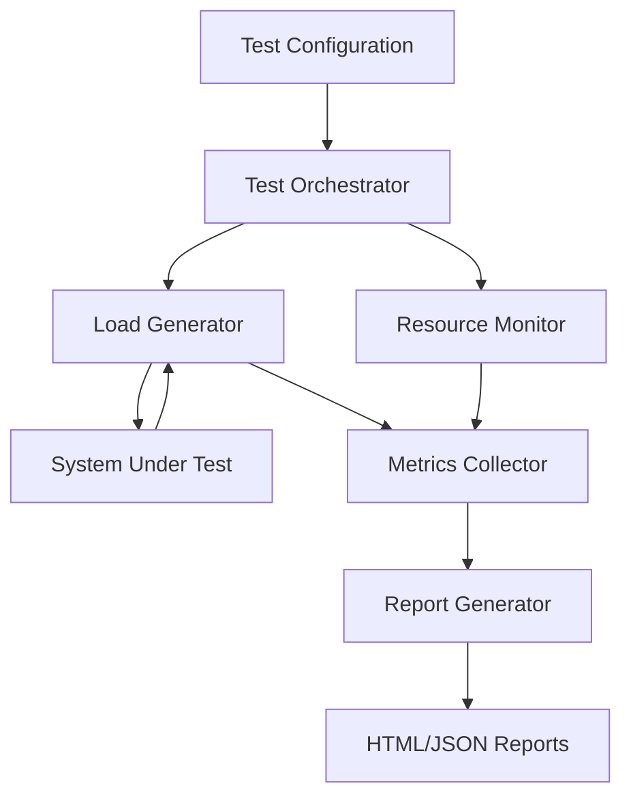

# Design Document: Performance Load Testing Harness

## Overview

The Performance Load Testing Harness is a comprehensive testing framework designed to validate the performance characteristics of the MyMeetings modular monolith application under various load conditions. The harness will enable developers to execute systematic performance tests against REST API endpoints, CQRS command/query handlers, and event-driven workflows across all five modules (Administration, Meetings, Payments, Registrations, UserAccess).

The design follows a modular architecture with clear separation between load generation, metrics collection, resource monitoring, and reporting. The harness integrates with the existing test infrastructure, reusing SUT initialization patterns and database management utilities from the current integration test suite.

Key capabilities include:
- Concurrent load generation with configurable ramp-up strategies
- Real-time metrics collection with millisecond precision
- System resource monitoring (CPU, memory, database connections)
- Baseline comparison for regression detection
- Event-driven workflow testing with end-to-end latency measurement
- Comprehensive HTML and JSON reporting
- CI/CD pipeline integration

The harness will be implemented in C# using .NET's built-in HTTP client infrastructure and will leverage existing testing patterns from the MyMeetings.IntegrationTests project.

## Technology Stack

### Core Framework & Libraries

**HTTP Client**
- **.NET HttpClient**: Built-in HTTP client for executing requests against the SUT
- Supports concurrent requests with async/await patterns
- Connection pooling and timeout management included
- No external dependencies required

**Testing Frameworks**
- **xUnit**: Unit and integration testing framework (already used in the project)
- **FsCheck**: Property-based testing library for .NET
  - Generates random test inputs for comprehensive validation
  - Integrates seamlessly with xUnit
  - Supports custom generators for domain objects
  - Minimum 100 iterations per property test

**Configuration Parsing**
- **System.Text.Json**: Built-in JSON serialization/deserialization
- **YamlDotNet**: YAML parsing for test scenario configuration files
  - Human-readable configuration format
  - Supports complex nested structures

**Metrics & Data Structures**
- **ConcurrentDictionary**: Thread-safe metrics storage during test execution
- **ConcurrentBag**: Thread-safe collection for time-series data
- Built-in .NET collections for efficient in-memory aggregation

**Resource Monitoring**
- **.NET Performance Counters**: CPU and memory utilization tracking
- **Database Connection Pool Metrics**: Leverages existing connection pool monitoring from Entity Framework
- Sampling every 5 seconds with minimal overhead

**Reporting**
- **HTML Generation**: Simple templating with embedded JavaScript for visualizations
- **Chart.js** (or similar): Client-side charting library for time-series graphs
- **JSON Output**: Using System.Text.Json for CI/CD integration

**Testing Infrastructure Integration**
- **IntegrationTestWebAppFactory**: Reuses existing SUT initialization pattern
- **Database Utilities**: Leverages existing setup/teardown scripts
- **Authentication Mechanisms**: Uses existing token generation from integration tests

**Mocking (for unit tests)**
- **WireMock.Net**: HTTP mocking for testing metrics collection without real SUT
- Simulates various response times, status codes, and error conditions

### Rationale

The technology choices prioritize:
- **Minimal external dependencies**: Primarily using built-in .NET capabilities
- **Consistency**: Aligning with existing project patterns (xUnit, integration test infrastructure)
- **Performance**: Efficient concurrent data structures for high-throughput scenarios
- **Maintainability**: Well-established libraries with active communities
- **CI/CD compatibility**: Standard output formats and fast execution times

## Implementation Phases

To manage complexity and deliver value incrementally, the implementation is divided into three phases. Each phase builds on the previous one and delivers a working, testable system.

### Phase 1: Core Load Testing (MVP)

**Goal**: Establish basic load testing capability with essential metrics and validation.

**Components**:
- Test Orchestrator (basic lifecycle management)
- Load Generator with immediate ramp-up only
- Metrics Collector (response times, throughput, error rates)
- JSON report generation
- Core property-based tests (Properties 1, 2, 7, 8, 9, 10, 18, 19, 21, 38, 46, 47)

**Deliverables**:
- Execute load tests with configurable virtual users
- Collect and report basic HTTP metrics (response time percentiles, throughput, error rate)
- Generate JSON reports with test results
- Validate core correctness properties
- CI/CD integration with exit codes

**Success Criteria**:
- Can run a 5-minute load test with 50 virtual users
- Accurately calculates p50, p95, p99 response times
- Reports pass/fail based on success criteria
- Executes in under 15 minutes for CI/CD

**Excluded from Phase 1**:
- HTML reports with graphs
- Resource monitoring (CPU, memory, database connections)
- Baseline comparison
- Advanced ramp-up strategies (linear, step)
- Think time simulation
- Event-driven workflow testing

### Phase 2: Advanced Metrics & Reporting

**Goal**: Add comprehensive monitoring, visualization, and regression detection.

**Components**:
- Resource Monitor (CPU, memory, database connections)
- HTML report generation with time-series graphs
- Baseline Repository and comparison logic
- Advanced ramp-up strategies (linear, step)
- Think time simulation
- Additional property tests (Properties 3, 4, 11, 12, 13, 14, 15, 16, 17, 22-26, 42-45)

**Deliverables**:
- System resource monitoring during tests
- HTML reports with embedded charts and visualizations
- Baseline storage and regression detection
- Configurable ramp-up patterns for realistic load simulation
- Think time for realistic user behavior simulation

**Success Criteria**:
- Resource metrics correlate with load levels
- HTML reports render correctly with graphs
- Baseline comparison detects 20% response time regressions
- Linear ramp-up creates users at expected intervals

**Builds on Phase 1**:
- Extends metrics collection with resource samples
- Adds visualization layer on top of existing JSON data
- Enhances load generation with timing strategies

### Phase 3: Multi-Module & Event-Driven Testing

**Goal**: Support complex workflows across modules with asynchronous event processing validation.

**Components**:
- Multi-module test orchestration
- Event-driven workflow testing (Outbox/Inbox latency tracking)
- Per-module metrics breakdown
- Cross-module workflow sequence execution
- Remaining property tests (Properties 27-37, 48-55)

**Deliverables**:
- Test scenarios spanning multiple modules
- End-to-end latency measurement for event-driven workflows
- Outbox and Inbox processing latency tracking
- Per-module metrics reporting
- Data generation strategies for test payloads

**Success Criteria**:
- Can execute cross-module workflows (e.g., Meeting creation → Payment processing)
- Measures event processing latency from command to final event
- Flags events taking longer than 5 seconds to process
- Reports metrics broken down by module

**Builds on Phase 2**:
- Extends test configuration to support workflow sequences
- Adds event processing hooks to metrics collector
- Enhances reporting with module-level breakdowns

### Phase Guidelines

**Development Approach**:
- Complete each phase fully before moving to the next
- Each phase should pass all its property tests before proceeding
- Maintain backward compatibility (Phase 2 configs should work in Phase 3)
- Document any phase-specific limitations in reports

**Testing Strategy per Phase**:
- Phase 1: Focus on core algorithm correctness (percentiles, throughput, error rates)
- Phase 2: Add resource monitoring and baseline comparison tests
- Phase 3: Add multi-module and event-driven workflow tests

**Deployment Strategy**:
- Phase 1 can be deployed to CI/CD immediately for basic performance validation
- Phase 2 enables performance regression tracking in staging environments
- Phase 3 supports comprehensive end-to-end performance testing

## Architecture

### High-Level Architecture

The Performance Load Testing Harness consists of five primary components:



### Component Responsibilities

**Test Orchestrator**
- Loads and validates test configuration
- Coordinates test execution lifecycle (warmup, ramp-up, steady-state, teardown)
- Manages test timing and phase transitions
- Aggregates results from all components
- Determines pass/fail status based on success criteria

**Load Generator**
- Creates and manages virtual user threads
- Executes HTTP requests according to test scenarios
- Implements ramp-up strategies (linear, step, immediate)
- Manages think time between requests
- Handles request distribution across virtual users

**Metrics Collector**
- Records response times with millisecond precision
- Calculates percentile metrics (p50, p95, p99)
- Tracks throughput in 1-second intervals
- Categorizes HTTP status codes and errors
- Distinguishes warmup vs. actual test metrics
- Stores time-series data for graphing

**Resource Monitor**
- Samples CPU utilization every 5 seconds
- Tracks memory consumption
- Monitors database connection pools per module
- Flags threshold violations
- Correlates resource usage with load levels

**Report Generator**
- Produces HTML reports with embedded graphs
- Generates JSON output for programmatic consumption
- Performs baseline comparison analysis
- Creates time-series visualizations
- Includes regression detection results

### Integration Points

The harness integrates with existing MyMeetings infrastructure:

1. **SUT Initialization**: Reuses `IntegrationTestWebAppFactory` pattern for spinning up the application
2. **Database Management**: Leverages existing database setup/teardown utilities
3. **Authentication**: Uses the same token generation mechanisms as integration tests
4. **Module Structure**: Follows the existing test project organization (one test class per module)

## Components and Interfaces

### Core Interfaces

```csharp
// Test configuration model
public interface ITestConfiguration
{
    string ScenarioName { get; }
    TestEndpoint[] Endpoints { get; }
    LoadParameters LoadParams { get; }
    TimeSpan Duration { get; }
    TimeSpan WarmupPeriod { get; }
    SuccessCriteria Criteria { get; }
    AuthenticationConfig? Authentication { get; }
}

// Load generation
public interface ILoadGenerator
{
    Task<LoadTestResult> ExecuteAsync(
        ITestConfiguration config,
        IMetricsCollector metrics,
        CancellationToken cancellationToken);
}

// Metrics collection
public interface IMetricsCollector
{
    void RecordRequest(RequestMetric metric);
    void RecordResourceSample(ResourceSample sample);
    MetricsSummary GetSummary();
    TimeSeriesData GetTimeSeries();
}

// Resource monitoring
public interface IResourceMonitor
{
    Task StartMonitoringAsync(CancellationToken cancellationToken);
    Task<ResourceSnapshot> GetCurrentSnapshotAsync();
}

// Report generation
public interface IReportGenerator
{
    Task GenerateHtmlReportAsync(TestResult result, string outputPath);
    Task GenerateJsonReportAsync(TestResult result, string outputPath);
}

// Baseline management
public interface IBaselineRepository
{
    Task<BaselineMetrics?> GetBaselineAsync(string scenarioName);
    Task SaveBaselineAsync(string scenarioName, BaselineMetrics metrics);
    Task<ComparisonResult> CompareAsync(string scenarioName, MetricsSummary current);
}
```

### Data Transfer Objects

```csharp
public record TestEndpoint(
    string Url,
    HttpMethod Method,
    string? RequestBody,
    Dictionary<string, string>? Headers);

public record LoadParameters(
    int VirtualUsers,
    RampUpStrategy Strategy,
    TimeSpan RampUpDuration,
    ThinkTime? ThinkTime);

public record RampUpStrategy(
    RampUpType Type,
    int? StepSize = null,
    TimeSpan? StepDuration = null);

public enum RampUpType { Linear, Step, Immediate }

public record ThinkTime(
    TimeSpan MinDelay,
    TimeSpan MaxDelay);

public record SuccessCriteria(
    TimeSpan? MaxResponseTime,
    double? MinThroughput,
    double MaxErrorRate);

public record RequestMetric(
    DateTime Timestamp,
    TimeSpan ResponseTime,
    int StatusCode,
    string Endpoint,
    bool IsWarmup);

public record ResourceSample(
    DateTime Timestamp,
    double CpuPercent,
    long MemoryMB,
    Dictionary<string, int> DbConnections);

public record MetricsSummary(
    int TotalRequests,
    int SuccessfulRequests,
    int FailedRequests,
    double ErrorRate,
    TimeSpan P50ResponseTime,
    TimeSpan P95ResponseTime,
    TimeSpan P99ResponseTime,
    double AverageThroughput,
    Dictionary<int, int> StatusCodeDistribution);
```

### Virtual User Implementation

Each virtual user runs as an independent task that executes requests in a loop:

```csharp
public class VirtualUser
{
    private readonly HttpClient _httpClient;
    private readonly ITestConfiguration _config;
    private readonly IMetricsCollector _metrics;
    private readonly Random _random;

    public async Task ExecuteAsync(CancellationToken cancellationToken)
    {
        while (!cancellationToken.IsCancellationRequested)
        {
            var endpoint = SelectEndpoint();
            var startTime = DateTime.UtcNow;
            
            try
            {
                var response = await _httpClient.SendAsync(
                    CreateRequest(endpoint), 
                    cancellationToken);
                
                var responseTime = DateTime.UtcNow - startTime;
                
                _metrics.RecordRequest(new RequestMetric(
                    startTime,
                    responseTime,
                    (int)response.StatusCode,
                    endpoint.Url,
                    IsWarmupPhase()));
            }
            catch (Exception ex)
            {
                // Record error metric
            }
            
            await ApplyThinkTimeAsync(cancellationToken);
        }
    }
}
```

## Data Models

### Test Configuration Schema

Test scenarios are defined in YAML format:

```yaml
scenarioName: "Meeting Creation Load Test"
endpoints:
  - url: "/api/meetings"
    method: POST
    requestBody: |
      {
        "title": "{{randomString}}",
        "startDate": "{{futureDate}}",
        "endDate": "{{futureDate}}",
        "capacity": {{randomInt:10:100}}
      }
    headers:
      Authorization: "Bearer {{authToken}}"

loadParameters:
  virtualUsers: 50
  rampUpStrategy:
    type: Linear
    duration: "00:00:30"
  thinkTime:
    minDelay: "00:00:01"
    maxDelay: "00:00:03"

duration: "00:05:00"
warmupPeriod: "00:00:30"

successCriteria:
  maxResponseTime: "00:00:02"
  minThroughput: 20.0
  maxErrorRate: 0.05

authentication:
  type: Bearer
  tokenEndpoint: "/api/auth/token"
  credentials:
    username: "testuser"
    password: "testpass"
```

### Metrics Storage Model

Metrics are stored in-memory during test execution using efficient data structures:

```csharp
public class MetricsStore
{
    // Time-series data bucketed by second
    private readonly ConcurrentDictionary<long, SecondBucket> _timeSeries;
    
    // Raw response times for percentile calculation
    private readonly ConcurrentBag<double> _responseTimes;
    
    // Status code counters
    private readonly ConcurrentDictionary<int, int> _statusCodes;
    
    // Resource samples
    private readonly ConcurrentBag<ResourceSample> _resourceSamples;
}

public class SecondBucket
{
    public long EpochSecond { get; init; }
    public int RequestCount { get; set; }
    public int ErrorCount { get; set; }
    public double TotalResponseTime { get; set; }
}
```

### Baseline Storage Model

Baselines are persisted to JSON files in the test project:

```json
{
  "scenarioName": "Meeting Creation Load Test",
  "capturedAt": "2024-01-15T10:30:00Z",
  "metrics": {
    "p50ResponseTime": "00:00:00.150",
    "p95ResponseTime": "00:00:00.450",
    "p99ResponseTime": "00:00:00.850",
    "averageThroughput": 45.2,
    "errorRate": 0.001
  },
  "resourceMetrics": {
    "avgCpuPercent": 35.5,
    "avgMemoryMB": 512,
    "maxDbConnections": 25
  }
}
```

### Report Data Model

The report generator produces structured output:

```csharp
public record TestResult(
    string ScenarioName,
    DateTime StartTime,
    DateTime EndTime,
    TestStatus Status,
    MetricsSummary Metrics,
    ResourceSummary Resources,
    ComparisonResult? BaselineComparison,
    List<TestPhase> Phases,
    List<ErrorDetail> Errors);

public enum TestStatus { Passed, Failed, Error }

public record TestPhase(
    string Name,
    DateTime StartTime,
    DateTime EndTime,
    int RequestCount,
    double Throughput);

public record ErrorDetail(
    DateTime Timestamp,
    string Endpoint,
    int StatusCode,
    string Message);
```


## Correctness Properties

*A property is a characteristic or behavior that should hold true across all valid executions of a system—essentially, a formal statement about what the system should do. Properties serve as the bridge between human-readable specifications and machine-verifiable correctness guarantees.*

### Property Reflection

After analyzing all acceptance criteria, I identified several areas of redundancy:

1. **Load maintenance properties (1.4 and 10.4)**: Both test that steady-state load is maintained after ramp-up. These can be combined into a single comprehensive property.

2. **Configuration structure properties (4.2-4.6, 10.5, 12.2, 14.5)**: Multiple properties test that configuration contains specific fields. These can be consolidated into properties about configuration completeness and validation.

3. **Report content properties (8.2-8.7)**: Multiple properties verify report contains specific sections. These can be combined into fewer comprehensive properties about report completeness.

4. **Resource monitoring properties (3.1-3.3)**: All test that specific resource types are tracked. Can be combined into a single property about resource tracking completeness.

5. **Ramp-up strategy properties (10.1-10.3)**: While these test different strategies, they can be unified under a single property that validates ramp-up behavior matches the configured strategy.

6. **Error categorization and rate calculation (11.1-11.2, 2.4)**: These overlap in testing error tracking. Can be consolidated.

The following properties represent the non-redundant set that provides comprehensive validation coverage.

### Property 1: HTTP Request Execution

*For any* valid test endpoint configuration, the harness should successfully execute HTTP requests and receive responses from the system under test.

**Validates: Requirements 1.1**

### Property 2: Virtual User Creation

*For any* test configuration specifying N virtual users, the load generator should create exactly N virtual user instances.

**Validates: Requirements 1.2**

### Property 3: Ramp-Up Strategy Adherence

*For any* ramp-up strategy configuration (linear, step, or immediate), the actual pattern of virtual user creation over time should match the specified strategy within acceptable tolerance.

**Validates: Requirements 1.3, 10.1, 10.2, 10.3**

### Property 4: Steady-State Load Maintenance

*For any* test configuration, once the ramp-up phase completes, the request throughput should remain stable within 10% variance for the duration of the steady-state phase.

**Validates: Requirements 1.4, 10.4**

### Property 5: Test Duration Accuracy

*For any* configured test duration between 10 seconds and 60 minutes, the actual test execution time should be within 5% of the specified duration.

**Validates: Requirements 1.5**

### Property 6: Report Generation Completeness

*For any* completed test execution, the harness should generate both HTML and JSON reports containing all required sections: summary statistics, time-series data, percentile metrics, resource utilization, and pass/fail status.

**Validates: Requirements 1.6, 8.1, 8.2, 8.3, 8.4, 8.5, 8.6**

### Property 7: Request Metric Recording

*For any* HTTP request executed during a test, a corresponding request metric should be recorded with timestamp, response time, status code, and endpoint information.

**Validates: Requirements 2.1**

### Property 8: Percentile Calculation Accuracy

*For any* set of response time measurements, the calculated p50, p95, and p99 values should match the mathematical definition of percentiles (within floating-point precision).

**Validates: Requirements 2.2**

### Property 9: Throughput Calculation

*For any* test execution, the calculated throughput should equal the total number of requests divided by the test duration (excluding warmup period).

**Validates: Requirements 2.3**

### Property 10: Error Rate and Status Code Tracking

*For any* test execution, the sum of all status code counts should equal the total request count, and the error rate should equal (failed requests / total requests) * 100.

**Validates: Requirements 2.4, 11.1, 11.2**

### Property 11: Metric Timestamp Precision

*For any* recorded metric, the timestamp should have millisecond precision (three decimal places in seconds).

**Validates: Requirements 2.5**

### Property 12: Time-Series Bucketing

*For any* test execution, metrics should be aggregated into 1-second interval buckets, with each bucket containing all requests that occurred within that second.

**Validates: Requirements 2.6**

### Property 13: Warmup Period Separation

*For any* test with a configured warmup period, all metrics recorded during the warmup phase should be flagged as warmup metrics and excluded from final test statistics.

**Validates: Requirements 2.7**

### Property 14: Resource Monitoring Completeness

*For any* test execution with resource monitoring enabled, the resource monitor should track CPU utilization, memory consumption, and database connection counts for all configured modules.

**Validates: Requirements 3.1, 3.2, 3.3**

### Property 15: Resource Sampling Interval

*For any* monitoring period, the time interval between consecutive resource samples should be approximately 5 seconds (±500ms).

**Validates: Requirements 3.4**

### Property 16: Resource Threshold Flagging

*For any* test execution where resource metrics exceed configured thresholds, the test report should contain flags identifying which resources exceeded thresholds and when.

**Validates: Requirements 3.5**

### Property 17: Resource-Load Correlation

*For any* resource sample, it should include a timestamp that allows correlation with the concurrent load level and request metrics.

**Validates: Requirements 3.6**

### Property 18: Configuration Deserialization Round-Trip

*For any* valid test configuration object, serializing it to YAML/JSON and then deserializing should produce an equivalent configuration object.

**Validates: Requirements 4.1**

### Property 19: Configuration Completeness

*For any* successfully loaded test configuration, it should contain all required fields: endpoints with HTTP methods, virtual user count, ramp-up strategy, test duration, warmup period, and success criteria.

**Validates: Requirements 4.2, 4.3, 4.4, 4.5, 10.5**

### Property 20: Authentication Configuration Presence

*For any* test configuration targeting authenticated endpoints, the configuration should include authentication credentials or token information.

**Validates: Requirements 4.6**

### Property 21: Configuration Validation

*For any* invalid test configuration (missing required fields, negative durations, invalid URLs), the validation process should fail and prevent test execution.

**Validates: Requirements 4.7**

### Property 22: Baseline Persistence Round-Trip

*For any* baseline metrics object, saving it to storage and then retrieving it should produce an equivalent baseline metrics object.

**Validates: Requirements 5.1**

### Property 23: Baseline Comparison Execution

*For any* test execution where a baseline exists for the scenario, the test result should include a comparison result object.

**Validates: Requirements 5.2, 5.5**

### Property 24: Response Time Regression Detection

*For any* test where the p95 response time exceeds the baseline p95 by more than 20%, the comparison result should flag a response time regression.

**Validates: Requirements 5.3**

### Property 25: Throughput Regression Detection

*For any* test where the average throughput falls below the baseline throughput by more than 15%, the comparison result should flag a throughput regression.

**Validates: Requirements 5.4**

### Property 26: Baseline Update Capability

*For any* test scenario, the harness should support saving the current test results as the new baseline metrics.

**Validates: Requirements 5.6**

### Property 27: Multi-Module Endpoint Support

*For any* endpoint from the Administration, Meetings, Payments, Registrations, or UserAccess modules, the harness should be able to execute requests against that endpoint.

**Validates: Requirements 6.1**

### Property 28: Module Specification in Configuration

*For any* test configuration, it should specify which modules are included in the test scope.

**Validates: Requirements 6.2**

### Property 29: Per-Module Metrics Reporting

*For any* test involving multiple modules, the metrics summary should include breakdowns by module showing request counts, response times, and error rates per module.

**Validates: Requirements 6.3**

### Property 30: Per-Module Database Connection Tracking

*For any* test execution, database connection counts should be tracked separately for each module's database.

**Validates: Requirements 6.4**

### Property 31: Cross-Module Workflow Sequence Definition

*For any* test configuration defining a cross-module workflow, the configuration should specify the complete sequence of operations across modules.

**Validates: Requirements 6.5**

### Property 32: End-to-End Event Latency Measurement

*For any* event-driven workflow test, the harness should measure and record the time from command execution to final event processing completion.

**Validates: Requirements 7.1**

### Property 33: Outbox Processing Latency Tracking

*For any* test involving the outbox pattern, the metrics should include outbox processing latency measurements.

**Validates: Requirements 7.2**

### Property 34: Inbox Processing Latency Tracking

*For any* test involving the inbox pattern, the metrics should include inbox processing latency measurements.

**Validates: Requirements 7.3**

### Property 35: Event Processing Timeframe Verification

*For any* integration event in an event-driven test, the harness should verify that processing completes within the expected timeframe.

**Validates: Requirements 7.4**

### Property 36: Event Processing Delay Flagging

*For any* event that takes longer than 5 seconds to process, the test report should include a flag indicating the delay with timestamp and event details.

**Validates: Requirements 7.5**

### Property 37: Baseline Comparison in Report

*For any* test execution with baseline comparison enabled, the test report should include regression analysis showing differences between current and baseline metrics.

**Validates: Requirements 8.7**

### Property 38: Success Criteria Evaluation

*For any* test with defined success criteria, the test status should be "passed" if all criteria are met and "failed" if any criterion is violated.

**Validates: Requirements 8.6**

### Property 39: Error Detail Inclusion

*For any* test execution with errors, the test report should include detailed error information with timestamps, endpoints, status codes, and error messages.

**Validates: Requirements 11.4**

### Property 40: Error Rate Test Failure

*For any* test where the error rate exceeds 5%, the test status should be marked as failed.

**Validates: Requirements 11.3**

### Property 41: High Error Rate Test Termination

*For any* test where the error rate exceeds 50%, test execution should terminate early rather than continuing to completion.

**Validates: Requirements 11.5**

### Property 42: Think Time Application

*For any* virtual user with think time configured, the time between consecutive requests from that user should include a delay within the configured min/max range.

**Validates: Requirements 12.1, 12.3**

### Property 43: Think Time Exclusion from Response Time

*For any* request executed with think time, the recorded response time should measure only the HTTP request/response duration, excluding the think time delay.

**Validates: Requirements 12.4**

### Property 44: Think Time Configuration

*For any* test configuration with think time enabled, it should specify both minimum and maximum think time values in milliseconds.

**Validates: Requirements 12.2**

### Property 45: Think Time Disablement

*For any* test configuration with think time disabled, virtual users should execute requests continuously without artificial delays between requests.

**Validates: Requirements 12.5**

### Property 46: Exit Code for Passed Tests

*For any* test execution where all tests pass their success criteria, the harness should return exit code 0.

**Validates: Requirements 13.1**

### Property 47: Exit Code for Failed Tests

*For any* test execution where one or more tests fail their success criteria, the harness should return a non-zero exit code.

**Validates: Requirements 13.2**

### Property 48: CI/CD Output Format

*For any* test execution in CI/CD mode, the output should be valid JSON that can be parsed by standard CI/CD reporting tools.

**Validates: Requirements 13.3**

### Property 49: Test Subset Execution

*For any* command-line invocation specifying a subset of test scenarios, only the specified scenarios should execute.

**Validates: Requirements 13.4**

### Property 50: CI/CD Execution Time Limit

*For any* test suite configured for CI/CD execution, the total execution time should not exceed 15 minutes.

**Validates: Requirements 13.5**

### Property 51: Parameterized Payload Variable Replacement

*For any* request payload template containing variable placeholders, the actual request should have all placeholders replaced with generated values.

**Validates: Requirements 14.1**

### Property 52: Unique Identifier Generation

*For any* test execution requiring unique identifiers, all generated identifiers should be unique across all requests in the test.

**Validates: Requirements 14.2**

### Property 53: Setup Script Execution Order

*For any* test with configured setup scripts, the setup scripts should execute to completion before any test requests are sent.

**Validates: Requirements 14.3**

### Property 54: Cleanup Script Execution Order

*For any* test with configured cleanup scripts, the cleanup scripts should execute after all test requests complete, regardless of test success or failure.

**Validates: Requirements 14.4**

### Property 55: Data Generation Strategy Specification

*For any* test configuration requiring data generation, it should specify the generation strategy (sequential, random, or from file).

**Validates: Requirements 14.5**


## Error Handling

The Performance Load Testing Harness must handle errors gracefully at multiple levels to ensure reliable test execution and accurate reporting.

### Configuration Errors

**Validation Failures**: When test configuration is invalid (missing required fields, malformed URLs, negative durations), the harness should:
- Fail fast before any test execution begins
- Provide clear error messages indicating which fields are invalid
- Return exit code 2 to distinguish configuration errors from test failures
- Log the full configuration and validation errors for debugging

**File Loading Errors**: When configuration files cannot be read:
- Report the file path and specific I/O error
- Suggest common fixes (file permissions, path typos)
- Exit with code 2

### Runtime Errors

**HTTP Request Failures**: When individual requests fail:
- Record the failure in metrics with status code and error message
- Continue test execution (unless error rate exceeds 50%)
- Include error details in the test report
- Categorize errors by type (network timeout, connection refused, DNS failure)

**Virtual User Crashes**: When a virtual user thread encounters an unhandled exception:
- Log the exception with stack trace
- Mark the virtual user as failed
- Continue other virtual users
- Include crash information in test report
- If more than 25% of virtual users crash, terminate the test

**Resource Monitoring Failures**: When resource monitoring encounters errors:
- Log the monitoring error
- Continue test execution with partial metrics
- Flag in the report that resource monitoring was incomplete
- Do not fail the entire test due to monitoring issues

**Event Processing Timeout**: When event-driven workflows don't complete:
- Record the timeout in metrics
- Flag the specific event that timed out
- Continue test execution
- Include timeout details in error section of report

### System Under Test Errors

**SUT Startup Failures**: When the system under test fails to start:
- Capture startup logs and error messages
- Fail immediately with clear error message
- Return exit code 3 to distinguish from test failures
- Provide diagnostic information about the failure

**Database Connection Failures**: When database connections fail:
- Retry up to 3 times with exponential backoff
- If retries exhausted, fail the test
- Include connection error details in report
- Suggest checking database availability and connection strings

### Report Generation Errors

**Report Writing Failures**: When report files cannot be written:
- Log the I/O error
- Attempt to write to an alternative location (temp directory)
- Still return appropriate exit code based on test results
- Output summary to console even if file writing fails

**Graph Generation Failures**: When HTML report graphs fail to render:
- Generate the report without graphs
- Include a note about missing visualizations
- Ensure JSON report is still complete
- Log the graph generation error

### Error Recovery Strategies

**Graceful Degradation**: The harness should continue operating with reduced functionality when non-critical components fail:
- Tests can run without resource monitoring
- Reports can be generated without graphs
- Baseline comparison can be skipped if baseline is unavailable

**Cleanup Guarantees**: Even when errors occur:
- Cleanup scripts should always execute (using try-finally patterns)
- Database connections should be properly closed
- Temporary files should be deleted
- SUT should be shut down cleanly

**Error Aggregation**: Multiple errors during a test should be:
- Collected and reported together
- Categorized by type and severity
- Included in both console output and report files
- Used to determine overall test status

### Exit Codes

The harness uses specific exit codes to communicate results:
- **0**: All tests passed
- **1**: One or more tests failed (did not meet success criteria)
- **2**: Configuration error (invalid config, missing files)
- **3**: System error (SUT failed to start, critical infrastructure failure)
- **4**: Execution error (>50% error rate, >25% virtual user crashes)

## Testing Strategy

The Performance Load Testing Harness will be validated using a dual testing approach combining unit tests for specific scenarios and property-based tests for universal correctness properties.

### Testing Framework Selection

**Unit Testing**: xUnit (already used in MyMeetings.IntegrationTests)

**Property-Based Testing**: FsCheck for .NET
- Mature library with good C# interop
- Supports custom generators for domain objects
- Integrates with xUnit
- Minimum 100 iterations per property test

### Unit Testing Approach

Unit tests will focus on:

**Specific Examples**:
- Test with a known configuration and verify expected behavior
- Example: "Given 10 virtual users with linear ramp-up over 30 seconds, verify users are created at ~3 second intervals"

**Edge Cases**:
- Minimum test duration (10 seconds)
- Maximum test duration (60 minutes)
- Zero think time
- Single virtual user
- Empty response bodies
- All requests failing (100% error rate)

**Integration Points**:
- SUT initialization and shutdown
- Database setup and teardown
- Authentication token generation
- Report file writing

**Error Conditions**:
- Invalid configuration files
- Unreachable endpoints
- Database connection failures
- Disk full when writing reports

Unit tests should be concise and focused. Avoid writing many similar unit tests—property-based tests handle comprehensive input coverage.

### Property-Based Testing Approach

Each correctness property from the design document will be implemented as a property-based test. Property tests will:

**Generate Random Inputs**:
- Test configurations with varying parameters
- Random endpoint URLs and payloads
- Random virtual user counts (1-1000)
- Random durations (10s-3600s)
- Random response times and status codes

**Verify Universal Properties**:
- Properties that must hold for ALL valid inputs
- Example: "For any test configuration, throughput = requests / duration"

**Tag with Property Reference**:
Each property test must include a comment tag:
```csharp
// Feature: performance-load-testing-harness, Property 9: Throughput Calculation
[Property(MaxTest = 100)]
public Property ThroughputEqualsRequestsPerSecond()
{
    return Prop.ForAll(
        GenerateTestExecution(),
        execution => {
            var expectedThroughput = execution.TotalRequests / execution.Duration.TotalSeconds;
            return Math.Abs(execution.CalculatedThroughput - expectedThroughput) < 0.01;
        });
}
```

**Custom Generators**:
Property tests will require custom generators for domain objects:
- `Gen<TestConfiguration>`: Generates valid test configurations
- `Gen<RampUpStrategy>`: Generates ramp-up strategies
- `Gen<RequestMetric>`: Generates request metrics
- `Gen<ResourceSample>`: Generates resource samples

### Test Organization

Tests will be organized by component:

```
MyMeetings.PerformanceTests/
├── Unit/
│   ├── LoadGeneratorTests.cs
│   ├── MetricsCollectorTests.cs
│   ├── ResourceMonitorTests.cs
│   ├── ReportGeneratorTests.cs
│   └── ConfigurationTests.cs
├── Properties/
│   ├── LoadGenerationProperties.cs
│   ├── MetricsProperties.cs
│   ├── ResourceMonitoringProperties.cs
│   ├── BaselineComparisonProperties.cs
│   └── ReportingProperties.cs
├── Generators/
│   ├── TestConfigurationGenerator.cs
│   ├── MetricsGenerator.cs
│   └── ResourceSampleGenerator.cs
└── Integration/
    ├── EndToEndLoadTestTests.cs
    └── EventDrivenWorkflowTests.cs
```

### Property Test Configuration

All property tests must be configured with:
- **Minimum 100 iterations**: `[Property(MaxTest = 100)]`
- **Timeout**: 30 seconds per property test
- **Shrinking enabled**: FsCheck should shrink failing inputs to minimal examples
- **Seed logging**: Log the random seed for reproducibility

### Test Data Management

**Test Databases**: Each test should use an isolated database instance
- Use Docker containers for database isolation
- Clean up after each test
- Seed with minimal required data

**Mock HTTP Responses**: For testing metrics collection without a real SUT
- Use WireMock.Net or similar for HTTP mocking
- Configure response times and status codes
- Simulate various error conditions

**Baseline Test Data**: Store baseline files in test resources
- Include sample baselines for common scenarios
- Test baseline comparison logic with known data
- Verify regression detection thresholds

### Coverage Goals

**Unit Test Coverage**:
- 80% code coverage minimum
- 100% coverage of error handling paths
- All public API methods tested

**Property Test Coverage**:
- One property test per correctness property (55 properties)
- All core algorithms validated (percentile calculation, throughput calculation, error rate)
- All configuration validation rules tested

### Continuous Integration

**CI Pipeline Tests**:
- Run all unit tests on every commit
- Run property tests on every commit
- Run integration tests nightly
- Fail build if any test fails

**Performance Regression Testing**:
- Run performance tests against staging environment weekly
- Compare results to baselines
- Alert team if regressions detected
- Update baselines when intentional changes occur

### Test Execution Time

**Target Execution Times**:
- Unit tests: < 2 minutes total
- Property tests: < 5 minutes total
- Integration tests: < 10 minutes total
- Full suite: < 15 minutes (CI/CD requirement)

**Optimization Strategies**:
- Run tests in parallel where possible
- Use fast in-memory databases for unit tests
- Mock external dependencies
- Keep test durations short (use 10-30 second test durations in tests)

