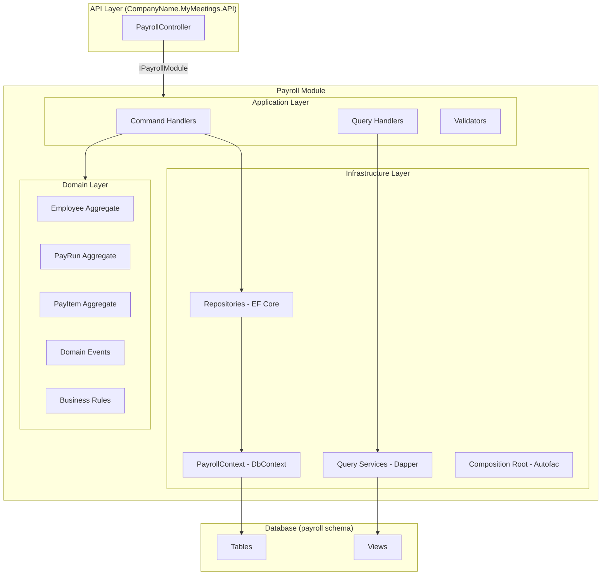
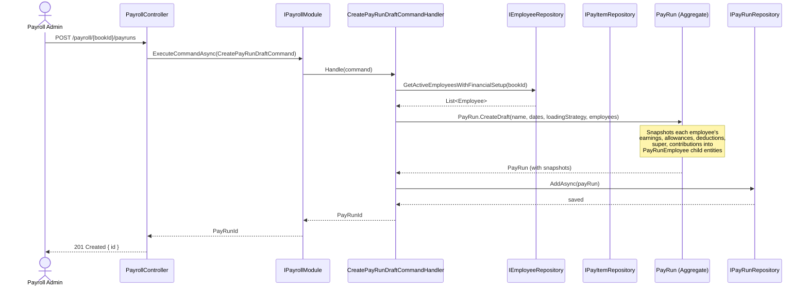
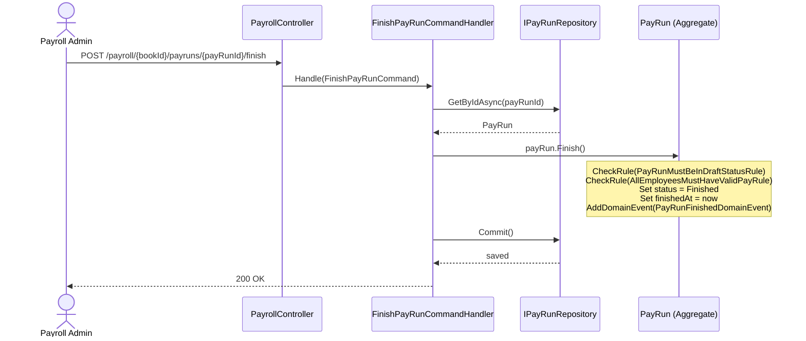
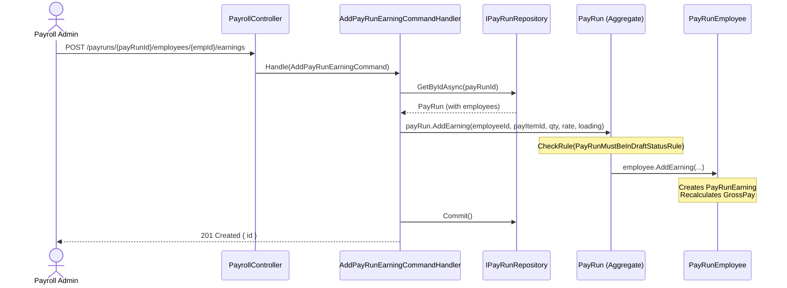

# Design: Payroll Pay Run Module (Phase 1)

## Overview

The Payroll module is a new module in the DDD modular monolith that manages employee master profiles, a pay item catalogue, and the full pay run lifecycle. It follows Clean Architecture (Domain → Application → Infrastructure) with strict CQRS separation. The module uses three aggregates — `Employee`, `PayItem`, and `PayRun` — where `PayRun` snapshots employee financial data at creation time. All data is scoped by `BookId` for multi-tenancy. The database schema is `payroll`.

## Architecture



## Components

### Employee Aggregate

- **Responsibility**: Manages the master employee profile — personal info, employment details, financial setup (master pay items), leave configuration, and tax details. This is the "source of truth" for employee data that gets snapshotted into pay runs.
- **Interface**: Commands to create/update employee and sub-resources; queries return flat DTOs via views.
- **Technology**: EF Core for persistence, strongly-typed IDs (`EmployeeId`).
- **Key Behavior**: When financial setup or base rate changes, raises `EmployeeFinancialSetupChangedDomainEvent`. Does NOT retroactively update existing pay runs.

### PayRun Aggregate

- **Responsibility**: Manages the pay cycle lifecycle (Draft → Finished) and owns snapshots of employee pay data (earnings, allowances, deductions, reimbursements, super, company contributions, tax overrides, leave accruals). All pay item mutations happen on the snapshot, not the master.
- **Interface**: Commands for lifecycle (create, finish, undo, delete) and pay item CRUD per employee. Queries return pay run summaries and employee pay details.
- **Technology**: EF Core for persistence, strongly-typed IDs (`PayRunId`, `PayRunEmployeeId`).
- **Key Behavior**: On creation, snapshots employee financial data from master profile. Enforces Draft-only edits via `PayRunMustBeInDraftStatusRule`. State transitions raise domain events (`PayRunFinishedDomainEvent`, `PayRunUndoneDomainEvent`).

### PayItem Aggregate

- **Responsibility**: The catalogue of available pay item types — earnings (Ordinary Hours, Overtime 1.5x, etc.), allowances, deductions, leave types, super types, company contribution types. Referenced by both Employee (master setup) and PayRun (snapshots).
- **Interface**: CRUD for managing the catalogue. Read-heavy — most operations are queries.
- **Technology**: EF Core for persistence, strongly-typed ID (`PayItemId`).
- **Key Behavior**: PayItems are book-scoped. Deleting a pay item that is in use by employees or active pay runs is rejected via `PayItemInUseCannotBeDeletedRule`.

### Payroll Module Interface

- **Responsibility**: Entry point for the API layer. Implements `IPayrollModule` with `ExecuteCommandAsync` and `ExecuteQueryAsync`.
- **Interface**: Same pattern as `IMeetingsModule`.
- **Technology**: Autofac composition root, MediatR for dispatching.

## Data Models

### Employee (Write Model)

| Field | Type | Required | Description |
|-------|------|----------|-------------|
| Id | EmployeeId (Guid) | Yes | Strongly-typed ID |
| BookId | BookId (Guid) | Yes | Multi-tenancy scope |
| EmployeeNumber | string | No | User-assigned employee number |
| FirstName | string | Yes | Legal first name |
| LastName | string | Yes | Legal last name |
| Email | string | No | Contact email |
| DateOfBirth | DateTime? | No | Date of birth |
| Gender | Gender (enum) | No | Male, Female, Other |
| MaritalStatus | MaritalStatus (enum) | No | Single, Married, etc. |
| IsDisabled | bool | No | Disability flag |
| Status | EmployeeStatus (enum) | Yes | Active, Terminated, Archived |
| CreatedAt | DateTime | Yes | Creation timestamp |

**Child Entity: EmployeeEmergencyContact**

| Field | Type | Required | Description |
|-------|------|----------|-------------|
| Id | Guid | Yes | PK |
| Name | string | Yes | Contact name |
| Phone | string | Yes | Contact phone |
| Relationship | string | No | Relationship to employee |

### EmployeeEmployment (Child Entity of Employee)

| Field | Type | Required | Description |
|-------|------|----------|-------------|
| Id | Guid | Yes | PK |
| JobTitle | string | No | Job title |
| JobDescription | string | No | Job description |
| ManagerId | EmployeeId? | No | Reporting manager |
| EmploymentType | EmploymentType (enum) | No | Full-time, Part-time, Casual, etc. (1-8) |
| PayFrequency | PayFrequency (enum) | No | Weekly, Fortnightly, Monthly (1-3) |
| WeeklyHours | decimal? | No | Standard weekly hours |
| PayScheduleId | Guid? | No | Linked pay schedule |
| BaseRateAmount | decimal? | No | Base pay rate |
| BaseRateType | PayRateBasisType (enum) | No | Hourly, Annual, etc. |
| AwardId | Guid? | No | Modern Award reference |
| AwardClassificationId | Guid? | No | Award classification |
| AgreementId | Guid? | No | Enterprise Agreement reference |
| AgreementClassificationId | Guid? | No | Agreement classification |
| PayTemplateId | Guid? | No | Applied pay template |

**Child Entity: EmployeeImportantDate**

| Field | Type | Required | Description |
|-------|------|----------|-------------|
| Id | Guid | Yes | PK |
| HireDate | DateTimeOffset? | No | Hire date |
| LongServiceDate | DateTimeOffset? | No | Long service start |
| TerminationDate | DateTimeOffset? | No | Termination date |
| TerminationReasonType | int? | No | Reason code |
| TerminationReasonCode | string | No | STP reason code |
| IsDeceased | bool | No | Deceased flag |
| IsTerminationPaid | bool | No | Termination paid flag |
| Comment | string | No | Free-text comment |
| Order | int | Yes | Sort order |

### EmployeeFinancialSetup (Child Entity of Employee)

Contains collections of master pay items that get snapshotted into pay runs.

**EmployeeEarning**

| Field | Type | Required | Description |
|-------|------|----------|-------------|
| Id | Guid | Yes | PK |
| PayItemId | PayItemId | Yes | Reference to PayItem catalogue |
| Quantity | decimal? | No | Default quantity |
| Rate | decimal? | No | Default rate |
| RateBasis | PayRateBasisType? | No | Hourly, Annual, etc. |
| IsBaseRate | bool | No | Is this the base rate earning |
| Multiplier | decimal? | No | Loading multiplier (e.g., 1.5x) |
| CustomerId | Guid? | No | Customer allocation |
| ProjectId | Guid? | No | Project allocation |

**EmployeeAllowance**

| Field | Type | Required | Description |
|-------|------|----------|-------------|
| Id | Guid | Yes | PK |
| PayItemId | PayItemId | Yes | Reference to PayItem catalogue |
| Quantity | decimal? | No | Default quantity |
| Rate | decimal? | No | Default rate |
| CalculationBasis | CalculationBasis? | No | How calculated |
| Limit | decimal? | No | Limit cap |
| CustomerId | Guid? | No | Customer allocation |
| ProjectId | Guid? | No | Project allocation |

**EmployeeDeduction**

| Field | Type | Required | Description |
|-------|------|----------|-------------|
| Id | Guid | Yes | PK |
| PayItemId | PayItemId | Yes | Reference to PayItem catalogue |
| Quantity | decimal? | No | Default quantity |
| Rate | decimal? | No | Default rate |
| RateType | RateType? | No | Fixed, Percentage |
| CalculationBasis | CalculationBasis? | No | On gross or net |
| Limit | decimal? | No | Limit cap |
| PayeeId | Guid? | No | Payee (e.g., union, insurer) |

**EmployeeSuperAccount**

| Field | Type | Required | Description |
|-------|------|----------|-------------|
| Id | Guid | Yes | PK |
| PayItemId | PayItemId | Yes | Reference to PayItem catalogue |
| Rate | decimal? | No | Contribution rate |
| RateType | RateType? | No | Fixed, Percentage |
| SuperFundId | Guid? | No | Super fund reference |
| FundProductId | Guid? | No | Fund product |
| Reference | string | No | Member reference |
| IsStatutoryRate | bool | No | Using SG rate |
| JoinDate | DateTime? | No | Fund join date |
| Minimum | decimal? | No | Minimum contribution |
| Limit | decimal? | No | Limit cap |

**EmployeeCompanyContribution**

| Field | Type | Required | Description |
|-------|------|----------|-------------|
| Id | Guid | Yes | PK |
| PayItemId | PayItemId | Yes | Reference to PayItem catalogue |
| Quantity | decimal? | No | Default quantity |
| Rate | decimal? | No | Default rate |
| CalculationBasis | CalculationBasis? | No | How calculated |
| Limit | decimal? | No | Limit cap |
| PayeeId | Guid? | No | Payee |

### EmployeeLeaveItem (Child Entity of Employee)

| Field | Type | Required | Description |
|-------|------|----------|-------------|
| Id | Guid | Yes | PK |
| PayItemId | PayItemId | Yes | Reference to leave PayItem |
| AnnualEntitlement | decimal? | No | Annual entitlement hours |
| AccumulationRate | decimal? | No | Accrual rate per period |
| LeaveStartDate | DateTime? | No | Accrual start date |
| AccrualPeriod | AccrualPeriod (enum) | No | Per pay, monthly, yearly |
| Maximum | decimal? | No | Maximum balance cap |
| Loading | decimal? | No | Leave loading percentage |
| IsPayOnTermination | bool | No | Include in termination payout |

### EmployeeTax (Child Entity of Employee)

| Field | Type | Required | Description |
|-------|------|----------|-------------|
| Id | Guid | Yes | PK |
| TaxFileNumber | string | No | Stored encrypted, displayed masked |
| TaxScaleId | Guid? | No | Tax scale reference |
| IsResident | ResidencyType (enum) | Yes | Resident, Non-Resident, Working Holiday |
| IsHelp | bool | No | HELP/HECS debt flag |
| VoluntaryFlatRate | decimal? | No | Voluntary additional rate |
| TaxOffset | decimal? | No | Tax offset claim |
| Amount | decimal? | No | Withholding variation amount |
| AmountType | int? | No | Variation type |
| StateId | Guid? | No | State for payroll tax |
| IncomeStreamCodeId | Guid? | No | STP income stream |
| HomeCountryCode | string | No | Required if non-resident |
| IsMedicareLevyAdjustmentClaimed | bool | No | Medicare adjustment |
| ChildrenNumber | int? | No | Dependents for medicare |
| MedicareRateId | Guid? | No | Medicare rate reference |
| IsStatutoryRate | bool | No | Using statutory rate |

### PayItem (Write Model)

| Field | Type | Required | Description |
|-------|------|----------|-------------|
| Id | PayItemId (Guid) | Yes | Strongly-typed ID |
| BookId | BookId (Guid) | Yes | Multi-tenancy scope |
| Name | string | Yes | Display name (e.g., "Ordinary Hours") |
| Category | PayItemCategory (enum) | Yes | Earning, Allowance, Deduction, Leave, Super, CompanyContribution |
| SubCategory | string | No | Further classification |
| IsActive | bool | Yes | Soft-delete/disable |
| AccountId | Guid? | No | Linked GL account |
| CreatedAt | DateTime | Yes | Creation timestamp |

### PayRun (Write Model)

| Field | Type | Required | Description |
|-------|------|----------|-------------|
| Id | PayRunId (Guid) | Yes | Strongly-typed ID |
| BookId | BookId (Guid) | Yes | Multi-tenancy scope |
| Name | string | Yes | Pay run name |
| Status | PayRunStatus (enum) | Yes | Draft, Finished |
| PayPeriodStartDate | DateTime | Yes | Period start |
| PayPeriodEndDate | DateTime | Yes | Period end |
| PaymentDate | DateTime | Yes | Payment date |
| LoadingStrategy | LoadingStrategy (enum) | Yes | CopyFromMaster, CopyFromPreviousPay, CopyFromCustomData, TimeEntry |
| CreatedAt | DateTime | Yes | Creation timestamp |
| FinishedAt | DateTime? | No | When finished |

**Child Entity: PayRunEmployee** (Snapshot of employee in this pay run)

| Field | Type | Required | Description |
|-------|------|----------|-------------|
| Id | PayRunEmployeeId (Guid) | Yes | Strongly-typed ID |
| EmployeeId | EmployeeId | Yes | Reference to master employee |
| IsArchivable | bool | No | Archival flag |
| ReportingClassification | string | No | STP reporting classification |
| PayFrequency | PayFrequency? | No | Override for this pay run |
| GrossPay | decimal | Yes | Calculated gross (default 0) |
| NetPay | decimal | Yes | Calculated net (default 0) |
| TotalTax | decimal | Yes | Calculated tax (default 0) |
| TotalSuper | decimal | Yes | Calculated super (default 0) |

**Child Entities of PayRunEmployee** (all snapshot pay items):

**PayRunEarning**

| Field | Type | Required | Description |
|-------|------|----------|-------------|
| Id | Guid | Yes | PK |
| PayItemId | PayItemId | Yes | Source pay item |
| Quantity | decimal? | No | Hours/units |
| Rate | decimal? | No | Rate per unit |
| Loading | decimal? | No | Loading percentage |
| Amount | decimal | Yes | Calculated amount |

**PayRunAllowance**

| Field | Type | Required | Description |
|-------|------|----------|-------------|
| Id | Guid | Yes | PK |
| PayItemId | PayItemId | Yes | Source pay item |
| Quantity | decimal? | No | Units |
| Rate | decimal? | No | Rate per unit |
| Amount | decimal | Yes | Calculated amount |

**PayRunDeduction**

| Field | Type | Required | Description |
|-------|------|----------|-------------|
| Id | Guid | Yes | PK |
| PayItemId | PayItemId | Yes | Source pay item |
| Quantity | decimal? | No | Units |
| Rate | decimal? | No | Rate per unit |
| Amount | decimal | Yes | Calculated amount |
| PayeeId | Guid? | No | Payee reference |

**PayRunReimbursement**

| Field | Type | Required | Description |
|-------|------|----------|-------------|
| Id | Guid | Yes | PK |
| PayItemId | PayItemId | Yes | Source pay item |
| Quantity | decimal? | No | Units |
| Rate | decimal? | No | Rate per unit |
| Amount | decimal | Yes | Calculated amount |
| IsTaxable | bool | No | Subject to tax |

**PayRunSuper**

| Field | Type | Required | Description |
|-------|------|----------|-------------|
| Id | Guid | Yes | PK |
| PayItemId | PayItemId | Yes | Source pay item |
| Rate | decimal? | No | Contribution rate |
| RateType | RateType? | No | Fixed, Percentage |
| Amount | decimal | Yes | Calculated amount |
| CompanySuperFundId | Guid? | No | Fund reference |

**PayRunCompanyContribution**

| Field | Type | Required | Description |
|-------|------|----------|-------------|
| Id | Guid | Yes | PK |
| PayItemId | PayItemId | Yes | Source pay item |
| Quantity | decimal? | No | Units |
| Rate | decimal? | No | Rate per unit |
| Amount | decimal | Yes | Calculated amount |

**PayRunTaxOverride** (Gross Earnings)

| Field | Type | Required | Description |
|-------|------|----------|-------------|
| Id | Guid | Yes | PK |
| OverrideAmount | decimal | Yes | Overridden tax amount |

**PayRunTerminationTax** (ETP)

| Field | Type | Required | Description |
|-------|------|----------|-------------|
| Id | Guid | Yes | PK |
| TaxableComponent | decimal | Yes | Taxable portion |
| TaxFreeComponent | decimal | Yes | Tax-free portion |
| EtpCode | string | Yes | ETP type code (R, O, S, P, D, B, N, T) |

**PayRunLeaveSummary** (Snapshot per leave type)

| Field | Type | Required | Description |
|-------|------|----------|-------------|
| Id | Guid | Yes | PK |
| PayItemId | PayItemId | Yes | Leave pay item |
| OpeningBalance | decimal | Yes | Balance at pay run start |
| AccruedThisPay | decimal | Yes | Accrued this period |
| TakenThisPay | decimal | Yes | Used this period |
| ClosingBalance | decimal | Yes | Calculated closing balance |
| IsAccrualOverridden | bool | No | Manual override flag |

## API Contracts

### Pay Run Endpoints

#### List Pay Runs

- **Method**: GET
- **Path**: `/payroll/{bookId}/payruns?page={page}&pageSize={pageSize}`
- **Request**: Query parameters: `page` (int, default 1), `pageSize` (int, default 20)
- **Response**:
```json
{
  "items": [
    {
      "id": "guid",
      "name": "string",
      "status": "Draft|Finished",
      "payPeriodStartDate": "date",
      "payPeriodEndDate": "date",
      "paymentDate": "date",
      "employeeCount": 0,
      "totalGross": 0.00,
      "totalNet": 0.00
    }
  ],
  "page": 1,
  "pageSize": 20,
  "totalCount": 0
}
```
- **Errors**: 400 (invalid BookId), 403 (unauthorized)

#### Create Pay Run Draft

- **Method**: POST
- **Path**: `/payroll/{bookId}/payruns`
- **Request**:
```json
{
  "name": "string",
  "payPeriodStartDate": "date",
  "payPeriodEndDate": "date",
  "paymentDate": "date",
  "loadingStrategy": "CopyFromMaster|CopyFromPreviousPay|CopyFromCustomData|TimeEntry"
}
```
- **Response**: `201 Created` with `{ "id": "guid" }`
- **Errors**: 400 (validation), 422 (overlapping periods)

#### Get Pay Run with Employee Details

- **Method**: GET
- **Path**: `/payroll/{bookId}/payruns/{payRunId}`
- **Response**:
```json
{
  "id": "guid",
  "name": "string",
  "status": "Draft",
  "payPeriodStartDate": "date",
  "payPeriodEndDate": "date",
  "paymentDate": "date",
  "employees": [
    {
      "payRunEmployeeId": "guid",
      "employeeId": "guid",
      "employeeName": "string",
      "grossPay": 0.00,
      "netPay": 0.00,
      "totalTax": 0.00,
      "totalSuper": 0.00
    }
  ]
}
```

#### Update Pay Run

- **Method**: PUT
- **Path**: `/payroll/{bookId}/payruns/{payRunId}`
- **Request**:
```json
{
  "name": "string",
  "payPeriodStartDate": "date",
  "payPeriodEndDate": "date",
  "paymentDate": "date"
}
```
- **Response**: `200 OK`
- **Errors**: 400, 409 (not in Draft status)

#### Finish Pay Run

- **Method**: POST
- **Path**: `/payroll/{bookId}/payruns/{payRunId}/finish`
- **Request**: Empty body
- **Response**: `200 OK`
- **Errors**: 409 (not in Draft), 422 (validation errors — e.g., employees with $0 pay)

#### Undo Pay Run

- **Method**: POST
- **Path**: `/payroll/{bookId}/payruns/{payRunId}/undo`
- **Request**: `{ "paymentDate": "date" }` (optional new payment date)
- **Response**: `200 OK`
- **Errors**: 409 (not in Finished status)

#### Delete Pay Run

- **Method**: DELETE
- **Path**: `/payroll/{bookId}/payruns/{payRunId}`
- **Response**: `204 No Content`
- **Errors**: 409 (not in Draft status)

### Employee Pay Item Endpoints (Pattern for all pay item types)

All employee pay item endpoints follow the same pattern. Shown for Earnings; same structure applies to Allowances, Deductions, Reimbursements, Super, and Company Contributions.

#### Create Earning

- **Method**: POST
- **Path**: `/payroll/{bookId}/payruns/{payRunId}/employees/{employeeId}/earnings`
- **Request**:
```json
{
  "payItemId": "guid",
  "quantity": 38.0,
  "rate": 45.50,
  "loading": null
}
```
- **Response**: `201 Created` with `{ "id": "guid" }`
- **Errors**: 409 (pay run not Draft), 404 (employee not in pay run)

#### Update Earning

- **Method**: PUT
- **Path**: `/payroll/{bookId}/payruns/{payRunId}/employees/{employeeId}/earnings/{earningId}`
- **Request**: Same as create
- **Response**: `200 OK`

#### Delete Earning

- **Method**: DELETE
- **Path**: `/payroll/{bookId}/payruns/{payRunId}/employees/{employeeId}/earnings/{earningId}`
- **Response**: `204 No Content`

### Tax Override Endpoints

#### Override Gross Earnings Tax

- **Method**: PUT
- **Path**: `/payroll/{bookId}/payruns/{payRunId}/employees/{employeeId}/gross-earnings-tax/{taxId}`
- **Request**: `{ "overrideAmount": 1500.00 }`

#### Termination Tax CRUD

- **Method**: POST/PUT/DELETE
- **Path**: `/payroll/{bookId}/payruns/{payRunId}/employees/{employeeId}/termination-tax[/{taxId}]`
- **Request**: `{ "taxableComponent": 5000, "taxFreeComponent": 1000, "etpCode": "R" }`

### Leave Summary Endpoints

#### Get Leave Summary

- **Method**: GET
- **Path**: `/payroll/{bookId}/payruns/{payRunId}/employees/{employeeId}/leave-summary`
- **Response**:
```json
{
  "items": [
    {
      "payItemId": "guid",
      "leaveName": "Annual Leave",
      "openingBalance": 80.0,
      "accruedThisPay": 2.92,
      "takenThisPay": 0.0,
      "closingBalance": 82.92,
      "isAccrualOverridden": false
    }
  ]
}
```

#### Override Leave Accrual

- **Method**: PUT
- **Path**: `/payroll/{bookId}/payruns/{payRunId}/employees/{employeeId}/leave-summary/accrued-this-pay`
- **Request**: `{ "payItemId": "guid", "accruedThisPay": 5.0 }`

### Employee Header & Pay Frequency Endpoints

#### Update Employee Header

- **Method**: PUT
- **Path**: `/payroll/{bookId}/payruns/{payRunId}/employees/{employeeId}/header`
- **Request**: `{ "reportingClassification": "string" }`

#### Mark Archivable

- **Method**: PUT
- **Path**: `/payroll/{bookId}/payruns/{payRunId}/employees/{employeeId}/archivable`
- **Request**: `{ "isArchivable": true }`

#### Update Pay Frequency

- **Method**: PUT
- **Path**: `/payroll/{bookId}/payruns/{payRunId}/employees/{employeeId}/pay-frequency`
- **Request**: `{ "payFrequency": "Weekly|Fortnightly|Monthly" }`

### Employee Master Endpoints

#### List Employees

- **Method**: GET
- **Path**: `/payroll/{bookId}/employees?page={page}&pageSize={pageSize}`
- **Response**:
```json
{
  "items": [
    {
      "id": "guid",
      "employeeNumber": "string",
      "firstName": "string",
      "lastName": "string",
      "employmentType": "FullTime",
      "status": "Active",
      "paySchedule": "string"
    }
  ],
  "page": 1,
  "pageSize": 20,
  "totalCount": 0
}
```

#### Create Employee

- **Method**: POST
- **Path**: `/payroll/{bookId}/employees`
- **Request**:
```json
{
  "firstName": "string",
  "lastName": "string",
  "email": "string",
  "employeeNumber": "string"
}
```
- **Response**: `201 Created` with `{ "id": "guid" }`

#### Get Full Employee Profile

- **Method**: GET
- **Path**: `/payroll/{bookId}/employees/{employeeId}`
- **Response**: Full profile including personal, employment, financial, leave, tax sections.

#### Sub-Resource Endpoints (per Requirement 15-19)

| Method | Path | Purpose |
|--------|------|---------|
| GET/PUT | `/payroll/{bookId}/employees/{employeeId}/personal` | Personal info |
| GET/PUT | `/payroll/{bookId}/employees/{employeeId}/employment` | Employment details |
| PUT | `/payroll/{bookId}/employees/{employeeId}/base-rate` | Base rate |
| POST | `/payroll/{bookId}/employees/{employeeId}/pay-template/apply` | Apply pay template |
| POST | `/payroll/{bookId}/employees/{employeeId}/pay-template/reapply` | Reapply pay template |
| POST | `/payroll/{bookId}/employees/{employeeId}/pay-template/remove` | Remove pay template |
| POST | `/payroll/{bookId}/employees/{employeeId}/rehire` | Rehire |
| GET/PUT | `/payroll/{bookId}/employees/{employeeId}/financial-setup` | Full financial setup |
| GET/POST/PUT/DELETE | `/payroll/{bookId}/employees/{employeeId}/leave[/{leaveId}]` | Leave config |
| GET | `/payroll/{bookId}/employees/{employeeId}/leave-balances` | Leave balances |
| GET/PUT | `/payroll/{bookId}/employees/{employeeId}/tax` | Tax details |

### Pay Item Catalogue Endpoints

| Method | Path | Purpose |
|--------|------|---------|
| GET | `/payroll/{bookId}/pay-items?category={cat}` | List pay items (filtered by category) |
| POST | `/payroll/{bookId}/pay-items` | Create pay item |
| GET | `/payroll/{bookId}/pay-items/{payItemId}` | Get pay item detail |
| PUT | `/payroll/{bookId}/pay-items/{payItemId}` | Update pay item |
| DELETE | `/payroll/{bookId}/pay-items/{payItemId}` | Delete pay item (if not in use) |

## Key Flows

### Pay Run Creation (Snapshot Flow)



### Pay Run Finish Flow



### Employee Pay Item Edit Flow



## Error Handling

### Domain Rule Violations

All business rule violations use the `CheckRule()` pattern from the DDD BuildingBlocks. Each rule implements `IBusinessRule` with a `BrokenRuleMessage`. These bubble up as `BusinessRuleValidationException` and are caught by the API layer's exception middleware, returning `409 Conflict` with the rule message.

Key rules:
- `PayRunMustBeInDraftStatusRule` — blocks all pay item edits on non-Draft pay runs
- `PayRunMustBeInFinishedStatusRule` — blocks undo on non-Finished pay runs
- `PayItemInUseCannotBeDeletedRule` — blocks deleting pay items referenced by employees or pay runs
- `EmployeeMustExistInPayRunRule` — blocks pay item operations on employees not in the pay run
- `NonResidentMustHaveHomeCountryRule` — blocks tax save without country for non-residents

### Validation Errors

FluentValidation validators on Commands return `400 Bad Request` with field-level error details. Validated before reaching domain logic.

### Concurrency

EF Core optimistic concurrency via row version on `PayRun` and `Employee` aggregates. Returns `409 Conflict` on stale writes.

## Security

### Multi-Tenancy Isolation

- All queries and commands include `BookId` as a mandatory parameter
- Repository implementations filter by `BookId` — no cross-book data access possible
- Database views include `BookId` in WHERE clauses

### TFN Protection

- TFN stored encrypted at rest in the database (AES-256)
- Query DTOs return masked TFN only (e.g., `***-***-123`)
- Raw TFN only written via Command, never returned in any Query

### API Authorization

- API endpoints require authenticated user with valid BookId access
- Future: integrate with Reckon Portal OAuth2 bearer token validation
- For POC: use the DDD project's existing authentication middleware

## Database Schema

Schema: `payroll`

### Tables (Write Model)

```
payroll.Employees
payroll.EmployeeEmergencyContacts
payroll.EmployeeEmployments
payroll.EmployeeImportantDates
payroll.EmployeePaymentMethods
payroll.EmployeeEarnings
payroll.EmployeeAllowances
payroll.EmployeeDeductions
payroll.EmployeeSuperAccounts
payroll.EmployeeCompanyContributions
payroll.EmployeeLeaveItems
payroll.EmployeeTax
payroll.PayItems
payroll.PayRuns
payroll.PayRunEmployees
payroll.PayRunEarnings
payroll.PayRunAllowances
payroll.PayRunDeductions
payroll.PayRunReimbursements
payroll.PayRunSupers
payroll.PayRunCompanyContributions
payroll.PayRunTaxOverrides
payroll.PayRunTerminationTax
payroll.PayRunLeaveSummaries
payroll.OutboxMessages
payroll.InternalCommands
```

### Views (Read Model)

```
payroll.v_EmployeeSummaries          -- for List Employees query
payroll.v_EmployeeProfiles           -- for Get Full Employee Profile query
payroll.v_EmployeeLeaveBalances      -- for Leave Balance query
payroll.v_PayRunSummaries            -- for List Pay Runs query
payroll.v_PayRunEmployeeDetails      -- for Get Pay Run with Employees query
payroll.v_PayRunEmployeePayItems     -- for getting all pay items for an employee in a pay run
payroll.v_PayItems                   -- for List Pay Items query
```
